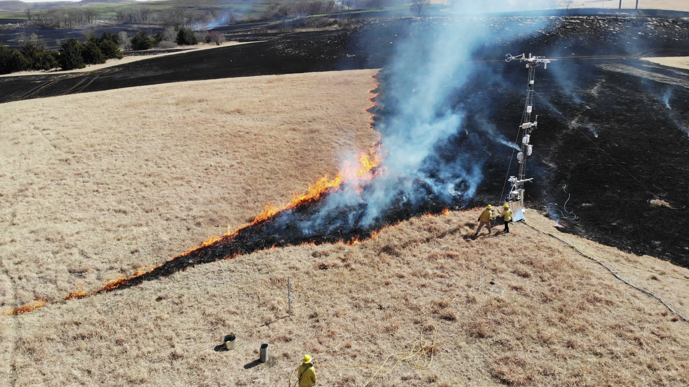
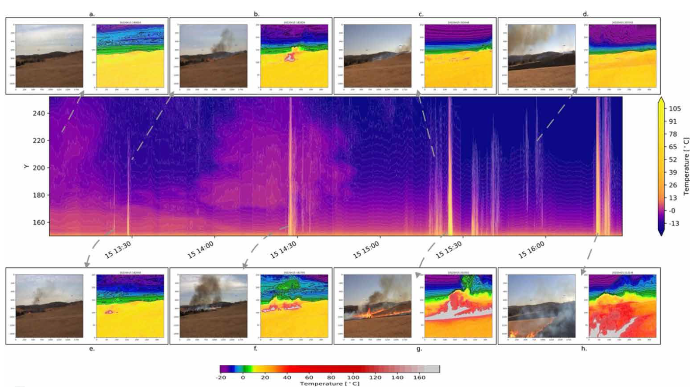
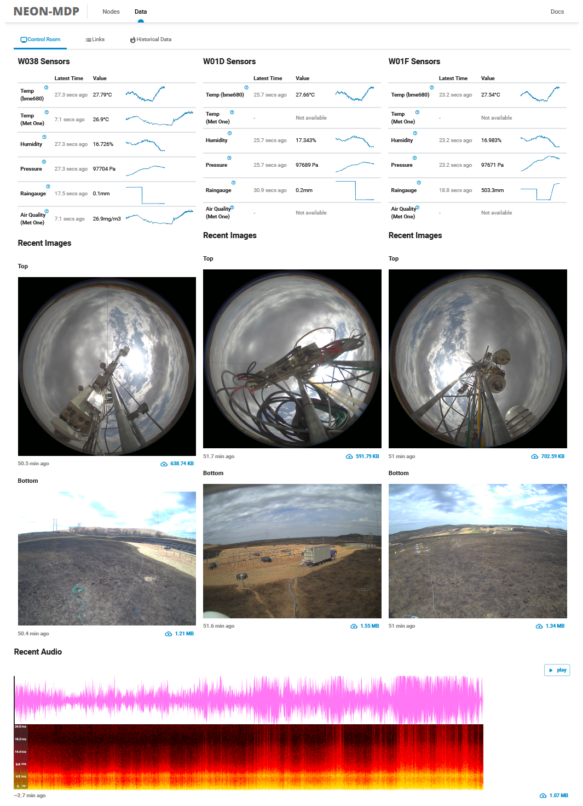

In April 2022, 4 Sage nodes (3 <a href="/docs/about/architecture#wild-waggle-node" target="_blank" rel="noopener">Wild Waggle Nodes</a> and 1 <a href="/docs/about/architecture#waggle-blade-node" target="_blank" rel="noopener">Waggle Blade Node</a>) were deployed with an array of sensors (thermographic camera, air quality sensor, etc.) to collect data to better our understanding of smoke and wildfire detection.

<!--truncate-->

<iframe title="Sage NEON deployment to the Konza LTER site in Kansas." src="https://www.youtube.com/embed/GF0jbkMPlTc?feature=oembed" frameborder="0" allow="accelerometer; autoplay; clipboard-write; encrypted-media; gyroscope; picture-in-picture" width="100%" height="400" allowfullscreen="" id="fitvid61143"></iframe>

#### Thermal imaging was used to understand how air temperature can be used to detect smoke and the early warning signs of fire.

Deployed MDP tower hosting Sage nodes in the middle of the controlled burn

<figcaption>Thermal images showing the detected increase in air temperature</figcaption>

<figcaption>Sage portal website showing data, image and audio feeds from Sage nodes</figcaption>
