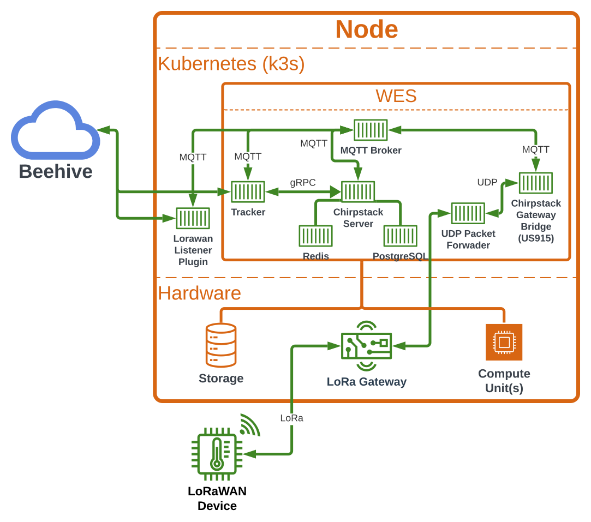

# Architecture

The cyberinfrastructure consists of coordinating hardware and software services enabling AI at the edge. Below is a quick summary of the different infrastructure pieces, starting at the highest-level and zooming into each component to understand the relationships and role each plays.

## High-Level Infrastructure


There are 2 main components of the cyberinfrastructure:
- [Nodes](#nodes) that exist at the edge
- The cloud that hosts services and storage systems to facilitate running [“science goals”](#science-goals) @ the edge

Every edge node maintains connections to 2 core cloud components: one to a [Beehive](#beehive) and one to a [Beekeeper](#beekeper)

### Beekeeper

The Beekeeper is an administrative server that allows system administrators to perform actions on the nodes such as gather health metrics and perform software updates.  All nodes "phone home" to their Beekeeper and maintain this "life-line" connection.

> Details & source code: https://github.com/waggle-sensor/beekeeper

### Beehive

The Node <-> Beehive connection is the pipeline for the science. It is over this connection that instructions for the node will be sent, in addition to how data is published into the Beehive storage systems from applications ([plugins](#what-is-a-plugin)) running on the nodes.

The overall infrastructure supports multiple Beehives, where each node is associated with a single Beehive. The set of nodes associated with a Beehive creates a "project" where each "project" is separate, having its own data store, web services, etc.


In the example above, there are 2 nodes associated with Beehive 1, while a single node is associated with Beehive 2.  With all nodes, in this example, being administered by a single [Beekeeper](#beekeeper).

> _Note_: the example above shows a single Beekeeper, but a second Beekeeper could have been used for administrative isolation.

> Details & source code: https://github.com/waggle-sensor/waggle-beehive-v2

## Beehive Infrastructure

Looking deeper into the Beehive infrastructure, it contains 2 main components:
- software services such as the [Edge Scheduler (ES)](#edge-scheduler-es), [Lambda Triggers (LT)](#lambda-triggers-lt), data APIs, and websites/portals
- data storage systems such as the [Data Repository (DR)](#data-repository-dr) and the [Edge Code Repository (ECR)](#edge-code-repository-ecr)


The Beehive is the “command center” for interacting with the Waggle nodes at the edge. Hosting websites and interfaces allowing scientists to create [science goals](#science-goals) to run [plugins](#what-is-a-plugins) at the edge & browse the data produced by those [plugins](#what-is-a-plugin).


The software services and data storage systems are deployed within a [kubernetes](https://kubernetes.io/) environment to allow for easy administration and to support running in a multiple server architecture, supporting redundancy and service replication.

While the services running within Beehive are many (both graphical and [REST](https://en.wikipedia.org/wiki/Representational_state_transfer) style API interfaces), the following is an outline of the most vital.

### Data Repository (DR)

The Data Repository is the data store for housing all the edge produced [plugin](#what-is-a-plugin) data. It consists of different storage technologies (i.e. [influxdb](https://www.influxdata.com/)) and techniques to store simple textual data (i.e. key-value pairs) in addition to large blobular data (i.e. audio, images, video). The Data Repository additionally has an API interface for easy access to this data.

The data store is a time-series database of key-value pairs with each entry containing metadata about how and when the data originated @ the edge. Included in this metadata is the data collection timestamp, [plugin](#what-is-a-plugin) version used to collect the data, the [node](#nodes) the [plugin](#what-is-a-plugin) was run on, and the specific compute unit within the node that the [plugin](#what-is-a-plugin) was running on.

```json
{
    "timestamp":"2022-06-10T22:37:47.369013647Z",
    "name":"iio.in_temp_input",
    "value":25050,
    "meta":{
        "host":"0000dca632ed6d06.ws-rpi",
        "job":"sage",
        "node":"000048b02d35a97c",
        "plugin":"plugin-iio:0.6.0",
        "sensor":"bme680",
        "task":"iio-rpi",
        "vsn":"W08C"
    }
}
```

In the above example, the value of `25050` was collected @ `2022-06-10T22:37:47.369013647Z` from the `bme680` sensor on node `000048b02d35a97c` via the `plugin-iio:0.6.0` [plugin](#what-is-a-plugin).

> _Note_: see the [Access and use data](/docs/tutorials/accessing-data) site for more details and data access examples.

> Details & source code: https://github.com/waggle-sensor/data-repository

### Edge Scheduler (ES)

The Edge Scheduler is defined as the suite of services running in Beehive that facilitate running [plugins](#what-is-a-plugin) @ the edge. Included here are user interfaces and APIs for scientists to create and manage their [science goals](#science-goals). The Edge Scheduler continuously analyzes node workloads against all the [science goals](#science-goals) to determine how the [science goals](#science-goals) are deployed to the Beehive nodes. When it is determined that a node's [science goals](#science-goals) are to be updated, the Edge Scheduler interfaces with [WES](#waggle-edge-stack-wes) running on those nodes to update the node's local copy of the [science goals](#science-goals). Essentially, the Edge Scheduler is the overseer of all the Beehive's nodes, deploying [science goals](#science-goals) to them to meet the scientists [plugin](#what-is-a-plugin) execution objectives.

> Details & source code: https://github.com/waggle-sensor/edge-scheduler

### Edge Code Repository (ECR)

The Edge Code Repository is the "app store" that hosts all the tested and benchmarked edge [plugins](#what-is-a-plugin) that can be deployed to the nodes. This is the interface allowing users to discover existing [plugins](#what-is-a-plugin) (for potential inclusion in their [science goals](#science-goals)) in addition to submitting their own. At it's core, the ECR provides a verified and versioned repository of [plugin](#what-is-a-plugin) [Docker](https://www.docker.com) images that are pulled by the nodes when a [plugin](#what-is-a-plugin) is to be downloaded as run-time component of a [science goal](#science-goals).

> Details & source code: https://github.com/waggle-sensor/edge-code-repository

### Lambda Triggers (LT)

The Lambda Triggers service provides a framework for running reactive code within the Beehive. There are two kinds of reaction triggers considered here: From-Edge and To-Edge.

From-Edge triggers, or messages that originate from an edge node, can be used to trigger lambda functions -- for example, if high wind velocity is detected, a function could be triggered to determine how to reconfigure sensors or launch a computation or send an alert.

To-Edge triggers are messages that are to change a node's behavior. For example an HPC calculation or cloud-based data analysis could trigger an [Edge Scheduler](#edge-scheduler-es) API call to request a [science goal](#science-goals) to be run on a particular set of edge nodes.

> Details & source code: https://github.com/waggle-sensor/lambda-triggers

## Nodes

Nodes are the edge computing component of the cyberinfrastructure. All nodes consist of 3 items:
1. **Persisent storage** for housing downloaded [plugins](#what-is-a-plugin) and caching published data before it is transferred to the node's Beehive
2. **CPU and GPU compute modules** where [plugins](#what-is-a-plugin) are executed and perform the accelerated inferences
3. **Sensors** such as environment sensors, cameras and [LiDAR systems](https://en.wikipedia.org/wiki/Lidar)


Edge nodes enable fast computation @ the edge, leveraging the large non-volatile storage to handle caching of high frequency data (including images, audio and video) in the event the node is "offline" from its Beehive.  Through expansion ports the nodes support the adding and removing of sensors to fully customize the node deployments for the particular deployment environment.

Overall, even though the nodes may use different CPU architectures and different sensor configurations, they all leverage the same [Waggle Edge Stack (WES)](#waggle-edge-stack-wes) to run [plugins](#what-is-a-plugin).

### Wild Sage Node (Wild Waggle Node)

The Wild Sage Node (or Wild Waggle Node) is a custom built weather-proof enclosure intended for remote outdoor installation. The node features software and hardware resilience via a [custom operating system](https://github.com/waggle-sensor/wildnode-image) and [custom circuit board](https://github.com/waggle-sensor/wagman). Internal to the node is a power supply and PoE network switch supporting the addition of sensors through standard Ethernet (PoE), USB and other embedded protocols via the node expansion ports.


The technical capabilities of these nodes consists of:
- NVidia Xavier NX ARM64 [Node Controller](https://github.com/waggle-sensor/nodecontroller) w/ 8GB of shared CPU/GPU RAM
- 1 TB of NVMe storage
- 4x PoE expansion ports
- 1x USB2 expansion port
- optional [Stevenson Shield](https://en.wikipedia.org/wiki/Stevenson_screen) housing a RPi 4 w/ environmental sensors & microphone
- optional 2nd NVidia Xavier NX ARM64 [Edge Processor](https://github.com/waggle-sensor/edgeprocessor)

> Node installation manual: [https://sagecontinuum.org/docs/installation-manuals/wsn-manual](/docs/installation-manuals/wsn-manual)

> Details & source code: https://github.com/waggle-sensor/wild-waggle-node

### Blade Nodes

A Blade Node is a standard commercially available server intended for use in a climate controlled machine room, or extended temperature range telecom-grade blades for harsher environments. The [AMD64 based operating system](https://github.com/waggle-sensor/blade-image) supports these types of nodes, enabling the services needed to support [WES](#waggle-edge-stack-wes).


The above diagram shows the basic technical configuration of a Blade Node:
- Multi-core ARM64
- 32GB of RAM
- Dedicated NVida T4 GPU
- 1 TB of SSD storage

> _Note_: it is possible to add the same optional [Stevenson Shield](https://en.wikipedia.org/wiki/Stevenson_screen) housing that is available to the [Wild Sage Nodes](#wild-sage-node-wild-waggle-node)

> Details & source code: https://github.com/waggle-sensor/waggle-blade

## Running plugins @ the Edge

Included in the Waggle operating systems are the core components necessary to enable running [plugins](#what-is-a-plugin) @ the edge.  At the heart of this is [k3s](https://k3s.io/), which creates a protected & isolated run-time environment. This environment combined with the tools and services provided by [WES](#waggle-edge-stack-wes) enable [plugin](#what-is-a-plugin) access to the node's CPU, GPU, sensors and cameras.

### Waggle Edge Stack (WES)

The Waggle Edge Stack is the set of core services running within the [edge node's](#nodes) [k3s](https://k3s.io/) run-time environment that supports all the features that [plugins](#what-is-a-plugin) need to run on the Waggle nodes. The WES services coordinate with the core [Beehive](#beehive) services to download & run scheduled [plugins](#what-is-a-plugin) (including load balancing) and facilitate uploading [plugin](#what-is-a-plugin) published data to the Beehive [data repository](#data-repository-dr). Through abstraction technologies and WES provided tools, [plugins](#what-is-a-plugin) have access to sensor and camera data.


The above diagram demonstrates 2 [plugins](#what-is-a-plugin) running on a Waggle node.  Plugin 1 ("neon-kafka") is an example [plugin](#what-is-a-plugin) that is running alongside Plugin 2 ("data-smooth"). In this example, "neon-kafka" (via the WES tools) is reading metrics from the node's sensors and then publishing that data within the WES run-time environment (internal to the node).
At the same time, the "data-smooth" [plugin](#what-is-a-plugin) is subscribing to this data stream, performing some sort of inference and then publishing the inference results (via WES tools) to Beehive.

> _Note_: see the [Edge apps](/docs/category/edge-apps) guide on how to create a Waggle [plugin](#what-is-a-plugin).

> Details & source code: https://github.com/waggle-sensor/waggle-edge-stack

### What is a plugin?

Plugins are the user-developed modules that the cyberinfrastructure is designed around. At it's simplest definition a "plugin" is code that runs @ the edge to perform some task. That task may be simply collecting sample camera images or a complex inference combining sensor data and results published from other plugins. A plugin's code will interface with the edge node's sensor(s) and then publish resulting data via the tools provided by [WES](#waggle-edge-stack-wes). All developed plugins are hosted by the Beehive [Edge Code Repository](#edge-code-repository-ecr).

> See [how to create plugins](/docs/category/edge-apps) for details.

### Science Goals

A "science goal" is a rule-set for how and when [plugins](#what-is-a-plugin) are run on edge nodes. These science goals are created by scientist to accomplish a science objective through the execution of [plugins](#what-is-a-plugin) in a specific manner. Goals are created, in a human language, and managed within the Beehive [Edge Scheduler](#edge-scheduler-es). It is then the cyberinfrastucture responsibility to deploy the science goals to the edge nodes and execute the goal's [plugins](#what-is-a-plugins). The [tutorial](../tutorials/schedule-jobs.md) walks through running a science goal.

## LoRaWAN

[The Waggle Edge Stack](#waggle-edge-stack-wes) includes the [ChirpStack software stack](#chirpstack) and other services to facilitate communication between [Nodes](#nodes) and LoRaWAN devices. This empowers [Nodes](#nodes) to effortlessly establish connections with wireless sensors, enabling your [plugins](#what-is-a-plugin) to seamlessly access and harness valuable data from these sensors.

>To get started using LoRaWAN, head over to the [Contact Us](../contact-us.md) page. A tutorial will be available soon showing you how to get started with LoRaWAN.

<!--To get started with using LoRaWAN, you can follow the step-by-step instructions in the [tutorial](../tutorials/schedule-jobs.md). -->



The above diagram demonstrates the hardware in [Nodes](#nodes) and services in [WES](#waggle-edge-stack-wes) that enable [Nodes](#nodes) to use LoRaWAN and publish the measurements to a [Beehive](#beehive). The following sections will explain each componenent and service.

>source code: 
> - [wes-chirpstack](https://github.com/waggle-sensor/waggle-edge-stack/tree/main/kubernetes/wes-chirpstack)
> - [wes-chirpstack-server](https://github.com/waggle-sensor/wes-chirpstack-server)
> - [wes-rabbitmq](https://github.com/waggle-sensor/waggle-edge-stack/blob/main/kubernetes/wes-rabbitmq.yaml)
> - [Tracker](https://github.com/waggle-sensor/wes-chirpstack-device-tracker)
> - [Lorawan Listener Plugin](https://github.com/FranciscoLozCoding/plugin-lorawan-listener)

### What is LoRaWAN?

LoRaWAN, short for "Long Range Wide Area Network," is a wireless communication protocol designed for low-power, long-range communication between IoT (Internet of Things) devices. It employs a low-power wide-area network (LPWAN) technology, making it ideal for connecting remote sensors and devices. For more information view the documentation [here](https://www.thethingsnetwork.org/docs/lorawan/).

### Chirpstack

ChirpStack is a robust and open-source LoRaWAN Network Server that enables efficient management of LoRaWAN devices, gateways, and data. Its architecture consists of several crucial components, each serving a distinct role in LoRaWAN network operations. Below, we provide a brief overview of these components along with links to ChirpStack documentation for further insights.

>[Chirpstack documentation](https://www.chirpstack.io/docs/index.html)

#### UDP Packet Forwarder

The UDP Packet Forwarder is an essential component that acts as a bridge between LoRa gateways and the [ChirpStack Network Server](#chirpstack-server). It receives incoming packets from LoRa gateways and forwards them to the [ChirpStack Gateway Bridge](#chirpstack-gateway-bridge) for further processing. To learn more about the UDP Packet Forwarder, refer to the documentation [here](https://github.com/RAKWireless/udp-packet-forwarder).

#### ChirpStack Gateway Bridge

The ChirpStack Gateway Bridge is responsible for translating gateway-specific protocols into a standard format for the [ChirpStack Network Server](#chirpstack-server). It connects to a [UDP Packet Forwader](#udp-packet-forwarder), ensuring that data is properly formatted and can be seamlessly processed by the network server. For in-depth information on the ChirpStack Gateway Bridge, explore the documentation [here](https://www.chirpstack.io/docs/chirpstack-gateway-bridge/index.html).

#### MQTT Broker

[WES](#waggle-edge-stack-wes) includes a MQTT (Message Queuing Telemetry Transport) broker to handle communication between various services. MQTT provides a lightweight and efficient messaging system. This service ensures that data flows smoothly between the network server, gateways, and applications. You can find detailed information about the MQTT broker integration in the ChirpStack documentation [here](https://www.chirpstack.io/docs/chirpstack/integrations/mqtt.html).

#### ChirpStack Server
The ChirpStack Server serves as the core component, managing device sessions, data, and application integrations. It utilizes [Redis](https://redis.io/) for device sessions, metrics, and caching, ensuring efficient data handling and retrieval. For persistent data storage, ChirpStack uses [PostgreSQL](https://www.postgresql.org/), accommodating records for tenants, applications, devices, and more. For a comprehensive understanding of the ChirpStack Server and its associated database technologies, consult the ChirpStack documentation [here](https://www.chirpstack.io/docs/chirpstack/requirements.html).

>NOTE: Chirpstack v4 combined the application and network server into one component.

### Tracker
The Tracker is a service designed to record the connectivity of LoRaWAN devices to the [Nodes](#nodes). This service uses the information received from the [MQTT broker](#mqtt-broker) to call [ChirpStack's gRPC API](https://www.chirpstack.io/docs/chirpstack/api/grpc.html). The information received from the API is then used to keep the Node's manifest up-to-date. Subsequently, it forwards this updated manifest to the [Beehive](#beehive). For more information, view the documentation [here](https://github.com/waggle-sensor/wes-chirpstack-device-tracker).

### Lorawan Listener Plugin
The LoRaWAN Listener is a plugin designed to publish measurements collected from LoRaWAN devices. It simplifies the process of extracting and publishing valuable data from these devices. For more information about the plugin view the plugin page [here](https://portal.sagecontinuum.org/apps/app/flozano/lorawan-listener). 

### Lorawan Device Compatibility

The Wild Sage Node is designed to support a wide range of Lorawan devices, ensuring flexibility and adaptability for various applications. If you are wondering which Lorawan devices can be connected to a Wild Sage Node, the device must have the following tech specs:

- designed for US915 (902–928 MHz) frequency region.
- compatible with Lorawan Mac versions 1.0.0 - 1.1.0
- compatible with Chirpstack's Lorawan Network Server
- The device supports Over-The-Air Activation (OTAA) or Activation By Personalization (ABP)
- The device has a Lorawan device class of A, B, or C

It is important to note that all channels within the US915 frequency band are enabled in a Wild Sage Node. If you wish to learn more about our Lorawan Gateway, please visit our [portal](https://portal.sagecontinuum.org/sensors/). For inquiries about supporting Lorawan regions other than US915, please [Contact Us](../contact-us.md).

#### Device Examples

Whether you are designing your own Lorawan sensor, looking for a Lorawan data logger, or seeking an off-the-shelf Lorawan device the Wild Sage Node will support it, we have examples for you:

- **Designing your own Lorawan sensor?**
  - [Arduino MKR WAN 1310](https://docs.arduino.cc/hardware/mkr-wan-1310/)

- **Looking for a Lorawan data logger?**
  - [ICT International MFR Node](https://ictinternational.com/product/mfr-node/)

- **Looking for an off-the-shelf Lorawan device?**
  - [ICT International SFM1X Sap Flow Meter](https://ictinternational.com/product/sfm1x-sap-flow-meter/)

- **Seeking Lorawan device manufacturers?**
  - [ICT International](https://ictinternational.com/)
  - [RAKwireless](https://www.rakwireless.com/en-us)
  - [The Things Network Device Marketplace](https://www.thethingsnetwork.org/marketplace/products/devices)
  - [DecentLab](https://www.decentlab.com)
