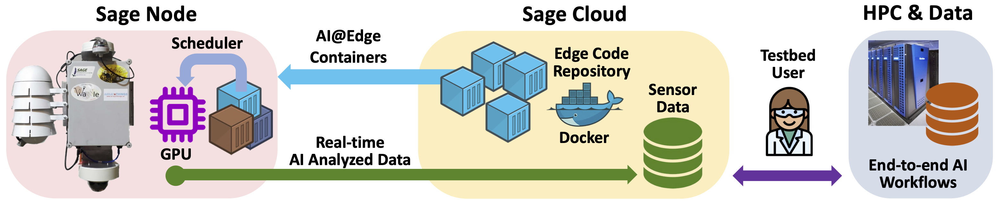

# Sage: A distributed software-defined sensor network.

## What is Sage?

Sage is a national AI infrastructure platform bringing advanced edge computing, multimodal sensing, and large language models to real-world environments. With over 100 sensor-equipped nodes across 17 states, Sage empowers researchers and students to deploy AI directly in the field—from wildfire detection and precision agriculture to urban science and ecosystem monitoring.

The Sage Grande Testbed (SGT)–an extension to the Sage NSF MSRI-1 project–will offer powerful tools like SageChat for natural language interaction, supports privacy-aware and trustworthy AI exploration, and provides a hands-on education pipeline through camps, workshops, and hackathons. As an open testbed funded by the NSF, Sage Grande invites researchers, educators, and community partners to build, test, and deploy AI applications that tackle urgent scientific and societal challenges.

Sage nodes can:
- **Collect data** from various sensors (infrared cameras, RGB cameras, LiDAR, and traditional sensors for air quality and wind, as well as LoRaWAN connected sensors for low-bandwidth measurements such as soil moisture)
- **Process data locally** using machine learning algorithms and AI models on embedded computers
- **Transmit results** to central servers for further analysis
- **Enable real-time monitoring** and automated responses and insights to events

> **[Read More About the Sage Grande Testbed](/about)**

## How do I use the platform?

We recommend using **[Getting Started](../getting-started)** to choose a path based on your expertise and goals.

## Who are the users?

The most common users have included:

- Domain scientists and AI developers interested in developing edge AI applications.
- Folks interested in sensor and application-produced datasets.
- Educators who are interested in teaching AI and data science using real-world sensor networks
- Domain scientists interested in adding new sensors and deploying nodes to answer science questions.
- Systems researchers interested in platform research.

## How is the cyberinfrastructure architected?

If you are interested in learning more about how the cyberinfrastructure works you can head on over to the [Architecture Overview](./architecture.md) page.
