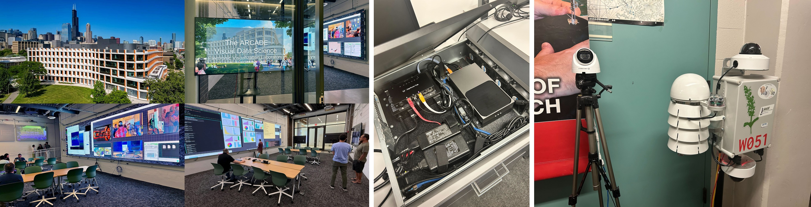

import Button from '@mui/material/Button'

# Sage Grande: Summer of AI

## Hack and Build AI@Edge
## Training the Next Generation of AI Scientists!

**Dates:** Monday, July 20 – Tuesday, July 28, 2026 \
**Location:** [UIC Electronic Visualization Laboratory (EVL)](https://www.evl.uic.edu/location), Chicago, IL \
**Format:** In-person with hands-on lab sessions \
**Audience:** Graduate students, postdoctoral researchers, and early-career
scientists

### Program Overview

This intensive seven-day summer camp brings together students and postdoctoral
researchers for a deep, hands-on immersion in building and deploying AI systems at the
edge using the Sage platform. Participants will work directly with real Sage nodes,
moving beyond textbook concepts to build, test, and deploy working AI pipelines on live
infrastructure.

The program is structured around a combination of morning and afternoon sessions, along with several hackathons.
Each day builds on the previous, moving from platform fundamentals through AI model deployment, data integration, sensor
expansion, and autonomous agent design. By the end of the week, participants will
have shipped real code to real nodes — including new sensors, new AI models, and
new automated workflows.

This is a hands‑on, collaborative experience. Participants are encouraged to bring their
own research ideas, sensors, and questions, and to play an active role in expanding the
Sage platform throughout the week.

### Prerequisite Skills

To get the most out of this program, participants are encouraged to arrive with the following:

- A general comfort with SSH and basic Linux command‑line tools (moving around the filesystem, managing files, checking processes, etc.)
- Some hands‑on experience running AI models locally — tools like Ollama or LM Studio are great starting points, but anything similar is perfectly fine
- A working familiarity with Python, including writing simple scripts, using virtual environments, and installing packages
- Basic familiarity with containers (Docker or similar) is helpful but not required

Participants should bring a laptop set up for local Python development. Some exercises may
require running models and tools on your own machine as well as on the provided nodes.

### Daily Schedule

| Time | Activity |
|------|----------|
| 8:00 AM – 9:30 AM | Open hacking / independent work |
| 9:30 AM – 12:30 PM | **Morning session (3 hrs)** |
| 12:30 PM – 1:30 PM | Lunch (on your own — campus dining or nearby restaurants) |
| 1:30 PM – 4:30 PM | **Afternoon session (3 hrs)** |
| 4:30 PM – 6:00 PM | Open hacking / independent work |
| Evening | Dinner on your own; hacking in teams, optional after-hours activities |

### Agenda:

#### Sunday, July 19: Check-in

We will meet at 5:00 PM at [EVL](https://www.evl.uic.edu/location), and then head to an informal welcome dinner.

#### Monday, July 20: Sage Foundations and System Software

**Introduction**: Framing for the 7 days of learning:  The Sage Grande Testbed and the future of AI@Edge.

A comprehensive tour of the full Sage software stack, from node boot to the lifecycle of a running application. Topics include the node architecture, the Kubernetes‑based container orchestration system, the `pluginctl` scheduler, and the data pipeline.

Students will learn:

- What is Sage and what does the platform provide?
- Accounts and the portal
- Finding nodes
- Working with data
- SSH and development nodes
- Basic app development
- Publishing to ECR
- Scheduling apps

#### Tuesday Morning, July 21: Finalize AI Setup for Sage Development

Modern AI development tools — including large language models, code agents, and Model Context Protocol (MCP) servers — are transforming how scientific software is written and maintained. Students will be testing their AI development toolchains:

- Using tools such as Cursor and Claude Code for AI‑assisted programming
- Setting up MCP servers to give AI agents access to Sage APIs and node‑management tools
- Prompt‑engineering strategies for generating reliable, testable code

By the end of this session, students will have completed several foundational Sage skill checkpoints -- AI development environment complete, submit job, explore cloud data, demonstrate your skills and begin making plans for your own project -- what will you accomplish before finishing the Summer Camp? Create a project plan with your AI assistant.

#### Tuesday Afternoon, July 21: AI and Sage (part 1)

An overview of how the University of Hawaii has used Sage for volcano and anomaly detection.

Familiarization with high level deep learning concepts and workflows to provide knowledge/understanding to interact with coding agents and get experience with coding agent outputs. 

At the end, there will be a quick example of training a head on top of a pretrained network.  Students may just watch or attempt to participate.  This should take no more than 30 minutes as examples are just running scripts and the code is thoroughly commented.
The first shows an example of running the standalone model (patch embeddings and cls embeddings).
The second demonstrates patch similarity with PCA to enforce the idea that the embeddings have related meanings with each other.
The last is the practical example which is training a head on top of the frozen DINOV2 model.  Examples are contained in such a way that the user should just be able to run a script, see the outcoming and inspect the code.

Results:

- Understand neural networks and deep learning at a high level
- Participants should be able to converse terminology with coding agents
- Understand the training loop (forward pass, backprop, loss function, hyperparameter tuning)

#### Wednesday Morning, July 22: AI and Sage (part 2 & 3)

**Foundation Models**

This session’s focus is on the benefits of foundation models and their utility and adaptability to scientific workflows, including at the edge. It uses taxonomic image classification and the BioCLIP family of models to explore how large pretrained models may be adapted to a scientific task and deployed under constraints. 

Participants will develop a mental model of AI concepts and approaches including image encoders, embeddings, CLIP-style image-text alignment, and the taxonomic supervision used with BioCLIP models. We will identify the strengths of such an approach, encounter where it still struggles, and implement targeted strategies for performance improvement such as fine-tuning and few-shot probing, and performance monitoring with benchmarking. 

Edge deployment imposes constraints to the process, such as low-latency requirements, bandwidth limitations, and open-ended sensor data. Approaches to address these needs will be covered through model distillation and quantization to compress and speed up model inference and discuss the topic of open-set recognition motivated by topics such as invasive and new species detection.

Learning outcomes:

- Explain why a pretrained foundation model is a useful starting point for scientific tasks, and what is involved in adapting one compared to training from scratch.
- Distinguish zero-shot classification, few-shot probing, fine-tuning, and continued pretraining, and recognize which approach fits a given task and data availability.
- Train and evaluate a small classifier on frozen foundation-model embeddings from a small number of labeled examples.
- Benchmark a model on a dataset relevant to a task; judge performance level adequacy.
- Explain conditions that motivate inference at the edge, why distillation and/or quantization can help, and why continued benchmarking is important.

**Semantic Image Search**

How do we turn a gigantic, unsearchable library of images into something scientists can actually use?

In this hands-on lab we will look into this, students will build a simplified version of Sage Image Search, the AI-powered image retrieval system used by Sage. Rather than treating AI as a black box, participants will explore every stage of a real multimodal retrieval pipeline—from image captioning and embeddings to hybrid search, reranking, and interactive search interfaces. 

Working inside a Jupyter Notebook on the National Data Platform (NDP), students will use open-source AI models and tools including Gemma, OpenCLIP, Milvus Lite, and Gradio to build a complete search workflow capable of finding scientific images from natural language queries. Along the way, they will learn why modern retrieval systems combine semantic understanding with traditional keyword search, and how these techniques scale to collections containing tens of millions of images. 

Rather than focusing solely on coding, this session emphasizes AI systems literacy—understanding how production AI systems are designed, evaluated, and deployed. Students will compare the simplified notebook implementation with the production Sage Image Search architecture, gaining insight into how research prototypes evolve into scalable scientific infrastructure. 

#### Thursday Morning, July 23: AI and Sage (part 4)

Wrap up end-to-end AI exploration and work with AI coding agent to advance your project

Student presentations

#### Thursday Afternoon, July 23: NRP/NDP and NSF Resources

The NSF provides cyberinfrastructure for research, including the National Data Platform (NDP), the National Research Platform (NRP), and NSF supercomputer centers such as SDSC, TACC, and NCSA. This session will guide students through connecting Sage data and AI computation to other NSF resources. 
Participants will connect to the National Data Platform, explore its capabilities, and see how it links data repositories, compute resources, and analysis tools into a single workflow.

Topics include:

- Registering and discovering digital assets in NDP
- Setting up and executing workspaces in NRP
- Using the Sage Data Client SDK for hands-on data analysis within NDP workspaces
- Building Sage-based workflows that combine NDP, NRP, and the Pelican data federation
- Publishing workspaces to support open, reproducible research

Through hands-on exercises, participants will learn to design and run end-to-end pipelines that connect Sage to the broader NSF research infrastructure.

#### Friday Morning, July 24: Sensors, Hardware, and Physical Integration (Part 1)

Sage nodes are extensible edge-computing platforms that can support a wide range of scientific sensors, instruments, radios, and actuators. This session introduces the complete hardware-integration path, from physical connectivity and power delivery to application development, containerization, data publication, and device sharing.
The session will combine short presentations, demonstrations, guided design exercises, and hands-on activities. Participants are encouraged to bring sensors, actuators, interface boards, cables, radios, power supplies, and device documentation for use during the afternoon workshop.

Major topics

- Sage node architecture, expansion interfaces, and boundary connectors
- Directly attached, networked, wireless, and microcontroller-mediated devices
- Communication interfaces, including USB, Ethernet, Wi-Fi, Bluetooth, LoRaWAN, UART, RS-232/RS-485, I2C, SPI, GPIO, and analog signals
- Tradeoffs involving bandwidth, distance, latency, reliability, software support, and environmental deployment
- Power requirements, voltage conversion, transient loads, grounding, isolation, connector selection, and electrical protection
- Linux device access, drivers, permissions, communication libraries, and hardware discovery
- Containerizing applications that read sensors or control actuators
- Publishing measurements with timestamps, units, sensor identity, and metadata
- Sharing sensors, measurements, and actuator access among applications
- Reliability, calibration, health monitoring, failure recovery, and outdoor deployment considerations

Representative devices may include environmental sensors, cameras, microphones, air-quality sensors, GPS receivers, serial instruments, microcontroller-based systems, relays, lights, motors, and pumps. Participants will examine the power, communication, software, data-rate, calibration, and deployment requirements of selected examples.

#### Friday Afternoon, July 24: Sensors, Hardware, and Physical Integration (Part 2)

This hands-on workshop will guide participants through connecting a sensor or actuator to a Sage development environment and implementing as much of the following end-to-end workflow as possible:

physical device → electrical interface → communication protocol → application code → container → Sage node → shared data or control service

Participants may work individually or in small teams. Example hardware may be available for participants who do not bring their own devices.

Hands-on activities

- Define a concrete integration objective, such as reading a sensor, capturing images or audio, receiving wireless data, controlling an actuator, or using measurements in a local AI application.
- Verify device voltage, current, connector pinout, signal levels, and communication requirements.
- Connect and detect the device through USB, Ethernet, serial, GPIO, a microcontroller, or a wireless interface.
- Establish basic communication by reading a measurement, capturing a record, or issuing a safe actuator command.
- Develop an application that initializes the device, exchanges data or commands, timestamps measurements, handles errors, records logs, and supports configuration.
- Package the application in a container with the required libraries, device access, network settings, and runtime parameters.
- Publish structured measurements through Sage data services or define a safe actuator-control interface.
- Demonstrate the integration and document what worked, what remains incomplete, and what would be required for field deployment.

AI coding assistants may be used to interpret device documentation, generate initial code, diagnose errors, and develop tests. All generated code must be validated against the device documentation and observed hardware behavior.

#### Saturday, July 25: Community Day

Chicago River Architecture tour, Chicago pizza, etc.  Networking and team building.  Hacking.

#### Sunday, July 26: Free Day

Self-directed exploration, project planning, or if needed, rest :-)

#### Monday Morning, July 27: The Future

AI Agents, Autonomous systems, future Sage opportunities.  Project plans finalized

AI agents capable of perception, reasoning, and action are emerging as a powerful paradigm for scientific instrumentation.
Sage is developing experimental frameworks for deploying such agents on edge nodes—systems that can monitor data streams, make decisions, and autonomously control node behavior, from steering PTZ cameras to triggering sampling events to adjusting operating parameters in response to changing conditions.

This session covers:

- Autonomous architecture and design principles
- Safety and governance considerations for autonomous systems
- Hands‑on development of agents that interact with real Sage APIs
- Deployment of agents to live nodes (where appropriate)
- Next‑generation edge accelerators
- New sensor modalities
- Evolving NSF cyberinfrastructure capabilities
- Open research questions in scientific edge computing

#### Monday Afternoon, July 27: Hack Time

Work on your project

#### Tuesday Morning, July 28: Development, Testing, and Preparation

#### Tuesday Afternoon, July 28: Project Presentations and Demos

Show off your project!  Celebrate.  Enjoy dinner and farewell.

### Baseline Deliverables for All Participants

In addition to hackathon project work, all participants are expected to complete the
following by the end of the week:

- Get new code into the ECR and run it on a deployed node
- Build AI tools and skills, and share them with the whole class
- Write an overview of your project, present and share with the class
- Process a batch of images using an LLM
- Build and test a data pipeline connecting two or more sensor streams

