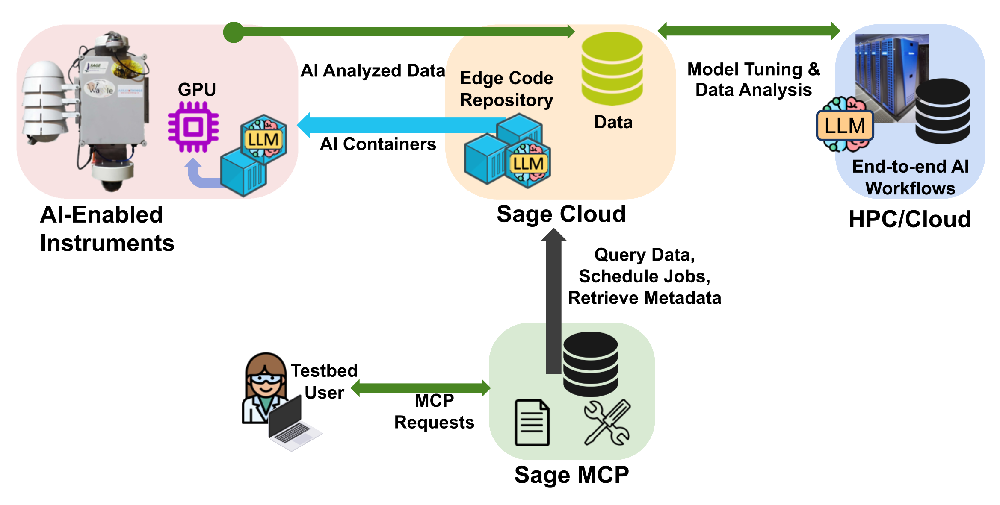
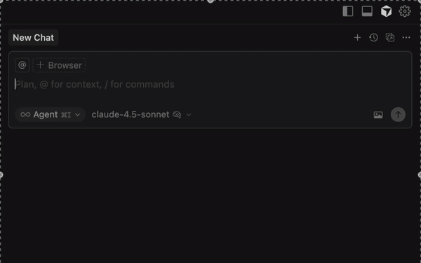

# Sage MCP Server




The Sage MCP Server brings the power of natural language to scientific edge computing. Instead of writing scripts or learning APIs, simply ask questions in plain English to query sensor data, discover plugins, search images, and deploy edge applications across 100+ nodes worldwide.

## What is Sage MCP?


Sage MCP connects AI-powered tools like Cursor, VSCode, and other IDEs to the Sage cyberinfrastructure through the Model Context Protocol (MCP). Think of it as having a knowledgeable assistant who understands Sage's data, nodes, sensors, and capabilities, and can help you explore and work with them conversationally.

**Key capabilities:**
- Query real-time sensor data from nodes across the US
- Search images semantically using natural language
- Find and deploy edge applications (plugins)
- Discover nodes by location or visual features
- Submit and monitor computing jobs
- Access comprehensive Sage documentation

## Getting started

### Prerequisites

Before you begin, you'll need:
- A Sage account (sign up at [portal.sagecontinuum.org](https://portal.sagecontinuum.org))
- An AI-powered IDE with MCP support (e.g. Cursor, VSCode)
- Your Sage access token from [portal.sagecontinuum.org/account/access](https://portal.sagecontinuum.org/account/access)

### Configuration

Add the Sage MCP server to your MCP client configuration. 

For **Cursor IDE**, follow these steps to setup the MCP Server:


1. Navigate to **Settings -> Tools & MCP** and click **+ New MCP Server**.
2. Add this to `~/.cursor/mcp.json`:

```json
{
  "mcpServers": {
    "sage": {
      "url": "https://mcp.sagecontinuum.org/mcp",
      "headers": {
        "Authorization": "Bearer {username}:{auth_token}"
      }
    }
  }
}
```

For **VSCode** IDE, follow these steps to setup the MCP Server:

1. Create a .vscode/mcp.json file in your workspace.

2. Select the Add Server button in the editor to add a template for a new server. VS Code provides IntelliSense for the MCP server configuration file.

3. The following example shows how to configure the GitHub remote MCP server. Learn more about the MCP configuration format in VS Code.

```JSON

{
  "servers": {
    "sage-mcp": {
      "type": "http",
      "url": "https://mcp.sagecontinuum.org/mcp",
      "headers": {
        "Authorization": "Bearer {username}:{auth_token}"
      }
    }
  }
}
```

Alternatively, run the **MCP: Add Server** command from the Command Palette, choose the type of MCP server to add and provide the server information. Next, select Workspace to add the server to the .vscode/mcp.json file in your workspace.

Replace `{username}` with your Sage username and `{auth_token}` with your access token from the portal.

### Your first query



Once configured, restart your IDE and try asking in the chat window:

```
"List available Sage nodes"
```

You should see a response like:

```
Available Sage Nodes (240):
Deployed Nodes:
D001 (000048B02D3D3A78)
H006 (000048B02D5BFBEA)
H007 (00003C6D664EBE1F)
H009 (00003C6D66640B0B)
H00B (00004CBB4701D227)
N001 (000048B02D5BFE93): 842 W Taylor St #2032, Chicago, IL 60607
N002 (000048B02D059C6A): 9700 South Cass Ave, Lemont, IL 60439
...

For detailed information about a specific node, use get_node_info with the node ID.
```

If you see this, congratulations! You're connected and ready to explore Sage.

## Tutorial: Exploring Sage through conversation

Let's walk through a real-world scenario to show you what Sage MCP can do. Imagine you're a researcher interested in studying wildlife near the Grand Tetons.

### Step 1: Finding nodes by location

Start by asking about nodes in that area:

```
"What Sage nodes are near the Grand Tetons?"
```

**Response:**

```
Found 1 nodes in or near Wyoming:
Node W06C: 000048B02D3AE335
Location: Amk Ranch Rd, Moran, WY 83013
Status: Deployed
Sensors: top_camera, bottom_camera, Metone ES-642, ptz, mobotix and 7 more
```

Great! We found one node in the area. Let's dig deeper.

### Step 2: Understanding what cameras see

Now let's find out what these cameras are actually looking at:

```
"Show me recent images from node W06C"
```

**Response:**

```
🖼️ Image Search Results for: 'Images from node W06C'
Found 21 matching images
1. sample.jpg
  📍 Node: W06C | Location: Amk Ranch Rd, Moran, WY 83013 | Camera: mobotix
  📅 Captured: 25-07-24 05:00 Z
  🎯 Relevance Score: 0.349
  📝 caption: The image presents a thermal infrared (TIR) anomaly map derived from a drone-based thermal sensor, likely capturing a forested area. The left panel displays a false-color composite, where ...
  🔗 Proxy URL: https://mcp.sagecontinuum.org/proxy/image?pt=...
  🔗 Direct URL: https://storage.sagecontinuum.org/api/v1/data/...

2. sample.jpg
  📍 Node: W06C | Location: Amk Ranch Rd, Moran, WY 83013 | Camera: mobotix
  📅 Captured: 25-07-24 16:00 Z
  🎯 Relevance Score: 0.335
  📝 caption: The image presents a thermal infrared (TIR) and visible light composite of a coniferous forest, showcasing the distinct temperature differences between vegetation and the ground. The TIR i...
  🔗 Proxy URL: https://mcp.sagecontinuum.org/proxy/image?pt=...
  🔗 Direct URL: https://storage.sagecontinuum.org/api/v1/data/...

3. sample.jpg
  📍 Node: W06C | Location: Amk Ranch Rd, Moran, WY 83013 | Camera: mobotix
  📅 Captured: 25-07-24 07:00 Z
  🎯 Relevance Score: 0.245
  📝 caption: The image presents a thermal infrared (TIR) and visible light composite of a forested area, likely captured during nighttime or under low-light conditions. The TIR image (left) displays a ...
  🔗 Proxy URL: https://mcp.sagecontinuum.org/proxy/image?pt=...
  🔗 Direct URL: https://storage.sagecontinuum.org/api/v1/data/...

...
```

The images show mountain landscapes with clear views of the terrain. Perfect for wildlife monitoring.

### Step 3: Finding existing wildlife detection plugins

Before building something new, let's see what's already available:

```
"Find plugins for wildlife detection"
```

**Response:**

```
Found 10 plugins matching your task 'wildlife detection':

1. ptzapp (v0.1.0):
  Image: dariodematties/ptzapp:0.1.0
  Description: Intelligent Pan-Tilt-Zoom Camera
  Keywords: camera, ptz, pan, tilt, zoom, florence, waggle
  Authors: Dario Dematties <ddematties@anl.gov>
  Parameters: iterations (int), object (string), username (string), password (string), cameraip (string), panstep (int), tilt (int), zoom (int), model (string)
  Homepage: https://github.com/dariodematties/PTZ_APP
  Science Description: # Science
  This application leverages an NVIDIA XAVIER (or comparable edge hardware) to perform real-time object detection and zooming using a PTZ (Pan‐Tilt‐Zoom) camera. By automatically detecting an...

2. sound-event-detection (v0.1.0):
  Image: dariodematties/sound-event-detection:0.1.0
  Description: Sound event detection (SED) plugin, using YAMNet audio classification model. Trained to classify over 500 audio sounds.
  Keywords: Machine learning, Internet of Things, Audio
  Authors: Enrique Nueve <ennu6440@colorado.edu>, Dario Dematties <dario.dematties@northwestern.edu>
  Parameters: DURATION_S (int), TOP_K (int), MIC_PATH (string), MODE (string), WATCH_SOUNDS (string), INTERVAL (int), SAMPLING_INTERVAL (int), ITERATIONS (int)
  Homepage: https://github.com/waggle-sensor/yamnet-plugin
  Science Description: # Science
  The task of identifying onsets and offsets of target class activities in general audio signals is called Sound event detection (SED) [1].
  The most common SED application is one in which the...
   ...
```

Excellent! There are already several options for wildlife detection. You can explore these plugins further, check their documentation, and see which one best fits your needs.

## Common workflows

Now that you've seen how to explore Sage nodes and discover plugins, here are more examples of what you can do with Sage MCP.

### Exploring sensor data

**Query sensor data from a specific node:**

```
You: "Whats the temperature and pressure on node W06C in the last hour?"
```

```
Response:
  All sensor data for node W06C (-1h):
  Total measurements: 1000
  Time range: 2025-11-18T20:51:38Z to 2025-11-18T20:51:46Z
  wxt.env.humidity (vaisala-wxt536):
  Count: 86
  Range: 79.4 to 79.4
  Average: 79.39999999999989
  wxt.env.pressure (vaisala-wxt536):
...
```

**Query plugin data:**

```
You: "Show me all image plugin data from node W06C in the last hour"
```

```
Response:
🖼️ Image Search Results for: 'Images from node W06C'
Found 21 matching images
  1. sample.jpg
  📍 Node: W06C | Location: Amk Ranch Rd, Moran, WY 83013 | Camera: mobotix
  📅 Captured: 25-07-24 05:00 Z
  🎯 Relevance Score: 0.349
  📝 caption: The image presents a thermal infrared (TIR) anomaly map derived from a drone-based thermal sensor, likely capturing a forested area. The left panel displays a false-color composite, where ...
  🔗 Proxy URL: https://mcp.sagecontinuum.org/proxy/image?pt=..
  🔗 Direct URL: https://storage.sagecontinuum.org/api/v1/data/..
  2. sample.jpg
  📍 Node: W06C | Location: Amk Ranch Rd, Moran, WY 83013 | Camera: mobotix
  📅 Captured: 25-07-24 16:00 Z
  🎯 Relevance Score: 0.335
  📝 caption: The image presents a thermal infrared
```

### Image search and discovery

**Find specific scenes:**

```
You: "Show me images of volcanoes"
```

```
Response:
🖼️ Image Search Results for: 'volcanoes'
Found 25 matching images
1. sample.jpg
  📍 Node: W097 | Location: Hawaii Volcanoes National Park, Pahoa, HI 96778 | Camera: bottom_camera
  📅 Captured: 25-07-23 23:10 Z
  🎯 Relevance Score: 0.649
  📝 caption: An aerial view showcases the volcanic landscape of Hawaiʻi Volcanoes National Park, specifically focusing on the interaction between dense, mature cloud forest vegetation and the active Kī...
  🔗 Proxy URL: https://mcp.sagecontinuum.org/proxy/image?pt=..
  🔗 Direct URL: https://storage.sagecontinuum.org/api/v1/data/..
2. sample.jpg
  📍 Node: W097 | Location: Hawaii Volcanoes National Park, Pahoa, HI 96778 | Camera: bottom_camera
  📅 Captured: 25-07-09 23:10 Z
  🎯 Relevance Score: 0.121
...
```

**Discover nodes by visual features:**

```
You: "Which nodes have views of mountains?"
```

```
Response:
🎥 Found 4 nodes with cameras capturing 'mountains' features:
1. Node W045
  📍 Location: 102 S 200 E, Salt Lake City, UT 84111
  📊 Matching images: 9
  Example images:
  sample.jpg
  Captured: 25-07-30 21:00 Z
  caption: The image presents an aerial view of a cityscape situated at the foothills of a mountain range under a predominantly clear blue sky with scat
  🔗 View: https://mcp.sagecontinuum.org/proxy/image?pt=..
2. Node W029
  📍 Location: Utah Natural History Museum
  301 Wakara Way
  Salt Lake City, UT 84108
  📊 Matching images: 8
...
```

### Plugin development and deployment

**Create a custom plugin:**

```
You: "Create a plugin to detect flowering plants using the camera"
```

```
Response:
✅ Plugin 'flowering-plant-detector' created successfully at ./flowering-plant-detector

The plugin includes:
- YOLOv8 model configuration for plant detection
- Camera integration with PyWaggle
- Data publishing for detection events
- Docker containerization

Plugin structure:
flowering-plant-detector/
├── main.py              # Main detection logic
├── requirements.txt     # Dependencies (torch, ultralytics, pywaggle)
├── Dockerfile          # Container configuration
├── sage.yaml           # Plugin metadata
└── README.md           # Usage instructions

Next steps:
1. Add your trained model weights to the plugin directory
2. Test locally: cd flowering-plant-detector && python main.py
3. Build: sudo pluginctl build .
4. Deploy: Use "Deploy flowering-plant-detector to node W023"

For detailed deployment instructions, see the README.md file.
```

**Find existing solutions:**

```
You: "What plugins measure air quality?"
```

```
Response:
Found 10 plugins matching your task 'air quality monitoring PM2.5 particulate matter pollution ozone NO2':
1. waggle-aqt (v0.23.5.04):
  Image: jrobrien/waggle-aqt:0.23.5.04
  Description: Captures & uploads meteorological and air quality conditions from a Vaisala AQT530 data stream.
  Keywords: meteorological
...

To deploy any of these, use:
"Deploy [plugin-name] to nodes [node-ids]"
```

### Geographic queries

**Find nodes in a region:**

```
You: "List all nodes in Hawaii"
```

```
Response:
1. W069 - Lahaina, Maui
  📍 Location: 980 Lahainaluna Rd, Lahaina, HI 96761
  🔧 Hardware ID: 000048B02D3AE2DB
  📊 Status: Deployed
  🎥 Sensors: Top camera, bottom camera, BME280, GPS, BME680, microphone, raingauge
2. W071 - Kaneohe, Oahu
  📍 Location: 45 Kulauli St, Kaneohe, HI 96744
  🔧 Hardware ID: 000048B02D3AE31E
  📊 Status: Deployed
  🎥 Features: Mountain views (Ko'olau Range), PTZ camera, meteorological sensors
3. W097 - Hawaii Volcanoes National Park, Big Island
  📍 Location: Hawaii Volcanoes National Park, Pahoa, HI 96778
  🔧 Hardware ID: 000048B02DD3C427
  📊 Status: Deployed
  🎥 Sensors: Top camera, bottom camera, PTZ camera, Mobotix thermal camera, WXT weather station, AQT air quality sensor
  🌋 Special: Monitors Kilauea volcano with thermal imaging and captures volcanic activity
...

Use get_node_info(node_id) for detailed specifications.
```

### Protected data access

Some data types (like raw images and audio from sensitive locations) require:
- A valid Sage account
- Signed Data Use Agreement
- Appropriate permissions

If you need access to protected data, [contact the Sage team](/docs/contact-us).

## Image proxy for easy viewing

The server includes an image proxy that generates browser-accessible pre-signed URLs:

```
You: "Get me a shareable URL for recent images from node W097"
```

```
Response:
🖼️ Pre-Signed Sage Image URL Generated

✨ Pre-Signed URL (No Auth Required):
https://mcp.sagecontinuum.org/proxy/image?pt=...

⏰ Expires: 2024-01-15 17:15:30 UTC (in 5 minutes)

This URL can be:
- Opened directly in any browser (no authentication needed)
- Downloaded with curl or wget without credentials

Example usage:
  # Download the image
  curl -L "https://mcp.sagecontinuum.org/proxy/image?pt=..." -o image.jpg
  
  # Or just paste the URL in your browser
```

The generated URL works without any authentication headers for the specified duration (default 5 minutes).

## Available tools reference

The Sage MCP server provides over 30 tools organized into categories. Your AI assistant automatically selects the right tools based on your questions.

### Sensor data tools
- `get_node_all_data` - Get all sensor data for a node
- `get_node_temperature` - Get temperature data
- `get_environmental_summary` - Get environmental data summary
- `search_measurements` - Search for specific measurements

### Node information tools
- `list_available_nodes` - List active Sage nodes
- `get_node_info` - Get detailed node information
- `get_sensor_details` - Get sensor specifications

### Job management tools
- `submit_sage_job` - Submit custom jobs
- `submit_plugin_job` - Submit pre-configured plugin jobs
- `check_job_status` - Check job status
- `query_job_data` - Query job output data

### Geographic tools
- `get_nodes_by_location` - Find nodes by location
- `get_measurement_stat_by_location` - Get statistics by location

### Plugin tools
- `find_plugins_for_task` - Find plugins for a task
- `get_plugin_data` - Query plugin data
- `query_plugin_data_nl` - Natural language plugin queries

### Image tools
- `search_images` - Search images using natural language
- `search_images_by_node` - Search images from specific nodes
- `find_nodes_by_visual_features` - Find nodes by what cameras see
- `get_image_proxy_url` - Generate pre-signed image URLs

### Documentation tools
- `ask_sage_docs` - Ask questions about Sage documentation
- `sage_faq` - Get FAQ answers
- `search_sage_docs` - Search documentation
