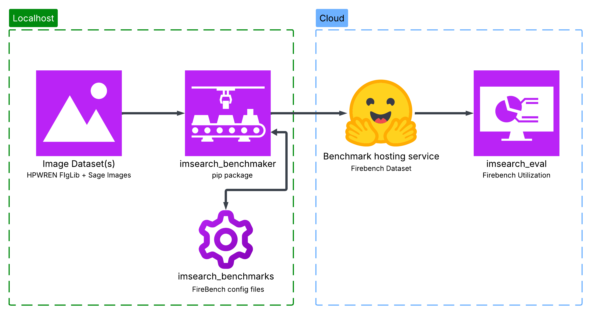
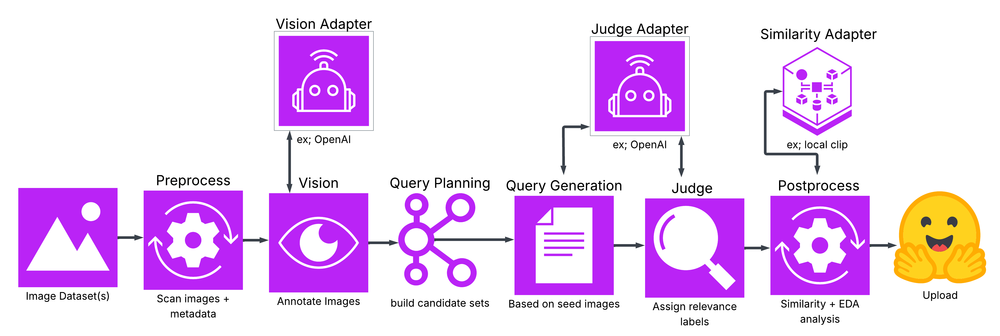
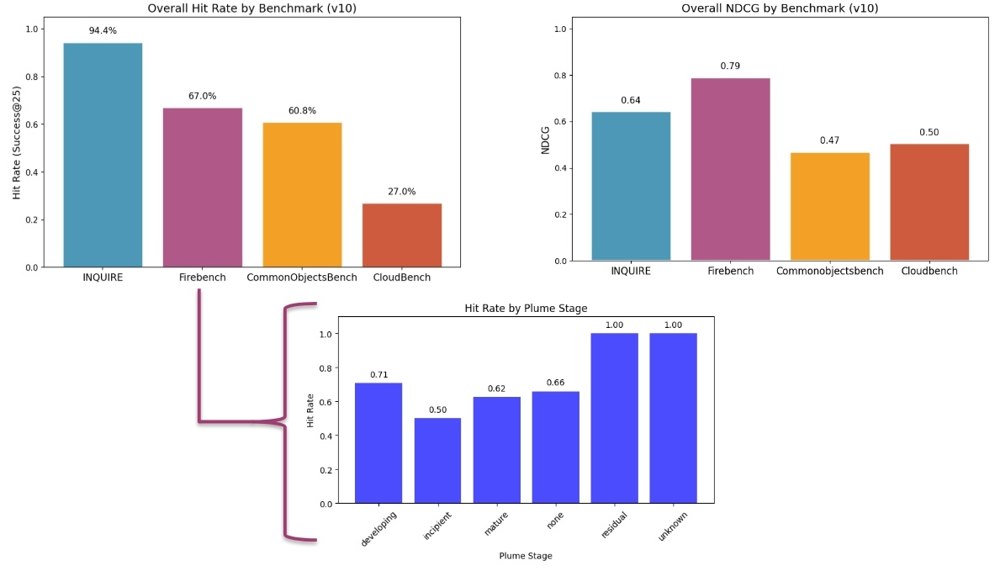
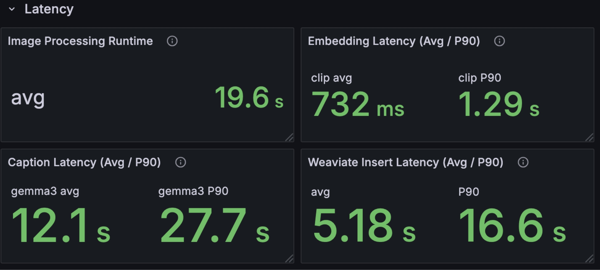

# Benchmarking AI-Powered Image Search at Scale

As we develop AI-powered [image search](./image-search) across Sage’s nationwide cyberinfrastructure, one challenge quickly stood out:

**How do you know your search system is actually improving?**

With tens of millions of images collected from distributed edge devices, intuition isn’t enough. We need **rigorous, scalable evaluation**.

This is the story of how we built that.

## The Challenge: Measuring Search Quality at Scale

Sage Image Search is not a single model—it’s a full pipeline:

* Captioning models interpret images
* Embedding models map them into a semantic space
* A vector database retrieves candidates
* Keyword search adds precision
* Reranking models refine the results

Each component can change independently. A new embedding model might improve relevance but increase latency. A prompt tweak might subtly shift results.

Without benchmarking, it’s impossible to answer:

* Did relevance actually improve?
* Are results better across all domains—or just a few?
* What’s the tradeoff between accuracy and performance?

This gap between experimentation and validation is a well-known challenge in AI systems and one we set out to solve directly.

## What We’re Benchmarking

At its core, Sage Image Search enables **semantic exploration of massive visual datasets**.

Instead of relying on metadata like timestamps or tags, users can search using natural language:

> “smoke plume forming over mountains at sunset”
> “dense clouds before a storm”

The system works by:

1. Generating captions for images
2. Embedding both images and text into a shared space
3. Performing hybrid search (semantic + keyword)
4. Reranking results for relevance

This hybrid approach allows researchers to explore data by **content, not just labels**, unlocking new scientific workflows across domains like ecology, atmospheric science, and wildfire detection.

## Building a Benchmarking Ecosystem

To evaluate this system end-to-end, we built a modular benchmarking ecosystem designed specifically for image retrieval.

> *Figure 1: Image Search Benchmarking Flow.* This diagram shows the flow of the benchmarking ecosystem. Starting from the left, we have the raw image dataset(s). Then, we have the benchmark generation step, which creates the benchmarks. From there, we have imsearch_benchmarks, which is the config storage for the benchmarks and huggingface which is the dataset storage for the benchmark. Finally, we have imsearch_eval, which is the evaluation framework that runs the benchmark on the live retrieval system.

### 1. Benchmark Generation ([imsearch_benchmaker](https://github.com/waggle-sensor/imsearch_benchmaker))

The first problem: datasets.

This step turns raw image collections into structured evaluation datasets through an automated, AI-driven pipeline (see Figure 2).

* Takes a folder of images + a config file
* Runs an end-to-end pipeline
* Produces structured queries and relevance labels
* Supports difficulty control and domain-specific tuning
* Uses adapter-based components (vision, judge, similarity) that can be swapped
* Fully reproducible

> *Figure 2: Image Search Benchmaker Flow.* This diagram shows the end-to-end benchmark generation pipeline. Raw images are ingested and preprocessed, then passed through a vision-language model for annotation. These annotations are used to plan and generate queries, which are paired with candidate images. An AI judge evaluates relevance and assigns labels, followed by postprocessing and analysis. The final output is a structured, reproducible benchmark dataset.

A key piece of this system is the **AI layer**:

* Vision-language models generate captions and annotations
* LLMs generate diverse, realistic queries
* AI judges evaluate relevance and assign labels

This means datasets are not just automated—they are **semantically rich and scalable**, without requiring manual labeling.

Because everything is config-driven, benchmarks can be regenerated or modified with minimal effort.

This allows us to create datasets that are:

* **Tailored to Sage's user domains and use cases**
* **Consistent across experiments**
* **Scalable to large image collections**

From here we can now easily create domain-specific benchmarks.

### 2. Domain Benchmarks ([imsearch_benchmarks](https://github.com/waggle-sensor/imsearch_benchmarks))

We’ve created a growing collection of domain-specific benchmarks, each designed to evaluate image retrieval in realistic scientific and operational settings:

* **[FireBench](https://huggingface.co/datasets/sagecontinuum/FireBench)** – fire and smoke detection
* **[CommonObjectsBench](https://huggingface.co/datasets/sagecontinuum/CommonObjectsBench)** – general scenes
* **[CloudBench](https://huggingface.co/datasets/sagecontinuum/CloudBench)** – atmospheric science
* **[Inquire](https://huggingface.co/datasets/sagecontinuum/INQUIRE-Benchmark-small)** – biology-focused retrieval
* **[SageBench](https://huggingface.co/datasets/sagecontinuum/SageBench)** – Sage metadata-driven retrieval

Each benchmark is built using imsearch_benchmaker, ensuring consistency in how datasets are generated and evaluated. The benchmarks include structured natural language queries, relevance labels (generated via AI + controlled sampling), and rich metadata (e.g., environment, conditions, categories). This structure enables fine-grained evaluation and analysis of the system's performance. Because benchmarks are modular and config-driven, new domains can be added easily—making this a **living benchmark suite** that evolves alongside the system. In practice, this allows us to move beyond “average performance” and answer deeper questions like:

* Does the system perform better on **smoke vs clouds**?
* Does it struggle with **early-stage vs mature events**?
* How does performance vary across **scientific domains**?

Instead of a single score, we gain a **multi-dimensional view of system behavior**, enabling us to evaluate performance across the diverse domains Sage users operate in.

### 3. Evaluation Framework ([imsearch_eval](https://github.com/waggle-sensor/imsearch_eval))

This is where everything comes together.

`imsearch_eval` runs benchmarks against the **live retrieval system**, not just isolated components, capturing the full behavior of the pipeline from query → retrieval → reranking.

It computes a range of complementary metrics:

* **Accuracy**: how many of the top-*k* results are relevant?
* **Precision & Recall**: how well the system retrieves relevant results overall
* **NDCG**: how well relevant results are ranked toward the top
* **MRR**: how high in the ranked list the first relevant result appears
* **Hit Rate**: whether at least one relevant result appears in the top-*k*
* **Diversity (1 − ILS)**: how varied the results are (avoiding near-duplicates)

Each metric captures a different aspect of search quality, no single score tells the full story.

Beyond metrics, the framework is designed for **experimentation at scale**. It allows us to run full benchmark suites across different model configurations and supports backend-agnostic evaluation (models, vector DBs, datasets).

Because it operates on the real system, it captures effects that isolated testing would miss, such as interactions between embedding and reranking models, tradeoffs between relevance and latency, and failure modes in specific domains or query types.This makes evaluation **representative of actual user experience**, not synthetic approximations. In practice, `imsearch_eval` turns evaluation into a continuous loop:

> change → evaluate → compare → iterate

—enabling fast, evidence-driven improvements to the system.

> *Figure 3: Benchmarking Example Graph.* This figure shows an example graph you can generate using the results outputted by imsearch_eval. You can see that the results can be drilled down to answer similar questions we asked in the previous section.

### 4. Real-Time Monitoring

Evaluation doesn’t stop with offline metrics.

We continuously monitor the system in production to understand how it behaves under real workloads—not just controlled benchmarks.

We track:

* **Query latency**: how long it takes to return results end-to-end
* **Model performance over time**: trends in relevance metrics across deployments
* **Regression detection**: identifying when changes degrade performance

This is critical because real-world systems operate under **dynamic conditions**—data changes, workloads shift, etc. Continuous monitoring helps detect these issues early before they impact users.

It also provides visibility into one of the most important tradeoffs in AI systems:

> **quality vs. compute (latency)**

Lower latency often requires simplifying models or reducing computation, which can impact accuracy, while higher-quality results typically come with increased computational cost and delay.

By tracking both in real time, we can:

* Compare system configurations under realistic conditions
* Detect when optimizations hurt relevance (or vice versa)
* Make informed decisions about deployment tradeoffs

In practice, this turns monitoring into a feedback loop:

> deploy → observe → detect → adjust

—ensuring the system remains **reliable, performant, and aligned with user needs** across Sage's diverse environments.

> *Figure 4: Latency Monitoring Dashboard.* This dashboard shows the latency monitoring for the image search system. You can see the latency for different components of the system and the overall latency.

## Scaling Experiments with HPC

To make this practical at scale, benchmarking runs on [NRP](https://nrp.ai/), a community-owned research platform that provides access to distributed GPUs, large-scale storage, and high-performance networking for AI workloads.

NRP operates as a **national-scale, distributed computing infrastructure**, allowing researchers to run large, parallel workloads across hundreds of nodes and datasets.

This enables:

* **Parallel model comparisons**: evaluate multiple embeddings, rerankers, or prompts at once
* **Large-scale query evaluation**: run thousands of queries across millions of images
* **Realistic workload simulation**: mirror production-scale usage instead of small test sets
* **Fast, repeatable experiments**: spin up experiments, run, and reproduce results reliably

Crucially, this shifts how experimentation is done.

Instead of:

> testing one model change at a time

we can:

> evaluate **entire system configurations in parallel**

This is especially important for a system like Sage Image Search, where performance depends on *interactions between components* (captioning, embeddings, retrieval, reranking).

HPC makes it possible to:

* explore a much larger design space
* compare tradeoffs (quality vs latency) across configurations
* iterate faster without sacrificing rigor

In practice, NRP turns benchmarking from a slow, sequential process into a **high-throughput experimentation loop**, enabling rapid, evidence-driven improvements at scale.

## AI as a Judge

One of the most powerful ideas in this system is how we generate labels.

Rather than relying solely on human annotation, we use **AI models to evaluate relevance**:

* Fast and cost-effective
* Works without pre-labeled data
* Scales to large datasets

While not perfect, AI judges are often **good enough to guide system development**, enabling rapid iteration where human labeling would be infeasible.

### Why AI as a Judge Works (and When It’s Enough)

One of the most common and valid questions when building evaluation systems like this is:

> *“Can you really trust AI to evaluate AI?”*

It’s a fair concern. But in practice, using AI as a judge is not only viable, it’s often the **only scalable option** for systems like ours.

Let’s break down why.

#### 1. Scale: Fast, Cheap, and Practical

Human evaluation is the gold standard, but it doesn’t scale.

Evaluating even a modest benchmark:

* Hundreds of queries
* Thousands of images
* Multiple system variants

…quickly becomes **expensive, slow, and operationally complex**.

AI judges solve this:

* Run in seconds instead of hours
* Cost orders of magnitude less
* Easily parallelizable across large datasets

This makes continuous evaluation possible, not just occasional validation.

#### 2. Works Without Ground Truth

Traditional evaluation depends on labeled datasets. But in many real-world systems, especially multimodal ones, **ground truth doesn’t exist**.

For example:

* What’s the "correct" image for a query like *"early-stage wildfire smoke"*?
* How do you label nuanced scientific imagery at scale?

AI judges remove this dependency.

Instead of comparing against fixed labels, we can:

* Ask the model to evaluate relevance directly
* Score results based on semantic alignment
* Compare outputs pairwise

This makes evaluation possible in domains where labeling is infeasible or ambiguous.

#### 3. Comparable to Human Judgment

The biggest concern is reliability.

But recent research shows that **strong AI judges closely match human evaluators**:

* Studies using MT-Bench found that models like GPT-4 achieve **~85% agreement with human judgments**, which is actually *higher than agreement between humans themselves (~81%)* (Zheng et al., 2023 [arXiv](https://arxiv.org/abs/2306.05685))
* More broadly, LLM judges consistently reach **~80%+ agreement**, approaching human-level consistency (Dubois et al., 2023 [arXiv](https://arxiv.org/abs/2404.04475))

This is a key insight:

> Human evaluation is not perfectly consistent either.

AI judges don’t need to be perfect, they need to be **as consistent and directionally correct as humans**.

#### 4. AI as an Aggregation of Human Preferences

Another way to think about this:

AI models are trained on massive datasets of human-generated content.

In many cases, they act as an **aggregation of human preferences at scale**.

This makes them surprisingly good at answering questions like:

* “Which result is more relevant?”
* “Which explanation is better?”
* “Does this match the query intent?”

Just like asking a person for their opinion, we’re asking a model to **approximate collective human judgment**.

#### 5. Prompting Matters (A Lot)

AI judges are not plug-and-play—they’re **prompt-sensitive**.

With the right setup, they can:

* Evaluate multiple criteria (relevance, correctness, clarity)
* Provide structured scores
* Generate reasoning for their decisions

Without proper prompting, they can be inconsistent or biased.

This is why our system:

* Uses carefully designed evaluation prompts
* Standardizes scoring criteria
* Keeps evaluation reproducible

With the right prompt + model combination, AI judges become **surprisingly reliable across domains**.

#### 6. “Good Enough” Is Often Enough

The goal of benchmarking is not perfection, it’s **guidance**.

Even if AI judgments are imperfect, they can still:

* Detect improvements
* Identify regressions
* Compare system variants
* Provide directional confidence

As highlighted in [AI Engineering by Chip Huyen](https://github.com/chiphuyen/aie-book):

> Even when AI judgments aren’t as good as human judgments, they can still be *good enough to guide development*.

And that’s exactly what we needed for Sage Image Search—**fast, iterative, evidence-driven progress**.

## Final Takeaway

AI as a judge is not a replacement for humans, it’s a **scaling mechanism for evaluation**.

It allows us to move from:

> Occasional, expensive human evaluation

to:

> Continuous, automated, system-wide benchmarking

And for a system operating at the scale of Sage, that shift is what makes meaningful iteration possible.

## What This Unlocks

With this benchmarking system in place, Sage Image Search is no longer a black box.

We can now:

* Compare models objectively
* Measure improvements scientifically
* Track performance across domains
* Iterate faster with confidence

Benchmarking is now:

* **Reproducible** – same inputs, same results
* **Modular** – swap models and components easily
* **Scalable** – evaluate at production scale
* **Aligned with reality** – reflects the actual pipeline

## Closing Thoughts

As AI systems become more complex, **evaluation becomes the bottleneck**.By building a scalable, modular benchmarking ecosystem, we’re turning evaluation into a strength—one that enables faster innovation, better models, and more reliable tools for scientific discovery.

Check out the [sage-nrp-image-search](https://github.com/waggle-sensor/sage-nrp-image-search/tree/main/benchmarking) repository to see the benchmarking ecosystem in action.