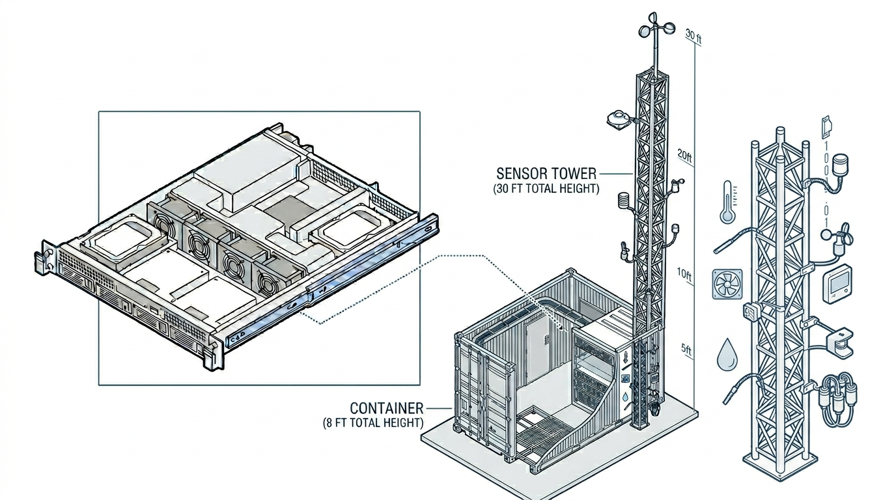
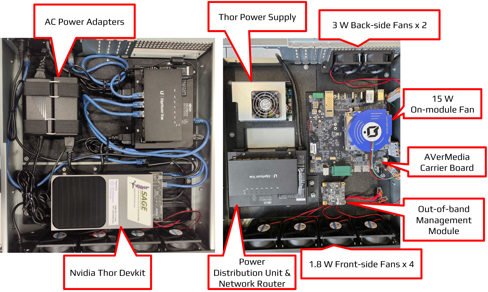
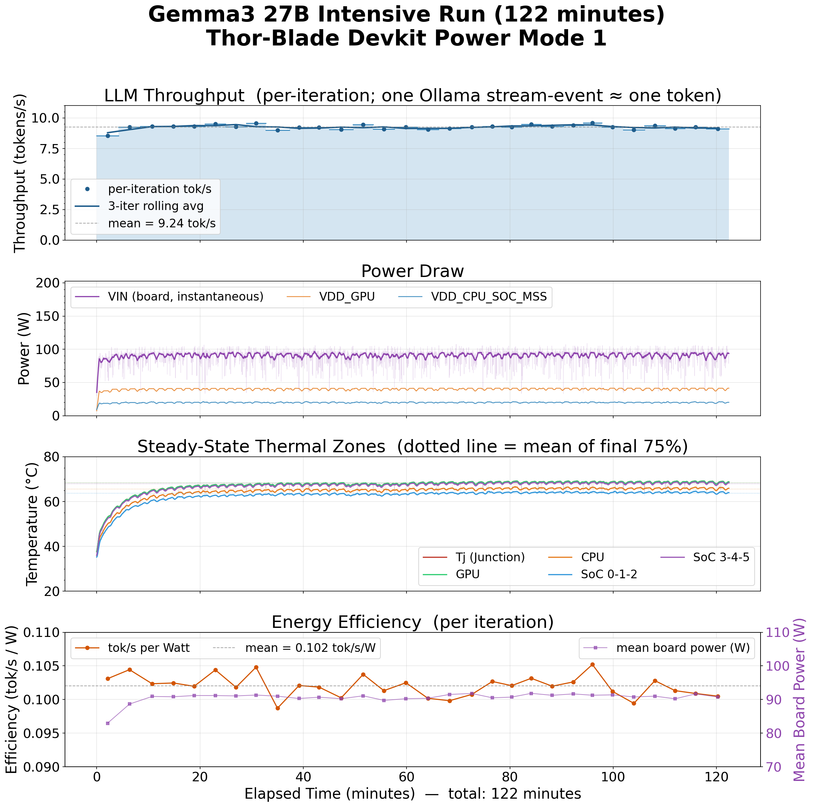
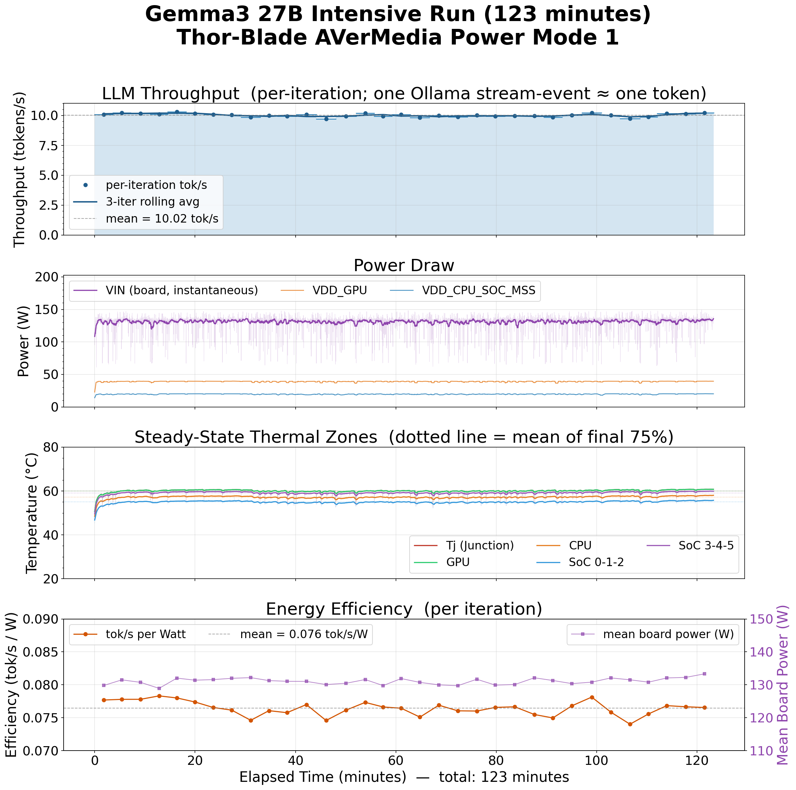

# Next-Generation Nodes for AI

AI is moving fast, and edge hardware is getting powerful and compact. The next-generation node in Sage Grande Testbed (SGT) is built for that exact challenge: bringing high-performance AI where data is created, in the field, in real time, and at scale.

## Indoor SGT Thor Blade Nodes

We have developed two new node architectures powered by [NVIDIA Jetson Thor technology](https://www.nvidia.com/en-us/autonomous-machines/embedded-systems/jetson-thor/):

1. Thor Blade with [**NVIDIA Jetson Thor Developer Kit**](https://marketplace.nvidia.com/en-us/enterprise/robotics-edge/jetson-thor-developer-kit/)
2. Thor Blade with [**AVerMedia carrier board**](https://professional.avermedia.com/product-detail/D331)

Both designs push AI capability directly to the edge, so users can run advanced foundation models close to sensors, reduce latency, and unlock faster decisions. These SGT nodes are formed in server rack chassis and can be deployed in an indoor environment, like a building or field-deployable container (see below).

> NOTE: The illustration above is AI generated.

#### 1) Thor Blade DevKit Node

The devkit-based node is our high-flexibility platform for rapid prototyping, model bring-up, and educational AI exploration. It gives researchers, developers, and students room to move quickly: test new model pipelines, connect multiple data sources, and iterate without friction.

This DevKit configuration is the precursor "v0" version of the node, used to validate architecture and operations before the Carrier Board Node design.

For full setup details, deployment steps, and operational guidance, see the detailed manual:

[SGT Manual: Thor Devkit Blade (PDF)](../docs/manuals/SGT_Manual_ThorDev_Blade_V1.0.pdf)

#### 2) Thor Blade + Carrier Board Node

The Thor Blade node with AVerMedia carrier board brings the same Thor compute core into a form factor optimized for production-style deployments. This architecture is designed for repeatability and scalability, making it easier to deploy powerful AI capability across larger fleets of edge sites. Additionally, [the out-of-band management module](https://professional.avermedia.com/product-detail/ERMI-module) enables remote device management for recovering the Thor device from failures.

### **What's under the hood**

The components inside SGT Thor Blade Nodes: (left) Thor Blade Devkit node and (right) Thor Blade + carrier board node.

1) Networking: The Thor Blade node accepts wired network and distribute the network inside the node. This allows components in the node to be connected for remote operation on these individual components. Separated from the wired network, the node manages its private network to host sensors and actuators that need edge computing. A power over Ethernet (PoE) device can be connected to the private network to connect network-based sensors.

2) Power Management: The power distribution unit (PDU) manages power for the network router and Thor device, ensuring that we can recover them from some failures that need powercycling.

3) Active Cooling: The Thor device is rated to consume over 100 W for computation, which is around 10 times more than our Wild Sage node with Jetson Xavier NX.

4) Out-of-band Management (Thor Blade + carrier board node only): This device provides remote management for the Thor device including serial console access, power control, and OS update via BSP OTA.

### Thermal and Energy Evaluation

We present a thermal characterization of the SGT Thor Blade nodes under sustained foundational AI inference. We set different module power modes to limit the maximum performance and measure AI inference throughput. The table below shows a summary of the characterization on the Thor Blade nodes over 3 Thor power modes (70 W, 120 W, and maximum) (see [Jetson Thor Module Power Modes](https://docs.nvidia.com/jetson/archives/r38.4/DeveloperGuide/SD/PlatformPowerAndPerformance/JetsonThor.html#supported-modes-and-power-efficiency)).

| Metric | SGT Thor Blade Devkit | SGT Thor Blade AVerMedia |
| --- | --- | --- |
| AI throughput | 9.72 - 8.13 tokens/sec | 9.2 - 10.43 tokens/sec |
| Power consumption | 80 - 100 W on average | 120 - 140 W on average |
| Ambient temperature on SoC | 60 - 70 C | 58 - 62 C |
| Energy efficiency | 0.1 tokens/sec per W on average | 0.078 tokens/sec per W on average |

The Thor Blade with AVerMedia carrier board has additional cooling fans constantly consuming at around 30 W (15 W + 6 W + 7.8 W) and 2 NVMe cards; this explains the difference in power consumption from the Devkit node. As a result, the SoC temperature is about 8 degree Celsius less, and AI throughput is slightly higher.

For reference, a couple of detailed time series plots are presented as follows,

## Wild SGT Node for Outdoor Deployment
(coming soon!)

**[Contact us](/docs/contact-us) on node design and deployment for your science!**
