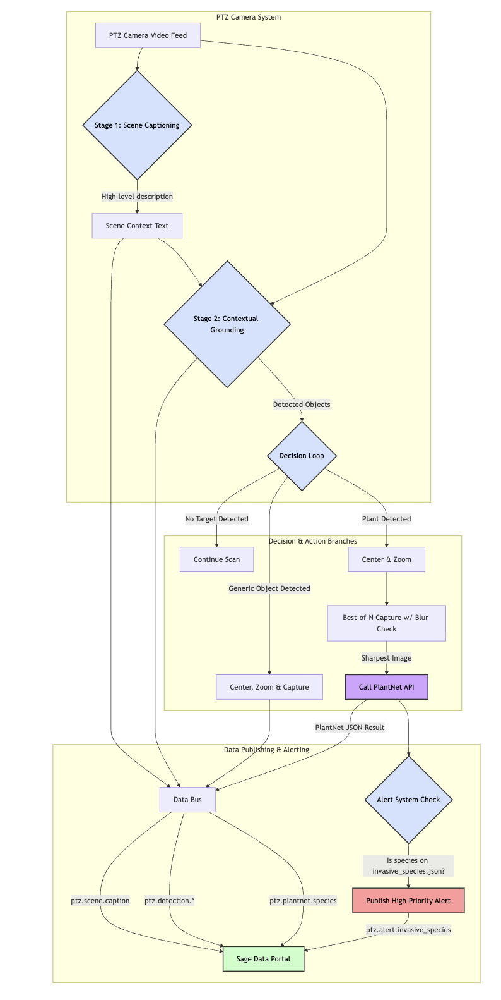
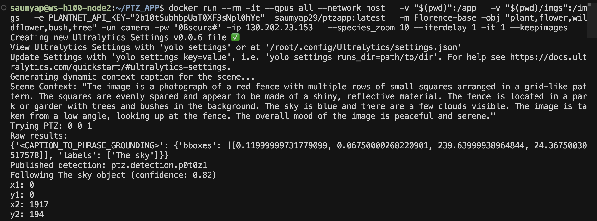

import LabButtons from './components/LabButtons'

# PTZ-App: Smarter Cameras for Wildlife and Scene Monitoring

<LabButtons id="ptz-app" />

Whether you're monitoring wildlife, securing an area, or collecting snapshots from dynamic outdoor scenes, this application helps you do it automatically, intelligently, and efficiently.

This article walks through this new architecture, its advanced capabilities, and how it enables more targeted and meaningful environmental monitoring.

---

## What We're Building

This application transforms a standard PTZ camera into a smart, self-directing observation system. It has evolved beyond a simple scanner to a context-aware agent.

> **Note:** The PlantNet integration below is an *example use case* if you are exploring the plant detection path. It demonstrates how PTZ-YOLO’s detection and zooming capabilities can be extended for species identification and environmental analysis. It is not a required component of the PTZ-YOLO core functionality.

The application:

-   **Understands the scene** using a high-level captioning model.
-   **Performs a contextual scan** to find objects relevant to the scene's description.
-   Detects objects using models like **YOLO** or the more advanced **Florence-2**.
-   Automatically **centers and zooms** to get the best shot of a target.
-   Optionally performs **plant species identification** via PlantNet, using the sharpest image from a "best-of-N" capture sequence.
-   Publishes rich **metadata, logs, and high-priority alerts**.
-   Runs autonomously on the edge (no cloud inference required).

---

## Supported Models

The application supports two model types depending on the use case:

### YOLO (Default)
A lightweight and fast model for known, predefined categories. Ideal for speed and efficiency when you know what you're looking for.

**Example:**
```bash
--model yolo11n --objects "person,car,dog"
```

### Florence-2
A powerful vision-language model that enables the new "Intelligent Cascade" workflow. It's used for a sophisticated two-stage process that goes far beyond simple object detection:

1.  **Scene Captioning (`<MORE_DETAILED_CAPTION>`):** The model first generates a high-level, descriptive caption to understand the entire scene.
2.  **Contextual Grounding (`<CAPTION_TO_PHRASE_GROUNDING>`):** This caption is then used as context for the object detection prompt. The model is no longer just asked to find a "plant," but to find a "plant" *in the context of the scene it just described*.

**Example (Detect specific plants):**
```bash
--model Florence-base --objects "plant,tree,bush,wildflower"
```

**Example (Detect everything visible):**
```bash
--model Florence-base --objects "*"
```
---

## Workflow: The Intelligent Cascade

The application's architecture has been redesigned from a rigid, hardcoded process to a flexible, context-aware workflow. This shift allows the camera to make smarter decisions about what is important in a scene.



Here is how the new "Intelligent Cascade" operates:

1.  **Scene Captioning**: The process begins with Florence-2 generating a detailed caption of the entire scene to create a foundational understanding.
2.  **Contextual Scan & Phrase Grounding**: Instead of a blind 360° scan, the system uses the scene caption to inform its search for objects within that specific context.
3.  **Decision Loop**: Based on the objects found, the system enters a decision loop to trigger different actions based on node-specific logic or object type.
4.  **Publish Based on Decision**: Only after a decision is made does the system act. Actions can include zooming in, passing the image to PlantNet, or publishing the image and all associated metadata.

---

## Where It Runs

PTZApp is containerized and ready for deployment across different platforms:

-   **GPU Servers** (e.g. Dell blades) for high-throughput inference
-   **Waggle Nodes** (Jetson Xavier or AGX Orin) for sensor-rich environments in remote areas

---

## Key Features & Data Publishing

### Best-of-N Capture with a Blur Gate
To ensure high-quality images for species identification, the app captures 1–3 quick shots and scores each for sharpness. If the best image is still too soft (blurry), it performs a quick focus adjustment and retries once, ensuring PlantNet receives a clear image.

### Metadata Logging & Telemetry
The original pipeline only published an image, losing valuable intermediate data. The new system logs all reasoning and publishes multiple distinct data streams:

-   **`ptz.scene.caption`**: The overall scene context generated by Florence-2.
-   **`ptz.detection.*`**: A JSON payload with the label, confidence, bounding box, and camera PTZ coordinates for every detection.
-   **`ptz.plantnet.species`**: The full JSON result from the PlantNet API.

### The Alert System
The system can now actively monitor for important events. Using configurable lists of species (e.g., `invasive_species.json`), it checks the PlantNet results. If a species of interest is detected, it publishes a **high-priority alert** (e.g., `ptz.alert.invasive_species`).

---

## How to Run

### Docker (Recommended for GPU servers)
```bash
docker run --rm -it --network host \
  -v "$(pwd)/imgs":/imgs \
  -v hf_cache:/hf_cache \
  -e PLANTNET_API_KEY='<your_plantnet_api_key>' \
  -e BLUR_MIN=120 \
  -e SPECIES_MIN_SCORE=0.25 \
  saumyap29/ptzapp:latest \
    -m Florence-base \
    -obj "plant,tree,bush,wildflower" \
    -un <camera_user> -pw '<camera_pass>' -ip <camera_ip> \
    --species_zoom 10 --iterdelay 0 -it 1 --keepimages --debug
```

### Python directly (For development)
```bash
export PLANTNET_API_KEY="<your_plantnet_api_key>"
python main.py \
  -m Florence-base \
  -obj "plant,tree,bush,wildflower" \
  -un <camera_user> -pw '<camera_pass>' -ip <camera_ip> \
  --species_zoom 10 --iterdelay 0 -it 1 --keepimages --debug
```
---

## Tunables & Flags

-   `--objects`: Comma-separated list of items to detect (e.g., `"person,car"`). Use `"*"` with Florence to find all objects.
-   `--confidence`: Detection confidence gate (default `0.1`).
-   `--species_zoom`: Extra relative zoom applied to large plants before PlantNet capture (e.g., `10`).
-   `BLUR_MIN` (env): Sharpness threshold (Laplacian variance) for an image to be considered clear.
-   `SPECIES_MIN_SCORE` (env): Minimum PlantNet score required to publish a species result.
-   `--keepimages`: Prevents deletion of saved images in the `/imgs` directory.
-   `--debug`: Enables verbose console logging for troubleshooting.

---

## What You’ll See (Outputs)

This section shows the step-by-step output flow from the application, from initial scene analysis to final species identification.

### Step 1: Scene Captioning
The process begins with the camera taking a wide shot of the area. The Florence-2 model then generates a detailed text description of this image to establish context.

**Initial Image:**


**Console Log:**


---

### Step 2: Plant Detection and Workflow Trigger
Using the scene context, the model performs phrase grounding to locate objects. When it identifies an object with a plant-related label (like "trees"), it automatically triggers the species identification workflow.

**Image:**


**Console Log:**


---

### Step 3: Auto-Zoom and Best-of-N Capture
The system automatically centers the camera on the detected plant and zooms in to get a better view. It takes multiple candidate shots (typically 3 tries) to ensure it can send the sharpest possible image to PlantNet.

**Saved Candidate Images:**
A list of the three candidate images saved by the system with additional zoom in each

**Example of a Zoomed-in Shot:**


---

### Step 4: Final Species Identification
The sharpest image is sent to the PlantNet API. The final log shows the successful identification, including the scientific name, common names, and the confidence score.

**Final Shot Sent:**


**Console Log:**


---

## Why It Matters: Scientific & Environmental Use

This intelligent approach to observation enables long-term, low-impact monitoring of ecological systems. This is ideal for:

-   **Wildlife Monitoring**: Track animal and plant presence with targeted, high-quality snapshots without human disturbance.
-   **Biodiversity Studies**: Build rich, labeled datasets for conservation research and AI training.
-   **Low-Bandwidth Operation**: Operate effectively in remote field locations by only uploading the most important moments and data.

Captured images are enriched with metadata like timestamps, PTZ coordinates, object labels, and—when applicable—plant species information.

---

## Limitations & Notes
- PlantNet accuracy depends heavily on image quality and the visibility of key organs (flowers, leaves). Adjust `--species_zoom` and `BLUR_MIN` for your specific camera and environment.
- Night scenes or scenes with heavy motion may require higher camera settle delays or confidence thresholds.
- Florence-2 is more compute-intensive than YOLO; choose your model based on the device's capabilities and your detection needs.

---

## What’s Coming Next

The project has several exciting directions ahead:

-   **Better Organ-Aware Framing**: Intelligently frame shots to focus on leaves, flowers, or fruit for more accurate species ID.
-   **Event-Based Triggers**: Use audio or motion sensors to trigger the camera, reducing power consumption and latency.
-   **Multi-Camera Coordination**: Track a single object as it moves across the views of several cameras.
-   **Active Learning**: Build systems to refine the detection models based on feedback from field data.

---

## Get Involved

If you are working on smart sensing, wildlife AI, or remote image collection, we invite you to explore this project. It is open, modular, and ready for collaboration. Contributions and issues are welcome.

<LabButtons id="ptz-app" />
