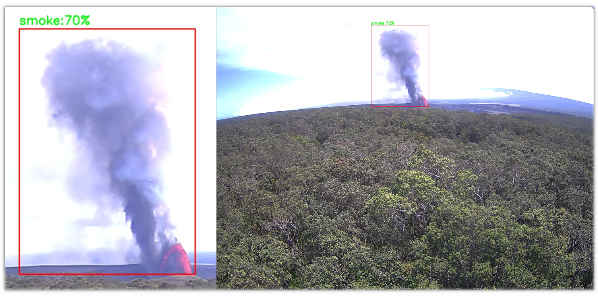
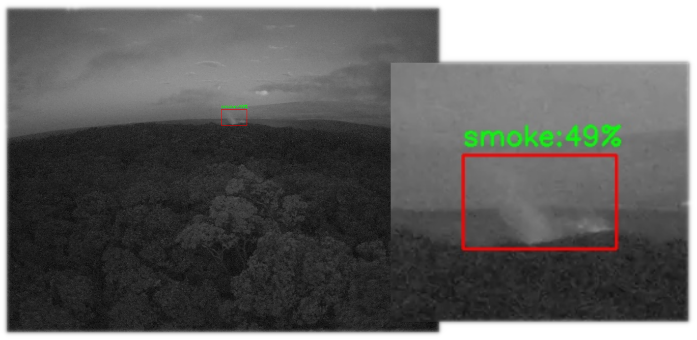
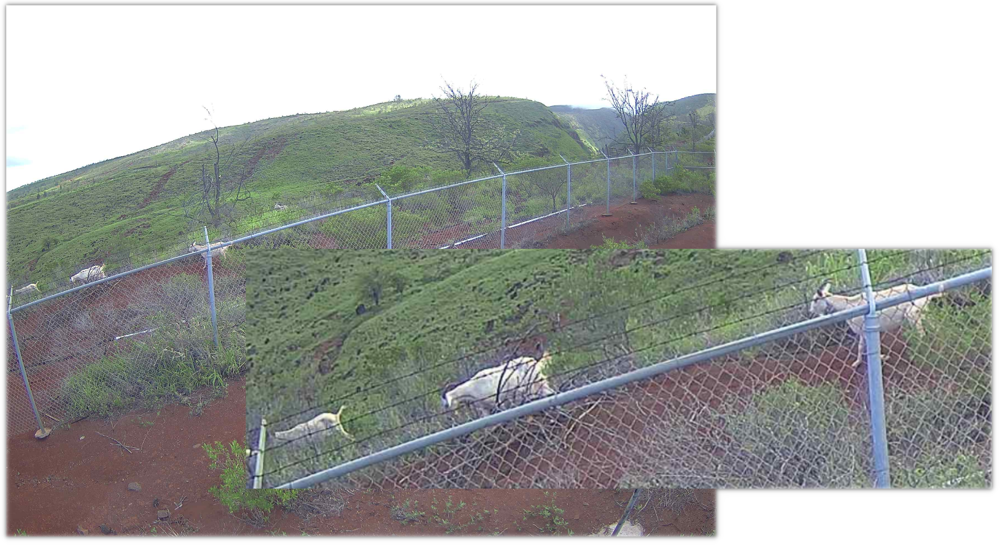
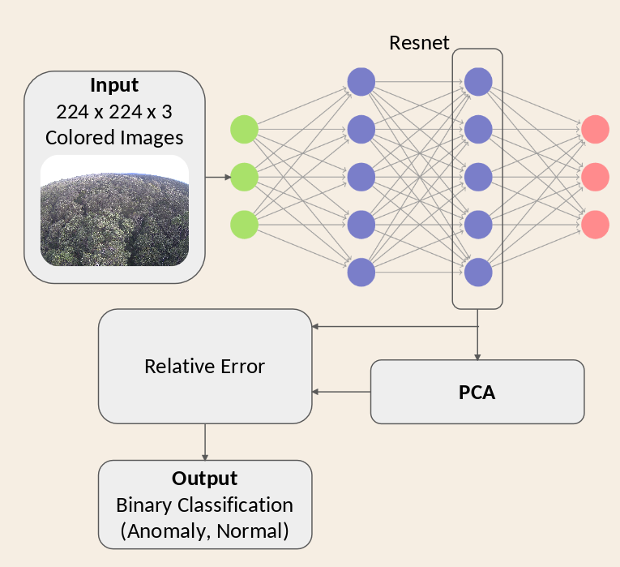
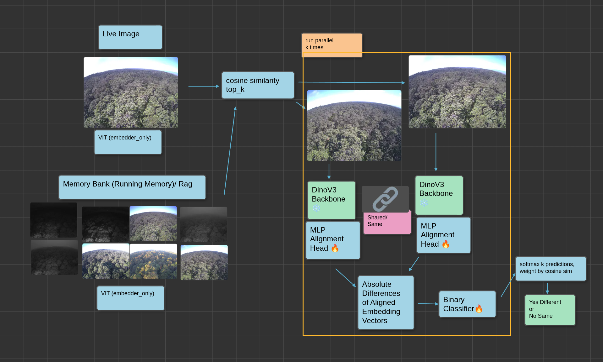

import LabButtons from './components/LabButtons'

# Volcano, Fire, and Anomaly Detection

<LabButtons id="volcano-fire-anomaly" />

## Detecting volcanic activity, fire, and anomalies using advanced AI models and edge computing.

## Introduction

If you need a way to monitor the environment continuously and detect critical events as they happen, this work is for you. As extreme weather events and natural disasters become increasingly frequent, there is a growing need for smart systems that can keep watch over our surroundings 24/7 in real time and flag significant deviations from normal conditions early and reliably—such as wildfires, volcanic eruptions, or severe weather.

What began as a narrowly scoped effort focused only on detecting fire and smoke quickly evolved into a broader research program exploring generalizable approaches for detecting unusual activity. We define this unusual activity or anomalies as prominent semantic changes, rare events that are out of distribution, or scenarios very unlikely to occur. As an example, tree swaying, lens flares, or shifting clouds patterns are generally to be considered normal under the assumption that they occur frequently, while a meteor or an eruption could be anomalous given that they rarely occur. The hope is to create an generalized approach to monitor the environment for disaster scenarios. The experiments are arranged in chronological order. New ideas, shifting requirements, and perspective changes on the problem are the main contributors to constantly creating new experiments for an effective solution. Imagery and demonstrations throughout the page will show the real world efficacy and impact of our experiments running on the Sage Nodes!

## Contributions

While our methodology and model piplines are similiar to pre-existing methods and standards, our contribution is focused on tweaking and applying these models for the purposes of the Sage Sensor network and natural environment conditions. This involves:

- Dataset creation fueled by Sage's historical data
- Creating, modifying, and finetuning VLM and AI pipelines then fitting them into the Sage ECR ecosystem
- Testing AI models on the Sage Network and Sage's historical data

## Experiments

### Object Detection: YOLOv7 Image Detection

#### Purpose

The primary goal of this experiment was to utilize the GPU, [Xavier NX](https://www.nvidia.com/en-us/autonomous-machines/embedded-systems/jetson-xavier-nx/), on the Sage Node for the detection of fire and smoke. Incidentally, this project provided an opportunity to familiarize ourselves with the Sage ecosystem.

#### Background and Methodology

The base model used for object detection is [YOLOv7](https://arxiv.org/abs/2207.02696) and was finetuned on the [DFire Dataset](https://github.com/gaia-solutions-on-demand/DFireDataset). YOLOv7 was selected because similar models have been demonstrated to run successfully on the Sage Node's hardware and software stack.

#### Dataset

The [DFire Dataset](https://github.com/gaia-solutions-on-demand/DFireDataset) contains a total of 21,527 images and labels: 17,221 images and labels are for training, and 4,306 are for testing. According to one of the main developers and authors for YOLO, [Alexey Bochkovskiy](https://github.com/AlexeyAB), it is desirable that the training set includes images with non-labeled objects that we do not want to detect, and to use as many images of negative samples as there are images with objects. The D-Fire dataset adheres to those paradigms, where labeled and unlabeled data are split approximately 50/50. This helps the model distinguish between objects of interest and the background or other unrelated objects more effectively.

#### Evaluation

The training ran for 43 epochs over the span of 12 hours with a batch size of 20. Performance was evaluated on the test set, unseen during training. Scores range from 0 to 1.

|                                                                                                                                                              |
| :-----------------------------------------------------------------------------------------------------------------------------------------------------------------------------------------: |
| _Confusion Matrix showing the model has learned smoke and fire classifications. Notice the darker blue box for true predictions of smoke and darker blue box for true predictions of fire._ |

| Class | Precision | Recall | Mean Average Precision at 0.5 Threshold | Mean Average Precision at 0.95 Threshold |
| :---- | --------: | -----: | --------------------------------------: | ---------------------------------------: |
| All   |     0.740 |  0.734 |                                   0.783 |                                    0.434 |
| Smoke |     0.791 |  0.782 |                                   0.832 |                                    0.492 |
| Fire  |     0.688 |  0.685 |                                   0.733 |                                    0.377 |

#### Real Impacts

During this model's active deployment on the Sage sensor, we were able to detect volcanic eruptions by proxy of smoke. The following shows two examples of a detection. The model proved to be robust and accurate, but not a perfect solution. False negatives have still occurred, however their impact is mitigated by temporal redundancy; as images are captured frequently over time.

<!-- Consider adding mention of eruption events by... -->

|                                                                                        |
| :----------------------------------------------------------------------------------------------------------------------: |
| _In the figure above, we can see a zoomed-in image on the right, and adjacent is the full image captured by the camera._ |

|                                                                                                   |
| :---------------------------------------------------------------------------------------------------------------------------------: |
| _The image depicts an night time detection of smoke from the active volcano. A zoomed image on the right is shown for convenience._ |

#### Want to Run it on Your Own Sage Node?

##### Step 0: Account Creation

Make sure you have an account and are logged in. If not, please follow the [guide here](https://sagecontinuum.org/docs/getting-started).

##### Step 1: Template

Start by going here [creating a job](https://portal.sagecontinuum.org/jobs/create-job) and then copy and paste the following into the editor. **BUT WAIT!** Don't submit yet, we need to edit the following fields (described in step 2).

```yaml
name: yolo-fire-detection
plugins:
  - name: yolo-fire-detection
    pluginSpec:
      image: registry.sagecontinuum.org/giorgio808/yolov7-fire:0.1.5
      args:
        - -stream
        - bottom_camera
        - -sampling-interval
        - "0"
      selector:
        resource.gpu: "true"
      volume: {}
nodeTags: []
nodes:
  W097: null
scienceRules:
  - 'schedule(yolo-fire-detection): cronjob("yolo-fire-detection", "*/15 * * * *")'
successCriteria: []
```

#### Step 2: Deploy on [x] Node

Edit this line to be the name of your node, W097 is the name of the node in this example:

```yaml
nodes:
  W097: null
```

##### Step 2.1: (Optional) Rename

You may replace the name `yolo-fire-detection` with a unique identifier of your choice, remember to replace all four instances of the original name in the template.

##### Step 3

Once ready, click the submit job and wait for deployment on your node! You may monitor the status of your [job here](https://portal.sagecontinuum.org/jobs/my-jobs).

<!--  -->

#### Additional Resources

<!-- [Full Technical Report]() -->

[Github: Code](https://github.com/LAVA-RAPID/yolov7-fire)

[ECR App](https://portal.sagecontinuum.org/apps/app/giorgio808/yolov7-fire)

[Technical Report](img/volcano/assets/GiorgioProject.pdf)

### Vision Language Models: Moondream2 and GPT

#### Purpose

A significant amount of time commitment is required to create a dedicated fire detection model. Therefore, we noticed a strong emphasis on time efficiency when it comes rapid preparedness when dealing with the next upcoming disaster. This lead us to experiment with the use of off the shelf vision language models (VLMs) for ad-hoc detection applications. These VLMs are imbued with fundament knowledge thereby making them highly generalizable to most vision tasks and require minutes to create a prompt. This prompt essentially translates into a new classifier.

In essence, we would like to ask the model a question and receive an accurate reply. As an example, We would ask if the image contains signs of fire; the VLM should analyze and respond with a message denoting jf any fires exist in the scene.

#### Background and Methodology

Moondream is a multi-modal language model with vision capabilities while maintaining a low memory footprint which is ideal for edge deployment; where resources are often limited. Moondream was created by Vikhyat Korrapati, [learn more ➡](https://moondream.ai/about/us). To make this model available for practical usage on the Sage Nodes, our team created a containerized wrapper of Moondream with minor modifications to improve memory usage.

#### Dataset

This model was evaluated on the [DFire Dataset](https://github.com/gaia-solutions-on-demand/DFireDataset) and the [Forest Fire Images Dataset](https://www.kaggle.com/datasets/mohnishsaiprasad/forest-fire-images). Two datasets were used to reduce the probably of feeding the LLM with images seen during its training. Unfortunately direct access to view the whole [LLAVA Dataset](https://llava-vl.github.io/), which was used to finetune moondream, was restricted.

#### Evaluation

The model was evaluated on the D-Fire data set and is actively deployed as to monitor the Volcano and oversee Lahaina. Our primary use case, currently, is for the model to act as an extra pair of eyes. Results for the [Forest Fire Images Dataset](https://www.kaggle.com/datasets/mohnishsaiprasad/forest-fire-images) seemed suspiciously high, and images in that dataset may have already been seen by the VLM. Scores range from 0 to 1.

##### [Forest Fire Images Dataset](https://www.kaggle.com/datasets/mohnishsaiprasad/forest-fire-images)

|                                                                                                                      |
| :------------------------------------------------------------------------------------------------------------------------------------------------------: |
| _Confusion matrix of Moondream2B's performance on the [Forest Fire Images Dataset](https://www.kaggle.com/datasets/mohnishsaiprasad/forest-fire-images)_ |

| Accuracy | Precision | Recall |    F1 |
| -------: | --------: | -----: | ----: |
|    0.983 |     0.972 |  0.990 | 0.981 |

##### [DFire Dataset](https://github.com/gaia-solutions-on-demand/DFireDataset)

|                                                                                        |
| :------------------------------------------------------------------------------------------------------------------------------: |
| _Confusion matrix of Moondream2B's performance on the [DFire Dataset](https://github.com/gaia-solutions-on-demand/DFireDataset)_ |

| Accuracy | Precision | Recall |    F1 |
| -------: | --------: | -----: | ----: |
|    0.862 |     0.787 |  0.964 | 0.867 |

Moreover, in conjunction, we are monitoring the performance of GPT-4o-mini and GPT-4o-nano, which are models ran externally utilizing NAIRR (Unity) resources; outside of the Sage Sensor ecosystem. This was feasible via the usage of the Sage Data Client API. [learn more ➡](https://pypi.org/project/sage-data-client/)

#### Real Impacts

The following are events found by the AI during deployment. We were able to detect a vast amount of volcanic eruption events by assumed heuristic of smoke. However, when attempting to use the AI to detect for wildlife, anecdotally, the AI performed poorly. High rates of false positives were noticable when the model during email alerts, notifying of an detection. While performance was not ideal, the AI still managed to detect goats.

The follow images depicits detection of described events:

|                                                                                                                                                                                                                                                                                                                                                                            |
| :---------------------------------------------------------------------------------------------------------------------------------------------------------------------------------------------------------------------------------------------------------------------------------------------------------------------------------------------------------------------------------------------------------------: |
| _The text snippet is from the [Sage Query browser](https://portal.sagecontinuum.org/query-browser?nodes=W097&apps=registry.sagecontinuum.org%2Fchrislee%2Fmoondream-2%3A0.1.5.*&start=2025-10-19T19%3A00%3A00.000Z&end=2025-10-20T02%3A00%3A00.000Z&page=0), above is the image being referenced; captured on 10/19/2025 at 1:00 pm. Blue dots in the image are associated with Moondream's point functionality._ |

|                                                                                                   |
| :----------------------------------------------------------------------------------------------------------------------------: |
| _On rare occasion, goats were detected using GPT-4o, while Moondream2 was unable to detect. Captured on 2/19/2025 at 10:20 am_ |

|                                                                                                                                                                                                                                                                                                                                                                                                                                                                                                                      |
| :----------------------------------------------------------------------------------------------------------------------------------------------------------------------------------------------------------------------------------------------------------------------------------------------------------------------------------------------------------------------------------------------------------------------------------------------------------------------------------------------------------------------------------------------: |
| _Volcano image captured on 10/18/2025 at 1:17 am on the Sage Node W097. GPT-4o-mini describes this event as: Yes, the image you provided appears to depict a volcanic eruption, which is a type of natural disaster. Volcanic eruptions can cause significant damage through lava flows, ash fallout, and pyroclastic flows, potentially threatening lives, property, and the environment. If you need information about a specific recent volcanic activity or related natural disasters, please provide more context or specify the location._ |

Furthermore, benefit of a general model was leveraged; allowing for quick deployment with respects to the anticipation for [Hurricane Kiko](https://governor.hawaii.gov/newsroom/office-of-the-governor-news-release-emergency-proclamation-issued-ahead-of-hurricane-kiko/)'s arrival near Hawaii on 9/4/25. We adjusted the model's prompt to look out for signs of heavy weather, rainfall, and indications of hurricane-like events. This quick deployment served as an ad-hoc solution while more sophisticated and narrow models are being developed for the Sage Sensors. The following is an image detected by the VLM during that time; GPT-4o-mini responded with Yes to a heavy weather detection prompt, while GPT-4o-nano responded with a No.

|                                                                                |
| :--------------------------------------------------------------------------------------------------------------: |
| _Captured on W097 at 09/10/2025 15:34:10HST, approximately when Kiko has its nearest approach to Hawaii Island._ |

<!-- ANYTHING MEANINGFUL found during Hurrican Kiko? -->

#### Want to Run it on Your Own Sage Node?

##### Step 0: Account Creation

Make sure you have an account and are logged in. If not, please follow the [guide here](https://sagecontinuum.org/docs/getting-started)

##### Step 1: Template

Start by going here [creating a job](https://portal.sagecontinuum.org/jobs/create-job) and then choose one of the two (moondream, moodream-2b) templates. Copy and paste the following into the editor. **BUT WAIT!** Don't submit yet, we need to edit the following fields (described in step 2).

###### moondream

Use this for memory limited deployment environments. Querying the VLM works, but is highly unreliable. It is recommended to just have the VLM caption.

```yaml
name: moondream
plugins:
  - name: moondream
    pluginSpec:
      image: registry.sagecontinuum.org/chrislee/moondream-2:0.2.0
      args:
        - --small
        - --stream
        - bottom_camera
        - --caption
      selector:
        resource.gpu: "true"
      resource:
        limit.cpu: "1"
        limit.memory: 3Gi
        request.cpu: "1"
        request.memory: 3Gi
      volume: {}
nodeTags: []
nodes:
  W097: null
scienceRules:
  - 'schedule(moondream): cronjob("moondream", "*/30 * * * *")'
successCriteria: []
```

###### moondream2b

This is the full 2B parameter model that is capable of proper querying, point, detect and captioning. Hallucinations are semi-frequent for complex tasks, use with caution; evaluate before official usage.

```yaml
name: moondream-2b
plugins:
  - name: moondream-2b
    pluginSpec:
      image: registry.sagecontinuum.org/chrislee/moondream-2:0.2.0
      args:
        - --dynamic-loading
        - --stream
        - bottom_camera
        - --caption
        - --point
        - smoke
        - --point
        - fire
        - --point
        - hazard
        - --query
        - Is there a fire?
      selector:
        resource.gpu: "true"
      resource:
        limit.cpu: "3"
        limit.memory: 7Gi
        request.cpu: "3"
        request.memory: 7Gi
      volume: {}
nodeTags: []
nodes:
  W097: null
scienceRules:
  - 'schedule(moondream-2b): cronjob("moondream-2b", "*/30 * * * *")'
successCriteria: []
```

Learn more with this slide deck!
| [](img/volcano/assets/encapsulation.pptx) |
| :------------------------------------------------------------------------: |
| Slides: [download ⤓](img/volcano/assets/encapsulation.pptx) |

##### Step 2: Deploy on [x] Node

Edit this line to be the name of your node:

```yaml
nodes:
  W097: null
```

##### Step 2.1: (Optional) Rename

You may replace the name `fire-detection` with a unique identifier of your choice, remember to replace all four instances of the original name.

##### Step 3

Click the submit job and wait for the deployment on your node! You may monitor the status of your [job here](https://portal.sagecontinuum.org/jobs/my-jobs). Do note that it will take a significant amount of time, hours, until the first job completion because the model is being download onto the node in a bandwidth limited environment.

<!--  -->

#### Additional Resources

[Github: Code](https://github.com/cleeuh/moondream-for-sage-node)

[ECR App](https://portal.sagecontinuum.org/apps/app/chrislee/moondream-2?tab=data)

### Anomaly Detection: PCA with Resnet Feature Extractor

#### Purpose

In an effort to capture events that we don't typically expect, we created a model pipeline to detect for changes at a object level as opposed to pixel level deductions. Such changes or anomalies at the object level could be the appearance of smoke, fires, or fog which is not present a set of baseline images showing normal conditions. We want object level detections because, in theory, they should be insensitive to minor movements such as tree sways, cloud progression; and avoid becoming a glorified motion detector.

#### Background and Methodology

The follow describes an image anomaly detection approach to know if there was significant changes present at a semantic level in an image. In order to capture and discriminate high level concepts in latent space rather than purely pixel level deductions, Resnet18 was used as a feature extractor forwarding to PCA. PCA acting as the discriminator. Since the PCA has been fitted to a set of existing examples depicting normal, any new unseen images will have their anomalies remove after being reconstructed via the computed PCA. The relative error between the (PCA) vectors allows for the calculation of an anomaly score. Threshold of the relative error is determined by the validation set or a human evaluator. Input to the model are images are down-sampled to 224 by 224 to fit into Resnet18 and the output is an anomaly score.

|                         |
| :---------------------------------------------------: |
| Architecture of the proposed anomaly detection method |

#### Dataset

The dataset consisted of colored 2560 by 1920 images taken from the [Sage Node W097](https://portal.sagecontinuum.org/nodes/W097) on the Big Island, overlooking Hawai'i Volcanoes National Park. Images selected were sampled every hour from 06/01/2024 at 8:00 am to 06/21/2024 at 8:00 pm. The whole dataset included 473 images. Eight canonicalized images that captured unique examples of normal scenery in various lighting conditions were selecting to fit the PCA. Another eight as the validation set. The test set included 342 samples of normal and 115 anomalous images. In an effort to better interpret the model's capabilities, two variations of the test sets were created. One set, set A, contained images depicting minor irregularities such as water droplets on lens or blurred regions along with obvious anomalies such as volcanic eruptions or extreme fog. Another set, set B, contains only the extreme anomalies.

#### Evaluation

Model selection/tuning was performed to rule out the usage of L2 and L1 distance measurements. Other aspects briefly explored, but not utilized in the model involved VAEs, KNNs, for discrimination, and image diffs, SIFTs, Erosion + Dilation for preprocessing. Below is the evaluation for the model described in the methodology. J-Stat calculated threshold's resulting class accuracy are the optimal\best possible results with respect to normal and anomaly accuracy; essentially the maximum performance achievable. The validation set determined threshold's class accuracy are a more realistic interpretation of the results. Score range from 0 to 1.

##### Set A: Full Dataset

|                                                                                            |
| :-------------------------------------------------------------------------------------------------------------------------: |
| _AUROC of model based on Set(A) full test set. More to the top left the better, more area under the blue curve, the better_ |

| J-Stat Normal Accuracy | J-Stat Anomaly Accuracy | Validation Set Determined Normal Accuracy | Validation Set Determined Anomaly Accuracy |
| ---------------------: | ----------------------: | ----------------------------------------: | -----------------------------------------: |
|                  0.872 |                   0.800 |                                     0.956 |                                      0.678 |

##### Set B: Extremes Dataset

|                |
| :-----------------------------------------------: |
| _AUROC of model based on Set(B) partial test set_ |

| J-Stat Normal Accuracy | J-Stat Anomaly Accuracy | Validation Set Determined Normal Accuracy | Validation Set Determined Anomaly Accuracy |
| ---------------------: | ----------------------: | ----------------------------------------: | -----------------------------------------: |
|                  0.977 |                   0.827 |                                     0.956 |                                      0.827 |

#### Discussion

This approach showed promise, based on the AUROC, under the assumption that a threshold value and training samples were procured by an expert. However, this method will struggle to capture meaningful anomalies that are relatively small due to the down-sampling of the image, note that down-sample acts as another form of image canonicalization in the model. Increasing the input size during postproccesing may introduce undesired artifacting in the downstream PCA step. Moreover, a huge limitation of the system is its reliance on a static scene; in the sense that movement of the ptz camera will require re-calibration/refitting of the PCA step.

#### Resources

<!-- [Github] -->

<!-- [Sage Anomaly Dataset]() -->

[Github: Code](https://github.com/cleeuh/anomaly-detect-resnet-pca)

[Technical Report](img/volcano/assets/dp-pca.pdf)

### Anomaly Detection: Dinov3 + Siamese Network Binary Classifier

This system is an evolution of the prior anomaly detection approach. The main idea is still to construct a model which can detect the semantic differences as the scene changes. It should be invariant to small irrelevant changes such as trees swaying or cloud progression of the same pattern. The adjusted requirements is that, the model should be capable of learning and adapting to its environment overtime. Ideally, it should involve no human initialized parameters and should be a set-and-forget type of system with no software maintenance required. The following describes a, work in progress, model, which is subject to change, to fulfill those requirements. Furthermore, we are taking this opportunity to incorporate up to date deep learning models and approaches.

#### Background and Methodology

The model proposed is an evolution of the PCA approach by augmenting the classifier with a real-time learning mechanism thereby reducing reliance on human inputs. The idea here is to use the foundation model, DinoV3 (_dinov3_vitl16_pretrain_lvd1689m-8aa4cbdd_), as an improved feature extractor coupled with a siamese network of MLP alignment heads to distinguish between the similarity of two images. Comparing to the prior approach, We replaced the PCA with a siamese network in hopes of better semantically distinguishing classes in complex scenes. The whole system works by taking the top k amounts of references images from a memory bank of persistently accumulated imagery throughout the past t weeks; We compare each k image against the current image. The result of same/different is weighted by the cosine similarity of each image pair. We've also experimented with a VLM, Gemini, instead of the siamese network; however its capabilities of distinguishing the change of certain objects between two images failed miserably (no finetuning was done to boost performance yet, could be a potential path). Training of the network was accomplished via an artificial dataset generated by GPT-Image 1.5 deployed on Azure with NAIRR resources.

|                                                                                                                                                                   |
| :-------------------------------------------------------------------------------------------------------------------------------------------------------------------------------------------------: |
| _Rough diagram of the proposed model, frozen weights are depicted by ❄️ and trainable are depicted as 🔥. Actual model tested uses contrastive learning instead of the binary classifier depicted._ |

#### Dataset

Due to manpower limitations for labeling a dataset derived from Sage's historical data, we opted to experiment with artificial dataset generation. The dataset generated, via GPT-Image 1.5, consists of 400 AI generated images and labels equating to 200 image pairs per balanced class with a 80/20/20 split. However, to better evaluate, we created a real world, small, unbalanced, test only set of approximately 70 images pairs constructed from the Sage Sensor's historic data and other online camera sources. During final evaluation, we simply replaced the generated test set; leaving the training and validation set's counts untouched.

#### Evaluation

Evaluation is currently a work in progress as we are still finetuning the model and adjusting the architecture. There are elements that don't quite mesh well together, due to its on-going development and persistent modifications; such as the ViT embedder usage along side the DinoV3. Here are some initial numbers to gauge the performance without intentional finetuning or engaging in preprocessing. According to the results thus far, the model seems to be capable of learning the artificial dataset to some degree. Strong Asymmetric class-wise performance is observed with class:same image pairs, but weaker performance for class:different image pairs. Furthermore, when testing is done with real images instead of artificially generated imagery, we notice a degradation in performance. This drop potentially indicates a domain/distribution shift, as the model generalization did not align with our intentions. The generated images are not similar enough to real world examples as the model generalized for specific features in the generated dataset which were not applicable in the real world.

| Dataset              | Accuracy | Precision | Recall |    F1 | Class = Different Accuracy/ Negative Class Recall | Class = Same Accuracy/ Positive Class Recall |
| :------------------- | -------: | --------: | -----: | ----: | ------------------------------------------------: | -------------------------------------------: |
| GPT-Image 1.5        |    0.850 |     0.769 |    1.0 | 0.870 |                                             0.700 |                                        1.000 |
| GPT-Image 1.5 + Real |    0.700 |     0.686 |  0.875 | 0.769 |                                             0.467 |                                        0.875 |

#### Resources (Work in Progress)

[Github: Code](https://github.com/cleeuh/dinov3-siamese/)

[Download Weights ⤓](https://github.com/cleeuh/dinov3-siamese/releases/download/weights/change_detection_contrastive_classifier.pth)

## Additional Remarks

We did not perform any comparative analysis due to each model requiring different sets of inputs/outputs. We did not have a universal dataset that satisified each model's input/output requirements. Moreover, the various approaches targeted different tasks. I.e. a fire detect model cannot be directly compared with an anomaly detection model.

## Future Direction

As requirements change and new ideas are introduced, our approaches must change accordingly. Introducing a temporal feature is one of new requirements. We believe that important information is lost in purely static image comparisons, where sequential images can show animal behaviours, smoke progression, rate of change in water levels, etc. Furthermore, we hope to find a solution to the self learning mechanism without human feedback such that the AI can naturally progress towards better defining its own "decision boundary" accurately.

## Acknowledgments

- RAPID Award NSF 2346568
- SGT Award NFS
- NAIRR Award
