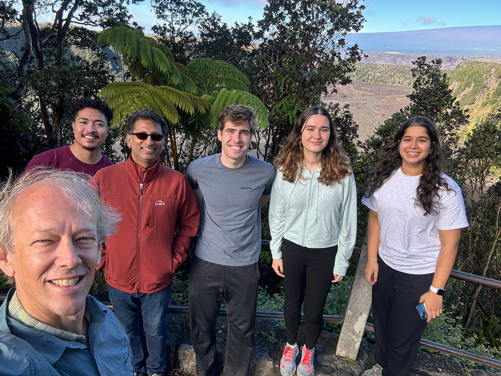

The Sage project combines advanced cyberinfrastructure, artificial intelligence (AI), and sensors to create intelligent, autonomous, new instruments to help us explore and understand climate change, natural hazards, urban landscapes, and the biosphere.  The Sage team has [deployed more than 100 nodes](https://portal.sagecontinuum.org) across the United States – but this installation was special…. Sponsored by [NAISE](https://naise.northwestern.edu), our goal was more than simply connecting an NVIDIA Jetson GPU, infrared camera, and anemometer to build a Wild Sage Node and create a secure infrastructure for scientific discovery – we were also intent on experiential learning -- from carrying scientific equipment through the dense forest of Volcanos National Park to learning about the restoration of a 400 year old native pond.  Together with a team of students from Northwestern University, University of Chicago, and University of Illinois, we set out to learn and contribute – Science!   Hawaii is beautiful, but Science is our goal.  Enjoy the reports that will show up here.

