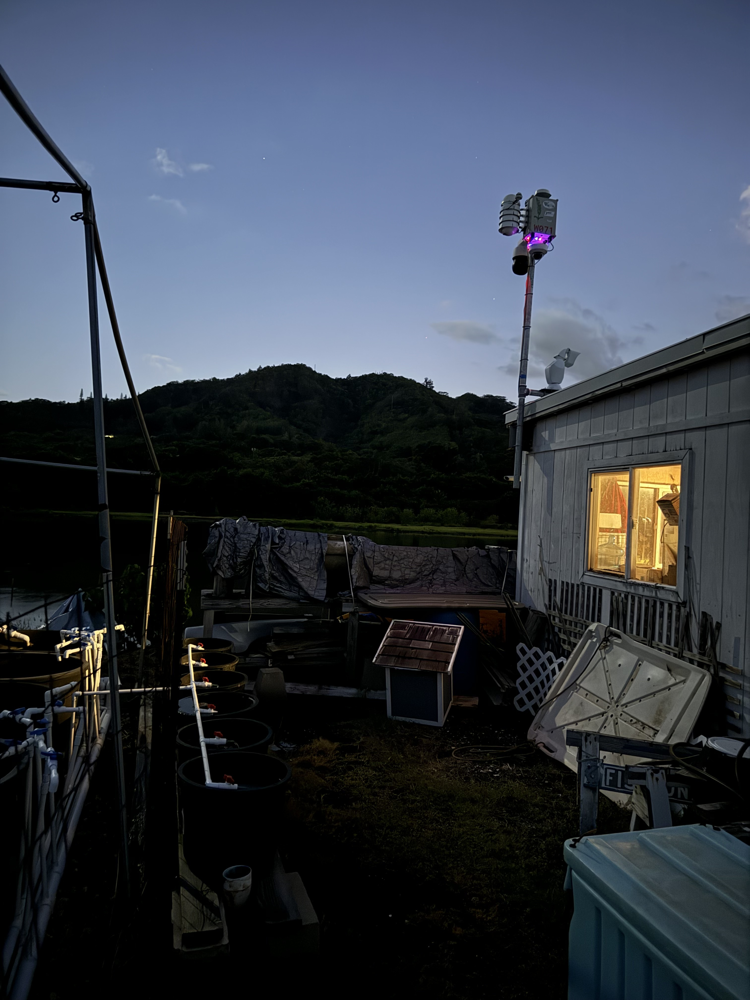

# October 25th 2023

Hi there! My name is Alex Arnold and I'm currently a senior at Northwestern University studying computer and cogntitive science. I worked with the team over the summer as an intern and also had the chance to help with a node deployment in Volcanos National Park in Hawai'i. 

Today we arrived in Honolulu. We checked into our hotel right off of the famous Waikiki beach, where we saw a lot of surfers catching waves out in the water. After a nine hour flight we were incredibly hungry so Aldo and I picked up a local snack: musubi spam. It’s basically spam on top of rice and wrapped together with seaweed. Served hot, it was unexpectedly good and a pleasant surprise. After a long flight without much food it tasted incredible.

After taking a short break, we headed out to the restored indigenous fish pond Waikalua Loko, which is run by the Pacific American Foundation (PAF). We crossed through a tunnel under the mountains that divide Oahu to get to the northern side of the island. We saw beautifulk views as the sun set over the mountains. We then met Dr. Derek Esibill from Windward Community College. He is working on restoring a pond that can be used to sustainably harvest fish from the bay. His work is also through a cultural lens and makes sure to incorporate education about Hawaiian culture and practices.

The pond is full of brackish water due to the combination of water coming in from the ocean and from a stream coming down the mountains. The two combine to make a hospitable environment for the fish to come in as youths through gates with wooden slats and fatten up. These fish are then unable to escape making them easy picking for fishermen. This method was used by the indigenous peoples of Hawai'i to sustainably feed the island. Each rock surrounding the pond was taken and placed intentionally by hand. At first glance it may seem that they made the walls too short since the ocean water spills over into the pond, but in actuality the ocean has risen due to climate change over the years. While most of the rocks are originally, these walls have been reinforced to combat the rising sea levels.

There used to be hundreds of these ponds, but most of them were filled in and now host fish inside of a Costco instead of the water. This particular pond also isn’t quite ready yet. A sewage treatment plant used to dump human waste into the water (remnants of which only disappeared less than two years ago) and now invasive mangrove trees have disrupted the sediments. Luckily, is working on restoring the pond and in the meantime he’s growing fish in tanks to “seed” other ponds in the area.

There’s currently a SAGE node (W071) set up right above the fish tanks that we saw in action. It’s monitoring the air quality levels and environmental data right now, but there’s a lot more the team is wanting to do with it. Computer vision and remote sensors could replace a lot of the work needed to monitor the water conditions in each tank. Currently somebody has to go out and measure the water conditions, and automating that process would make the work much easier. A node could also be used to monitor the water level and flow of the pond with nothing but an image, and more work needs to be done to create robust models that can predict that better than the current sensors can.

After we left the fish pond we all went out to dinner and learned about what other foods we should try. Derek’s son Kai (our honorary guide and recommended Poi and Lau Lau) and tried to stay up to combat jet lag. By the time we got back to our hotel we were all exhausted, but we made one more trip to the beach to take in the ocean to relax before turning in for he night.
