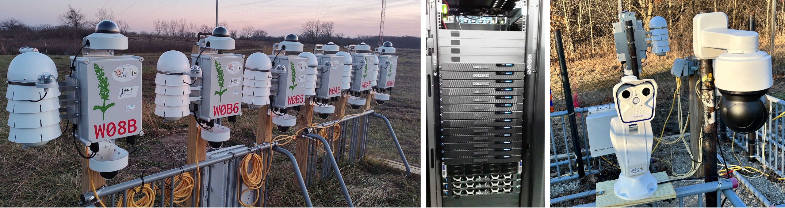

The Sage team is thrilled to kick off 2024 by introducing our new Sage Testbed!

<!--truncate-->

For Sage users, one of the major challenges is bridging the gap between local development and real production deployment.

While local development is fantastic for prototyping ideas quickly, it often lacks the nuance and intricacy of real hardware, particularly when it comes to sensors and instruments. Further, specific technical hurdles with tools like Docker or Rancher Desktop prevent Mac or Windows users from even integrating certain sensors with their own machine for development and testing.

In response to this challenge, the team has dedicated a focused effort on building out a comprehensive testbed.  This testbed consists of 16 Wild Sage Nodes and 14 Sage Blades which all have access to a range of sensors such as PTZ and thermal cameras, with the explicit intent of being made widely available to the community for development access.

The Northwestern University Sage Testebed is hosted at a testing site on the Argonne National Laboratory campus.  Because it is easily accessible and maintained, we can better support users interested trying more cutting-edge or low level experiments on devices.

Does this sound interesting to you? If so, visit the [Access Credentials](https://portal.sagecontinuum.org/account/access) section of the Sage Portal and request dev access to the Sage Testbed to get started.

