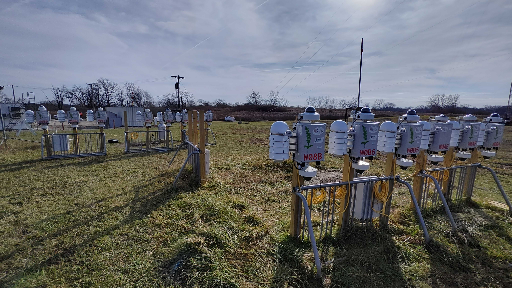

The Sage team is very excited to kick off 2024 by announcing our new Sage Testbed!

<!--truncate-->

One of the big challenges for Sage users has been bridging the gap between local development and production deployment.

Local development is fantastic for prototyping ideas quickly and intially sketching out software but often lacks the nuance of real hardware, particularly sensors and instruments. Further, specific technical challenges with tools like Docker or Rancher Desktop limit Mac or Windows users from even being able to connect some sensors to their own machine.

In order to make this process easier, the team has made a concerted effort to build a testbed at Argonne National Lab consisting of 16 Wild Sage Nodes and 14 Sage Blades, along with many of our sensors such as PTZ and thermal cameras, with the explicit intent that these will be made widely available to the community for development access.

Further, since the testbed is maintained here at Argonne in a more maintainance ready environment, we can better support users interested trying more cutting-edge or low level experiments on devices.

If sounds exciting and you would like to get access to the testbed, please visit the [Access Creds](https://portal.sagecontinuum.org/account/access) section of the Sage Portal and request dev access to the Sage Testbed.

