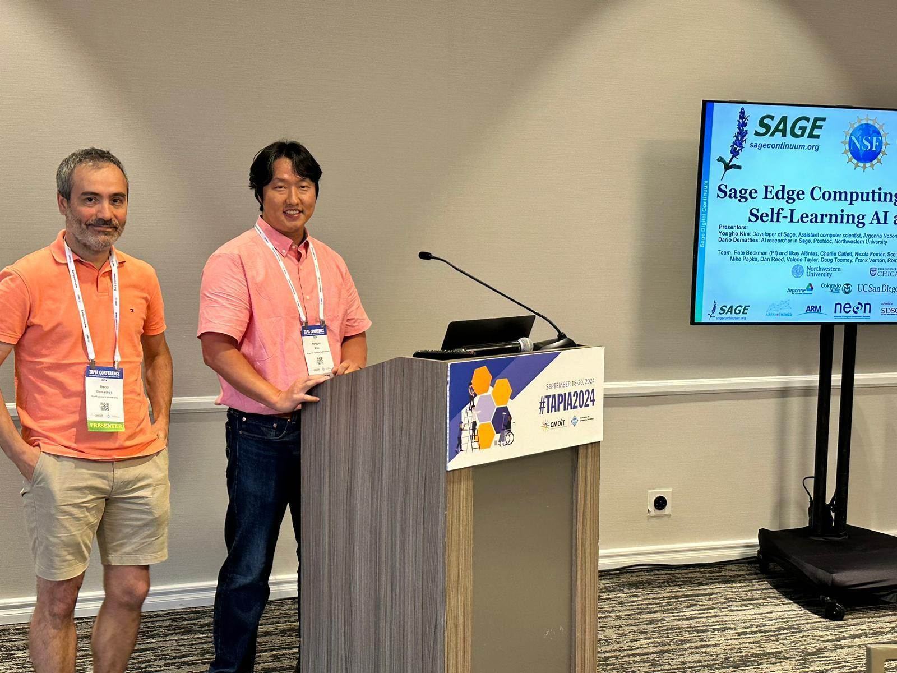

# Sage at TAPIA 2024

Sponsored by [Sage NDC-C](https://nairrpilot.org/projects/demo/sage), we presented the Sage edge computing platform and self-supervised learning at the edge in the TAPIA conference (See [the presentation slides](workshop-pdfs/TAPIA-sep-2024.pdf)). During the workshop, we met many academic professors, computer scientists, and students who were passionate about engaging with us and sharing their research challenges. We look forward to future collaborations with them!

> For those who are interested in running the iPython notebooks we demonstrated in the presentation, here are the links: [geospatial mapping](https://github.com/sagecontinuum/sage-data-client/blob/main/examples/contrib/geospatial_mapping_example_v2.ipynb) and [node performance plot](https://github.com/waggle-sensor/edge-scheduler/blob/main/scripts/analysis/analyze_node_performance.ipynb).