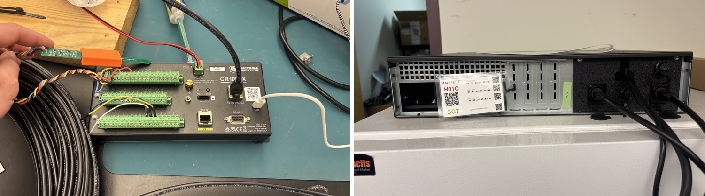

[Colorado State University (CSU)](https://agsci.colostate.edu/) is collaborating with the [U.S. Forest Service](https://www.fs.usda.gov/) and [USDA Agricultural Research Service (ARS)](https://www.ars.usda.gov/) to deploy two Sage Thor Blades for edge AI and data collection.

At the [Central Plains Experimental Range (CPER)](https://www.neonscience.org/field-sites/cper), CSU and ARS are connecting more than 25 climate stations to a Sage node over LoRaWAN. A successful test used an Arduino MKRWAN 1310 to transmit 16 variables from a soil monitoring station, including soil temperature, moisture, electrical conductivity, and precipitation data every five minutes.

A second Thor-blade will be installed at USFS [Glacier Lakes Ecosystem Experiments Site (GLEES)](https://research.fs.usda.gov/rmrs/forestsandranges/locations/glees) in southern Wyoming, where more than 200 sensors capture measurements including eddy covariance, soil moisture, snow depth, and radiation. CSU has already replicated the GLEES data workflow in the lab and is preparing for deployment.
