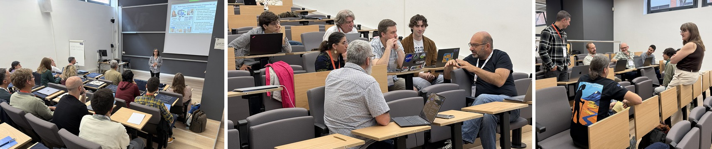

### The Workshop at a Glance

From May 4 to May 6, 2026, roughly forty researchers from across the United States and Europe gathered in Barcelona for an intentionally small, conversation-driven workshop on *AI and Edge Computing for Scientific Research*. The meeting was hosted at [Universitat Politècnica de Catalunya (UPC)](https://www.upc.edu/en), directly next to the [Barcelona Supercomputing Center (BSC)](https://www.bsc.es/), and was supported by [DISCOVER-US](https://www.discover-us.eu/), the EU project building transatlantic research collaboration in advanced computing. The workshop was organized by Pete Beckman ([Northwestern University](https://www.northwestern.edu/)), Nicola Ferrier ([Argonne National Laboratory](https://www.anl.gov/) / [Northwestern](https://www.northwestern.edu/)), and Rosa M. Badia ([BSC](https://www.bsc.es/)), with a welcome led by Koen De Bosschere ([Ghent University](https://www.ugent.be/en)) on behalf of DISCOVER-US.

<!-- truncate -->

The participant list was deliberately broad. Ecologists and biodiversity researchers from LTER Spain, [Doñana National Park](https://www.donanareservas.com/en/), the [Charles Darwin Foundation](https://www.darwinfoundation.org/en/), [NEON](https://www.neonscience.org/), UC Davis, Maine, Idaho, Wisconsin, and Iowa State sat alongside computer scientists and AI/orchestration specialists from BSC, Argonne National Laboratory, Northwestern, Ohio State's Imageomics Institute, UPV, INRIA, CEA, CSIC, and Utah; hazards researchers from BSC and GEO3BCN; and deployment leaders from NEON, [AmeriFlux](https://ameriflux.lbl.gov/), the [California Bio Sentinel network](https://cassn.org/), and the [Sage Grande Testbed](https://sagecontinuum.org/about). The roughly even US/EU balance was intentional.

### Format and Flow

The three-day program followed a deliberate rhythm: short framing talks to set the intellectual stage, lightning talks from domain experts, and then structured breakout discussions where small groups wrestled with a small number of carefully worded questions. Monday afternoon opened with the DISCOVER-US welcome and a talk providing an overview of the Sage Grande Testbed for AI, followed by the first thematic session. Tuesday packed in three full sessions and a long final discussion block; Wednesday closed the workshop with follow-up discussion, collaboration scoping, and final remarks. A visit to the [MareNostrum supercomputer](https://www.bsc.es/marenostrum) at BSC and a workshop dinner at Restaurant Santa Clara added time for the more informal conversations that often produce the most durable collaborations.

### Session Highlights

The four thematic sessions worked through the problem space from complementary angles.

**Session 1 (Ecology and Biodiversity)** was framed by Anne Fouilloux (LifeWatch) and Christine Kreuder Johnson (UC Davis), with lightning talks from Joana Colomer (LTER Spain / Minuartia), Nicolas Moity (Charles Darwin Foundation, Galápagos), Sydne Record (University of Maine), and Rachel Poretsky (UIC).

**Session 2 (Computer Science — AI and Orchestration)** was framed by Nicola Ferrier on AI and Francesc Lordan (BSC) on distributed computing, with lightning talks from Delia Velasco (CSIC), Elizabeth Tranel (Iowa State), Matthew Thompson (Ohio State), and Germán Moltó (UPV).

**Session 3 (Hazards — Wildfire and Earthquake)** was framed by Josep de la Puente (BSC), with lightning talks from Daniel Balouek (INRIA) and Leonardo Mingari (GEO3BCN).

**Session 4 (Deployments and Networks)** was framed by Chris Florian (NEON), with lightning talks from Sebastien Biraud (LBNL) and Gary Bucciarelli (UC Davis). The Wednesday wrap-up added perspectives from Manish Parashar (Utah) on the National Discovery Cloud, Julia McKenna (Northwestern) on the STRONG Manoomin collective, Kyle Kovach (Wisconsin) on hyperspectral sensing, from Josep de la Puente (BSC) on Distributed acoustic sensing, Delia Velasco on the Doñana Park infrastructure, and others.

### Cross-Cutting Scientific Questions and Novel Insights

What made the workshop productive was the way these very different communities converged on the same handful of questions. Across every breakout, participants returned to what makes a scientific question *transformative* and only addressable through AI at the edge: real-time, continuous, multimodal observation; the ability to trigger sampling on events rather than schedules; the move from correlational to causal inference; and the capacity to act, not merely record. Ecologists framed this as detecting short disturbances, species interactions, or shifting baselines that simply do not survive batch upload; computer scientists framed it as autonomous discovery, in-the-wild fine-tuning, and adaptive sampling.

The vision of an *agentic edge* drew the most energy — and the most caution. Participants imagined fleets of edge agents that orchestrate sensing, negotiate interpretations with HPC simulations, and collaborate as peers through publish/subscribe and event-driven architectures, with federated model updates aggregating local knowledge into shared understanding without moving raw data. Equally, they catalogued the hard problems: trust, verifiability, uncertainty quantification, safety certification, prompt injection, credential delegation, and the self-reinforcing biases that emerge when agents learn from each other. A recurring move was the shift from *standardization* to *interoperability* — accepting that networks will not converge on a single schema, and that the more tractable goal is for agents to translate between FAIR-aligned metadata, ontologies, and APIs. Several groups argued for "thin edge, smart cloud" architectures that do the minimum necessary in the field and push the rest upward.

A few phrases captured the room. *"Bringing the office to the sensor"* reframed what agentic field campaigns might feel like for working scientists. The provocation that orchestration may need its own *"vibe coding"* revolution surfaced both enthusiasm and serious questions about who reviews AI-generated workflows.

### Follow-Ups and Next Steps

The Wednesday collaboration session produced a concrete set of threads to pursue. Manish Parashar, Josep de la Puente, and Domenico Giardini agreed to scope a partnership around the Bedretto Lab data stream. Joana Colomer, Lluís Brotons, and Gene Kelly opened a conversation on connecting US LTER with ILTER and bringing Sage to LTER and Doñana sites. The group identified the [Bio Sentinel network](https://cassn.org/) as a strong candidate for a first transatlantic deployment, with the next step being to identify a European partner; there was particular interest in bats as a use case. Other threads included an ESIIL hackathon, a possible HiPEAC workshop, and an emerging recognition that nature-risk finance is creating real demand for pre-competitive biodiversity data infrastructure.

On funding, the group mapped several pathways worth exploring in parallel: an NSF EAGER, NGI Transoceanic open calls, an EU COST Action, and SBIR-style industry partnerships. The shared sentiment was captured in one of the workshop's better lines: *be reckless with interdisciplinary boundaries*. The workshop closed with broad agreement that this group — and this conversation — should continue.