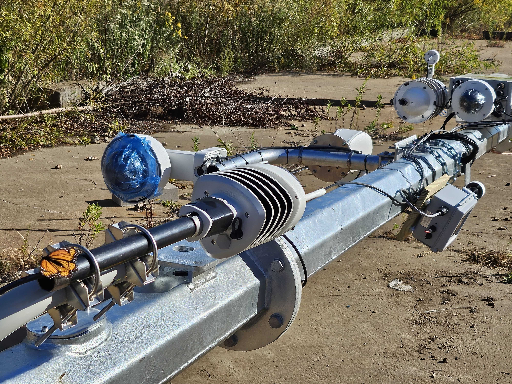
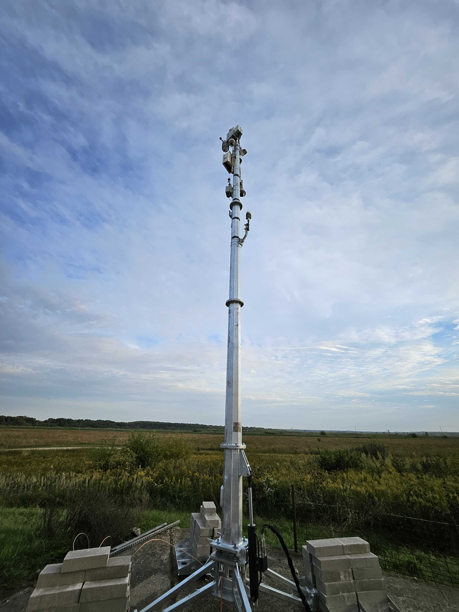

## Sage Collaborates with The Nature Conservancy

<!-- need an intro -->
Lorem ipsum dolor sit amet, consectetur adipiscing elit, sed do eiusmod tempor incididunt ut labore et dolore magna aliqua. Ut enim ad minim veniam, quis nostrud exercitation ullamco laboris nisi ut aliquip ex ea commodo consequat. Duis aute irure dolor in reprehenderit in voluptate velit esse cillum dolore eu fugiat nulla pariatur. Excepteur sint occaecat cupidatat non proident, sunt in culpa qui officia deserunt mollit anim id est laborum.

A butterfly came and landed on the tower during Sage node and sensor installation

<!-- truncate -->

A Sage node, equipped with cameras, microphone, and meteorological sensors, was strapped on a 15 m tall tower. 2 pan-tilt-zoom cameras providing visible and infrared images will be looking at wildlife and the preserve to monitor the environment. The sky-facing fisheye camera provides complete sky view that will allow to analyze clouds and local weather condition. The dust sensor will measure quality of the atmosphere. The full list of sensors can be found [here](https://portal.sagecontinuum.org/node/W01B?tab=sensors).

The W01B Sage node is completely powered by renewable energe storage with 8 of 1 m x 2 m solar panels. This system not only provides power to the node, but also allows to analyze the local solar power production based on weather and cloud coverage, that can be obtained from the Sage node's sensors.