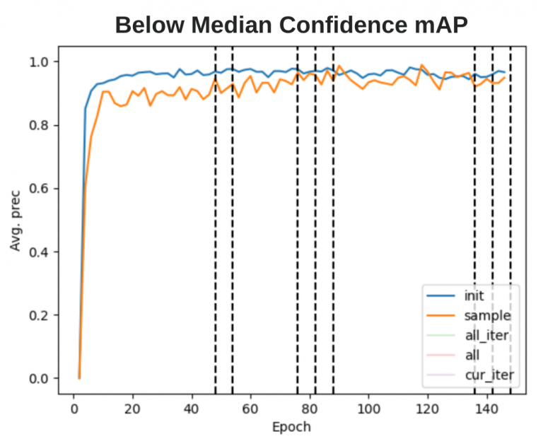
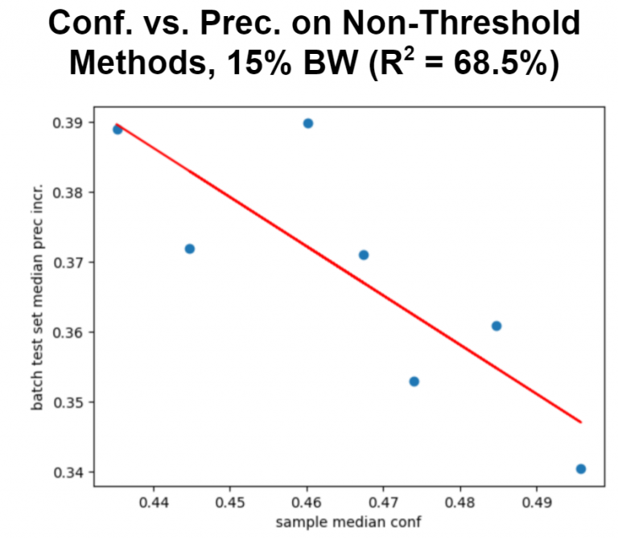
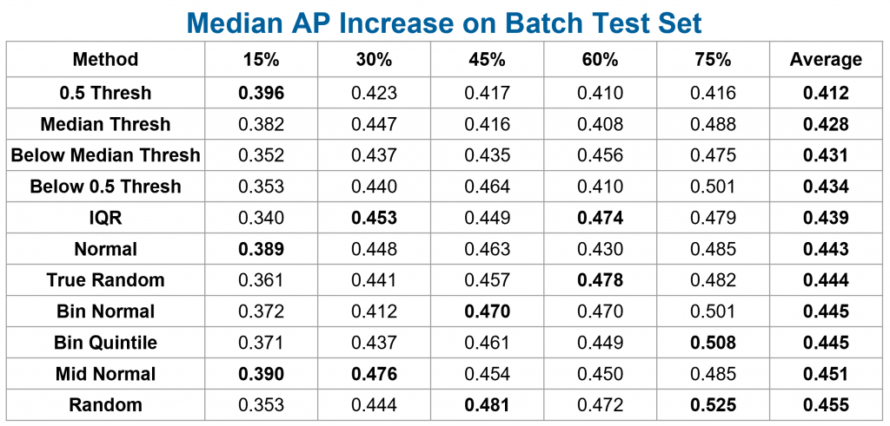

# Bandwidth Aware Learning

Hi there! My name is Spencer Ng, and I’m a rising second-year studying Computer Science and Theater & Performance Studies at the University of Chicago.

As seen throughout this website, Sage is a platform that scientists can use to deploy machine learning models at the “edge” and detect both human-centered and natural features. These features include water, smoke from wildfires, snowflakes, vehicles, and more. Models are created by learning from a set of example data, then they are used on Sage nodes in a variety of locations. As a result, they might not be as accurate in the real world compared to test conditions.

One way to resolve this is to give a model a greater variety of data to learn from, so it can generalize to more environments or adapt to a specific one. But what happens if there aren’t enough existing data to train an accurate model? With the help of the original model, we would need to collect new data (e.g. images and videos) containing the features we are tracking from the nodes at the edge. These data would be sent to the central Beehive server, which would then retrain models and send them back to the edge. This continuous approach can be applied to improve the accuracy of a variety of machine learning techniques used on Sage.

However, a major limitation is the rate at which data can be sent from the nodes, as Sage relies on a cellular data connection, which can be slow and/or expensive to use, depending on the environment. Consequently, nodes receive and process more data at a given time period than they can send. My project aims to determine the most effective strategies for sampling data to retrain machine learning models with improved performance, so we get the most “bang” for our “buck” when transmitting data.

## Inferences at the edge

> Example inference results of a car make/model detector at the edge.

To begin formulating sampling functions, I considered the available information about data at the edge and ways to measure performance that could scale to an array of Sage experiments. In general, machine learning models output a prediction and a confidence score about that prediction when given input data. For example, a model that detects car make/model and has an input video feed of a street intersection would draw bounding boxes around objects that it thinks are cars and label them with a particular confidence (e.g. a Ford Fusion at 0.50 confidence). This inferencing occurs at the edge, so we would be able to use model outputs as parameters for creating a sample.

Confidence can be viewed as a “negative measure” of uncertainty, and it made intuitive sense to sample data that models are more uncertain of, as they would be more likely to be incorrectly labeled. Retraining with previously-inaccurate data (after telling the model their true labels) could then make the model learn from its errors, improving accuracy in the future. In order to use this heuristic, I first had to ensure there was a correlation between confidence and precision.

## Making uncertainty more certain

Examples of (augmented) Chars74K images (left) and KAIST Scene Text (right)
My initial experiment involved training a simple object detection network using YOLOv31 to recognize 12 different alphanumeric characters using the Chars74K dataset2, and I ran inference on images with the same characters from the KAIST Scene Text dataset3. The initial results supported the idea that output confidence was positively correlated with the accuracy and precision of the model’s results, but the left set of confidence distributions below revealed that both accurate and inaccurate detections tended to have high confidences. This would make it difficult to automatically differentiate between data that are correctly and incorrectly labeled at the edge using only their confidences.

> Confidence distribution of initial model inferences on KAIST data, before (left) and after (right) modifying confidence score calculation

I then implemented an improved measure of uncertainty suggested by Geifman et. al4 in hopes of differentiating the confidence distributions for accurate and inaccurate labels. In this method, each input data point is evaluated by a series of linearly-spaced checkpoint models generated in the process of training the latest model, outputting many bounding boxes and confidences. These outputs are later combined by finding overlapping regions with Intersection over Union and averaging confidence scores for both object and class predictions. This new inferencing method yielded confidence distributions that were more left-skewed for accurate detections and right-skewed for misses (see right set of histograms), allowing us to choose either accurate or inaccurate images, depending on the sampling method’s goals.

## To sample, or not to sample?
A variety of sampling methods based on the overall confidence distrubtion at the edge were then created and tested. Although we wanted to bias the selection towards “hard” cases with lower confidences (and thereby boost the accuracy and confidences of similar examples in the future), prior literature suggests it is also important to retain some “easier” cases in the model to maintain its overall accuracy, especially when the task we are retraining for is difficult5. Thus, our sampling procedures included the taking the following data:

All data with confidences above or below the median confidence
All data above or below a confidence of 0.5
All data within the interquartile range of confidences
Sampling data according to a normal probability density function, centered at the median confidence with a standard deviation equal to the standard deviation of the confidences
Sampling data according to a normal curve centered at 0.5 with a standard deviation of 0.25
Taking an amount of data proportional to the area under the above curve, after creating five “bins” of confidences
Taking data uniformly in 0.2 confidence bins
Randomly taking data with equal probability
In the first five methods, the confidence distribution of each inferred class type (e.g. a specific letter) is independently generated, then data from that class’s distribution are sampled. That way, the final sample would be roughly representative of the various classes given as the model’s inputs; a character that tends to have lower confidences compared to the overall median confidence would still be included in the sample if using the first sampling method. In the following two “binned” methods, we looked only at the overall confidence distribution, as it may not be necessary to retrain proportionately for some classes if their results were already accurate. Finally, the random sampling method was executed independent of confidence, and we ran two variants: one where class distribution was accounted for via stratification, and a truly random sample that uniformly sampled on all images.

> Confidence distributions and metrics of samples created from various techniques on the first batch of KAIST data

After creating a sample, the key “bandwidth limit” was enforced by randomly removing images for each class until the sample had an approximately equal number of images per class (oversampling on classes with more examples if necessary), with a total number of images under the limit.

## Testing cycle
In a practical implementation of the sampling and retraining process on Sage, data would be continuously collected and sent to the Beehive periodically (e.g. twice a day) after running the inference and sampling functions at the edge. Once retraining is completed, the new and improved models would be sent back to Sage nodes and used for inference. To simulate this, 3,500+ images of the 12 different character classes from the KAIST dataset were split into batches of 500 images each, of which at most 300 were sampled and “sent back” for retraining. The retrained model would then be used to sample the next batch, until all batches were used.

> Mean average precision of initial training and retrained models on the initial test set and combined test sets from sample data

The goal was to continuously track changes in inferencing results on a subset of both initial and sample data reserved for testing as retraining went on; there could be increases in precision within each iteration, throughout the entire retraining process, or perhaps decreases due to biasing the model on “hard” data. These analyses were run for the various sampling methods described above, using the linearly-spaced average method for benchmarking. The left graph shows an example training-precision curve for the first method, where we collected images below the median confidence.

A second method to track improvement was to use inferencing results on the 500-image batches that were inputs to the sampling functions, which were controlled between each sampling method. The pseudo-random method of enforcing the bandwidth limit meant the test sets generated from each iteration sample varied in the number of images they contained and their actual images. Consequently, comparing how well the model at the end of each iteration inferred the ground truth for its upcoming batch would thus yield a more consistent test set between sampling strategies.

As an extension of the next-batch testing method, I also created a larger, consistent test set by pooling several of the sample batches together. This meant we couldn’t reliably benchmark models that were retrained using those samples, but this new test set could be used for all other models created during the retraining process for a fair standard of comparison.

## Retraining pipeline development

> High level diagram of the sampling and retraining pipeline, with character detection experiment parameters italicized.

The Python software pipeline for iterative retraining is designed to be scalable and easy for users to modify and deploy. An initial labeled set of data, separate from the data used for retraining, is first split into training, validation, and testing sets for creating a baseline neural network model. The training set is then augmented via a series of random affine transforms and shifts from the Albumentations library6, such that each class contains the same number of training images. These images are input into YOLOv3, a popular object detection framework, and training continues until the UP3 early stop criteria is reached, described by Prechelt7 as when validation loss increases three times in a row for a particular interval of training epochs. In custom experiments, users can also initialize the network with a set of pretrained weights, adjust hyperparameters, or modify the pipeline to use other neural network frameworks for use cases beyond object detection in images.

Once an initial model is created, inference is run on the first batch of images by averaging a series of checkpoint models, as described above. These results are used to create a sample, in accordance to a sampling function that takes in images’ confidences and selects a subset of the batch. The batch is then annotated with the ground truth (automatically done in the simulation), split into three sets again, and a proportion of seen data is mixed in with the sets derived from the sample. The goal of retaining with some of the seen data was to determine if we could create a more generalized model, without biasing the model too heavily on the sample data. Retraining then occurs with the new image sets, using the same parameters and processes (including the early stop criteria), except the most recent model is used as initial weights. These cycles continue in the simulation run until there are no more complete batches of images. In a real-world implementation, analyses on the model’s precision and accuracy after each iteration could be done to determine when to stop the pipeline, as performance improvements tend to converge after retraining for a certain number of batches.

# Retraining results
The initial character detection model was trained on the Chars74K data for 48 epochs, then the KAIST Scene Text data was used for sampling and retraining via the various sampling functions. Sampling was done on six batches of 500 images each, with a “bandwidth limit” of 300 images (60% of the sample) used for generating retraining, validation, and testing sets. I used the next-batch method for benchmarking, comparing the mean average precision (mAP) of the retrained models against the baseline model’s mAP for each batch:

Sampling Method	Batch 1	Batch 2	Batch 3	Batch 4	Batch 5	Batch 6
Baseline	0.923	0.921	0.941	0.948	0.946	0.923
Below Median Threshold	0.952	0.948	0.970	0.987	0.969	0.960
Random	0.940	0.957	0.957	0.963	0.958	0.956
Above Median Threshold	0.941	0.943	0.949	0.944	0.955	0.918

> mAP of baseline character model and retrained models on sampling batches. Some sampling methods omitted for brevity.

The above table is still inconvenient to use for comparing sampling methods, so I averaged the increases in mAP of each sampling method against the baseline model and plotted them against the average confidences of the samples:

Sampling Method	Avg. Sample Confidence	Avg. mAP Increase
Below median confidence	0.482	0.030
Binned normal PDF	0.580	0.020
Binned quintiles	0.589	0.024
Random	0.620	0.021
Normal PDF at 0.5 confidence	0.625	0.025
IQR	0.640	0.015
Normal PDF at avg. confidence	0.647	0.017
Above 0.5 confidence	0.710	0.013
Above median confidence	0.746	0.008

>Average confidences of samples and improvements in retrained models’ mAP using next-batch testing
Linear regression plot of sample confidence and average mAP increase

The strong negative correlation of the linear regression (R2 = 83.8%, p = 0.01) between sample confidence and next-batch mAP increase supports the idea that we want to retrain with “harder” examples when learning for an “easier” task. The baseline model trained with Chars74K data already achieved a high average precision of 0.934 on the KAIST data, so methods like sampling character detections below the median confidence would help the model learn the more nuanced features of the sample data that it wasn’t recognizing before. On the other hand, training on examples the model easily recognized would lead to little to no improvement in precision and accuracy.

## Car detection insights
In order to evaluate these sampling methods against larger and more complex problems, I created models for detecting car body types (e.g. sedan, SUVs). The baseline model was trained using 9,800 images from the Stanford Cars Dataset8, while the real-world VeRi dataset9, 10 was split into ten 3,000-image batches for sampling and a standardized test set of 6,800 images. Benchmarks of the initial model revealed fairly-accurate results on the Stanford training validation set, though with much room for improving precision and recall on the VeRi test set:

Class	N	Precision	Recall	Avg. Conf.	Baseline Valid. AP
cab	247	0.204	0.727	0.380	0.720
hatchback	1352	0.153	0.791	0.390	0.328
sedan	2370	0.805	0.769	0.435	0.781
suv	598	0.334	0.621	0.350	0.730
van	2247	0.116	0.301	0.806	0.771
Overall	6814	0.322	0.743	0.410	0.666

> Results of the initial model trained with the Stanford dataset on the VeRi test set. Validation AP is based on the training validation set.

As the model learned through each batch’s samples, accuracy improvements converged. However, I found that the point of convergence was generally a function of the number of epochs that a model underwent retraining for, rather than the number of sampling batches processed. Because the number of retraining epochs for each batch tended to vary between sampling methods, the medians of metrics across all batches were used instead of the averages to create correlations in improvements.

One noticeable trend was the direct relationship between the average standard deviation of samples’ prediction confidence scores and the subsequent average precision increase. This standard deviation metric was used as a measure of spread, calculated with the resultant confidence distributions for each class after applying the linear average method to yield a confidence score for each bounding box.

Sampling Method	Median Avg. Conf. Standard Deviation	Median AP Increase
Above median thresh.	0.010	0.408
Above 0.5 thresh.	0.112	0.410
IQR	0.116	0.474
Below 0.5 thresh.	0.126	0.410
Below median thresh.	0.136	0.456
Normal PDF at avg. conf.	0.179	0.430
Normal PDF at 0.5 conf.	0.195	0.450
Random (stratified)	0.197	0.472
Binned normal PDF at 0.5 conf.	0.217	0.470
Binned quintiles	0.225	0.449
Random	0.226	0.478

Regression of the median average standard deviation of confidence scores in samples against the median AP increase, with each point representing a sampling method
The data above suggest that threshold sampling methods (i.e. sampling above and below median confidence and 0.5 cutoffs), which intrinsically have a smaller spread of confidence scores, tend to result in smaller improvements in average precision. On the other hand, binned and random sampling methods have a larger range and the highest increases in precision. The linear regression between the two variables (R2 = 38.2%, p = 0.04) further supports this positive correlation.

Furthermore, when focusing on non-threshold methods, there remains a fairly strong inverse relationship between sample confidence and increases in average precision. That is, sampling lower-confidence data would be most beneficial when a model is learning. Note that the sampling and retraining process for the car experiments was run multiple times for various bandwidth limits, between 15% and 75%, in increments of 15% (i.e. 450, 900, 1350, etc. images were sampled per batch). The above graphs only capture results at a particular sampling amount, though trends were evident across all bandwidths.

After conducting this bandwidth sweep, I was able to evaluate if the effectiveness of each sampling method in improving model performance would increase or decrease as bandwidth changed. On average, threshold methods all still perform poorly compared to methods that lead to a larger range of confidence scores. This supports the idea that as models are learning and have not converged in performance, they should learn from a mix of ‘easy’ and ‘hard’ examples (i.e. through binned or random methods), regardless of what the bandwidth size is.

> Table of median average precision increase across image batches for bandwidth limit and sampling method combinations. The highest increases for each bandwidth amount are bolded.

I also wanted to evaluate how differing bandwidth sizes would affect the model’s learning rate after processing all image batches. Presumably, as the model trained with more images, it would be able to better generalize when testing and thus have the greatest increase in average precision. As a baseline, I retrained a model using all of the data from the VeRi image batches as samples (i.e. 3,000 images per batch), in order to see how significant improvements could be if we did not have the bandwidth limitation at the edge. This was plotted against the median AP increase for the non-stratified random sampling method as a fair standard of comparison.

The above graph suggests that the effectiveness of extended bandwidth on increasing precision appears to converge as we increase the number of images sampled per batch. We have a sharp jump between 15% and 30% bandwidth, though we have diminishing returns as we approach 75%. However, sampling all images yields a peak AP of 0.871 (compared to the initial baseline of 0.322), and more data should be collected in the 75% to 100% range to better define the curve.

Another real-world consideration aside from bandwidth is the retraining length of each image batch under the UP3 stopping criteria7, as cloud computational resources would be limited when Sage is handling many deployed models. I noticed that the average training time per batch tends to increase as bandwidth limit increases, regardless of sampling method. Certain sampling methods also were more likely to have batches that take a significantly longer time to train. Consequently, we define the efficiency of a particular sampling method at a particular bandwidth:

These efficiencies, median APs, and median train durations were then averaged across either bandwidths or sampling methods and tabulated below:

Method	Avg. Median Train Len.	Avg. Efficiency
IQR	37.2	1.19
Binned quintile	31.8	1.64
Random (stratified)	31.2	1.66
Binned normal PDF at 0.5 conf.	30.6	1.71
Random	23.4	2.13
Below 0.5 conf.	20	2.25
Above 0.5 conf.	20	2.25
Normal PDF at 0.5 conf	20.2	2.53
Normal PDF at avg. conf.	19.4	2.75
Above median conf.	15.6	2.79
Below median conf.	18.4	2.849
BW	Avg. Median Train Len.	Avg. Median AP Incr.	Avg. Efficiency
15%	16.4	0.369	2.53
30%	18.2	0.442	2.82
45%	25.8	0.452	1.97
60%	27.2	0.446	1.90
75%	34.1	0.486	1.72

## Conclusions

Overall, larger bandwidth availability for sampling leads to longer training times for a given sampling method, along with diminishing returns in average precision increase. If bandwidth and training computational times are both cost factors, then sampling at around 30% of the bandwidth (900 images per batch for the car experiment) would yield the highest gains at minimal cost. Sampling the images with predicted confidences above the median confidence or along a normal probability density curve centered at 0.5 would also be optimal for maximizing model improvements with smaller retraining times. However, these conclusions may vary with tasks that are significantly different from car body type detection and classification.

In general, across the ‘easier’ character classification task and the ‘harder’ car task, the (binned) normal PDF at 0.5 confidence and below median threshold sampling methods are promising for the largest improvements. They have relatively short median training times (and high efficiency), while they demonstrate noticeable accuracy improvements after several batches of retraining, comparable to the best methods. We should also aim to prioritize sampling a greater spread of confidences at higher bandwidths so the model can better generalize to a variety of inputs, and taking high-uncertainty samples may be a more effective approach at lower bandwidths to learn quickly through each batch.

Future work
Going forward, I would want to run more experiments to better support my conclusions, continuing to examine the relationships between sampling methods and bandwidth sizes. Potential directions to consider include true object detection models (as both experiments had test data that were pre-cropped), classification/detection with known datasets like MNIST and COCO, and examining regression and time series problems.

It would also be interesting to create sampling methods and correlations based on sample confidence score variance when performing the linear average of checkpoint models, as that data is also available at the edge and may provide an additional measure of uncertainty. We could also optimize stop criteria to reduce the number of training epochs per batch and further investigate effects of bandwidth limit values. Finally, we could try to automate the selection of hyperparameters and sampling methods based on a small initial test set and baseline model (using data from the edge), so solutions to this bandwidth problem could be applicable to all machine learning models deployed on Sage.

I’d like to thank all of the Sage staff and my fellow interns for providing guidance and helping me learn more about machine learning this summer. If you have any questions or comments about my work, please feel free to reach out via email, <a href="https://www.linkedin.com/in/spencer-ng/">connect with me on LinkedIn</a>, or <a href="https://github.com/spencerng">follow me on GitHub</a>.

The iterative retraining pipeline is under development and in the process of being documented, but you can follow my progress via its GitHub repository.

## References
1. J. Redmon and A. Farhadi, “YOLOv3: An incremental improvement,” arXiv preprint arXiv:1804.02767, 2018.
2. T. E. de Campos, B. R. Babu, and M. Varma, “Character recognition in natural images.” VISAPP (2), vol. 7, 2009.
3. J. Jung, S. Lee, M. S. Cho, and J. H. Kim, “Touch tt: Scene text extractorusing touchscreen interface,” ETRI Journal, vol. 33, no. 1, pp. 78–88, 2011.
4. Y. Geifman, G. Uziel, and R. El-Yaniv, “Bias-reduced uncertainty estimation for deep neural classifiers,” in International Conference on Learning Representations, 2018.
5. H. S. Chang, E. Learned-Miller, and A. McCallum, “Active bias: Training more accurate neural networks by emphasizing high variance samples,” in Advances in Neural Information Processing Systems, 2017, pp. 1002–1012.
6. A. Buslaev, V. I. Iglovikov, E. Khvedchenya, A. Parinov, M. Druzhinin, and A. A. Kalinin, “Albumentations: fast and flexible image augmentations,” Information, vol. 11, no. 2, p. 125, 2020.
7. L. Prechelt, “Early stopping-but when?” in Neural Networks: Tricks of the trade. Springer, 1998, pp. 55–69.
8. J. Krause, M. Stark, J. Deng, and L. Fei-Fei, “3D object representations for fine-grained categorization,” in 4th International IEEE Workshop on 3D Representation and Recognition (3dRR-13), Sydney, Australia, 2013.
9. X. Liu, W. Liu, T. Mei, and H. Ma, “A deep learning-based approach to progressive vehicle re-identification for urban surveillance,” in European Conference on Computer Vision. Springer, 2016, pp. 869–884.
10. ——, “PROVID: Progressive and multimodal vehicle reidentification for large-scale urban surveillance,” IEEE Transactions on Multimedia, vol. 20, no. 3, pp. 645–658, 2017.
