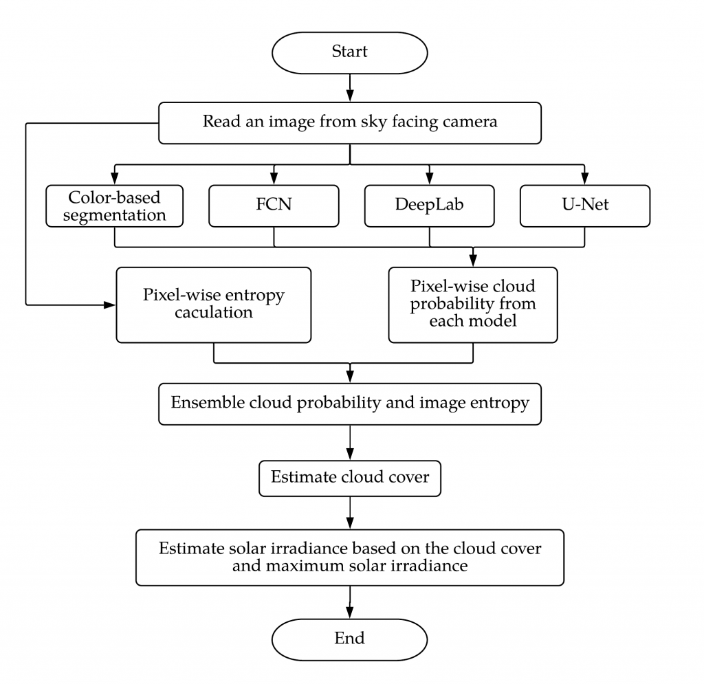
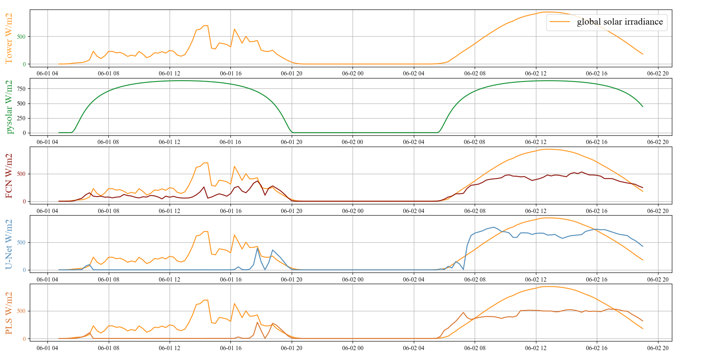

# Characterizing Clouds
Clouds have been widely studied in a variety of fields. The shape and distribution of clouds are not only important to modeling climate and weather, but also to understand interactions between aerosol and cloud for weather research, and to develop environment forecasting models including radiation and cloud properties. Additionally, detecting and understanding cloud cover over the sky have been studied to estimate and forecast solar irradiance and performance of renewable solar photovoltaic energy generation. For this reason, examining solar irradiance in photovoltaic power grids has been investigated in many ways. Even though the purpose of each study is diverse, it is common that they have approached to analyze the magnitude of cloud coverage. In this context, answering how much cloud covers the sky is a striking problem along with other factors such as wind direction, speed, temperature, and other meteorological factors.

Many of the cloud images used in the studies have been collected from satellites. Those image data are then used to analyze cloud types and solar irradiance. The images captured from satellites are advantageous to study large areas with regard to the resolution of the image to understand the overall environment of the area. However, to analyze local cloud environment, which is a much smaller area and changing rapidly, using the images from the satellite are unrealistic, costly, and slow. Instead, ground-based images have been used predominantly for analyzing local cloud status which can affect on estimation and prediction of solar irradiance. Because local weather conditions and solar irradiance are affected significantly by the cloud coverage of local sky, the ground-based images are more suitable to represent local sky conditions.

As a method to estimate cloud cover and solar irradiance based on the cloud cover, we propose a method using machine learning models. we ensembled cloud segmentation result from four machine learning methods for cloud segmentation and entropy of image: color-based cloud segmentation using partial lease squares regression (PLS), fully convolutional network (FCN), U-net, and DeepLab. To train each of machine learning models with various sky conditions, we created a cloud dataset that can reinforce dark sky conditions and overcast on Singapore whole Sky imaging segmentation (SWIMSEG) dataset using a Waggle node deployed in Argonne National Laboratory. With the cloud cover estimation, we examine correlation between cloud cover, solar irradiance, and solar power generation.

Above image is examples of raw images and labels from Waggle cloud dataset. The original image resolution is 2304×1536. However the images were resized as 300×300 because of lack of memory issue on training process. We utilized OpenCV to label pixels based on saturation, red, and blue value first. By adjusting the threshold of the three color channels, we roughly separated cloud and sky pixels. Then we manually labeled the pixels that were difficult to separate through the threshold adjustment.

Below is the flowchart of image processing to estimate cloud cover and solar irradiance. We first estimate cloud cover using four machine learning models, and calculate entropy of the image. The results from the five are ensembled to improve accuracy of the segmentation. And lastly the segmentation result, which is the ratio of cloud over sky, is used to calculate solar irradiance with max solar irradiance calculated from pysolar, a python library that calculates max solar irradiance based on the measure from 2007 to 2018.

Below is the segmentation results from the machine learning models. **It is showing raw input, ground truth, segmentation result from FCN, U-Net, PLS, DeepLab, ensemble trained with class name, ensemble trained with normalized cloud probability, ensemble trained with class name excluding entropy, from left to right.** Ensemble models are trained with three inputs. First one was using class number. Which means sky pixels were masked as 0, and cloud pixels were masked as 1, that are their class number. Second one was using normalized cloud probability distribution, and last was using class number and exclude entropy. Entropy is excluded because when you see the 3rd, and last two bottom results, the results from the model trained with class number very mis-segmented while the model more accurately segmented in other cases. And as a result of excluding entropy, the model with entropy segments best among the three ensemble models.

And mean segmentation accuracy and mean intersection over union for each model were calculated. In this category, U-Net absolutely superior then other methods. However, when you see the mean error ratio FCN is the lowest. We are working on to process segmentation results from ensemble models. This means that the mIoU and mAP can be increased when the model over-segment cloud, but the solar irradiance estimation can become worse. Also, we did not separate thin, think, medium cloud, the solar irradiance estimation can be significantly under-estimated when there were only thin clouds. And for mostly cloudy sky, the models estimated zero solar irradiance so the error ratio goes high.

**Below graphs are the results of global solar irradiance measured from ANL met tower colored with dark orange (top), estimated max solar irradiance using pysolar python library colored with green (second top), and below, IRR estimation using cloud cover ratio from FCN, U-Net, PLS, and DeepLab, and IRR estimation error ratio using FCN, U-Net, PLS, and DeepLab on June 1st and 2nd, 2020.** We did not collect images late night and early morning, the straight lines between around from 9 pm to 8 am means ‘No Data’. The results show it seems that the error rates are high in the morning and evening. It can be because of sky condition as other papers describe, but I think in our case, the max solar irradiance is over-estimated in the morning and evening. You can see the second hill in the first two graphs. On June 2nd, the day was whole clear and sunny, so the 2nd hill in the first graph could be the max solar irradiance on June, at 484 site. Compare to the max IRR from pysolar that is plotted very below of that, the IRR values in the morning and evening were over-estimated in the morning and evening. It seems that the model can estimate the trend of solar irradiance with cloud cover, even the models over-estimate cloud cover so that under-estimate solar irradiance.

[More results to be updated at a later time]

