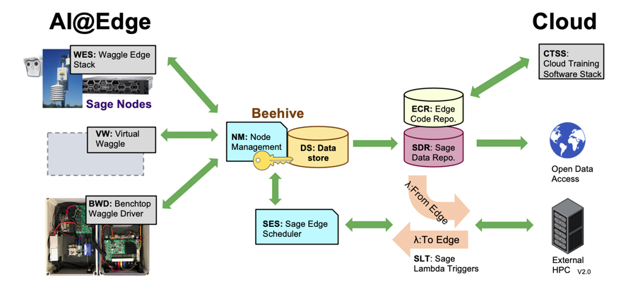
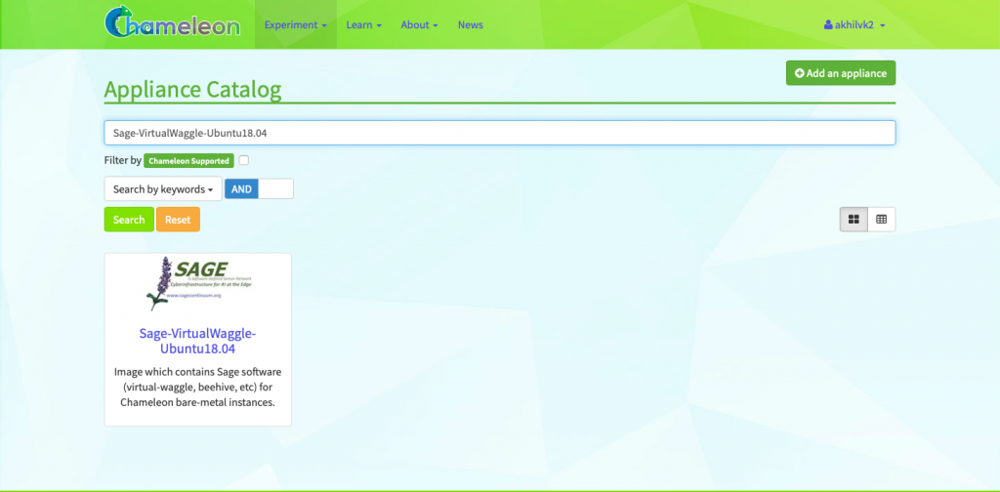

# Integrating Chameleon

Hello! My name is Akhil Kodumuri, and I am currently a Sophomore pursuing a Computer Engineering degree at the University of Illinois at Urbana-Champaign. My work with Sage this Summer consisted of integrating Sage AI at the edge cyberinfrastructure with the Chameleon platform to simulate a testing and deploying environment.

## Setting the Stage

The goal of the Sage project is to design and build a new kind of national-scale reusable cyberinfrastructure to enable AI at the edge. Wildfire, flood, and climate change change detection will be made available at the edge thanks to the Sage project.

However, in order for this goal to become a reality, software and hardware must be created in order to support AI at the edge. There must be a way for a student or programmer to easily access Sage’s resources and interact with the Sage environment.

Well, what’s the best way to do this so students and researchers can install an environment easily with all of Sage’s dependencies? Sounds like a challenge that <em>software virtualization </em>is designed to solve! We created an all encompassing Image designed to meet the needs of students and programmers who use the Sage platform.

With this image, the Sage team created a customizable, innovative, and user friendly environment for students and programmers alike to run their world changing machine learning algorithms with the help of Sage software and hardware. However, having a useful image is one thing, but not every student or programmer has a computer powerful enough to run intensive machine learning algorithms or Sage software plugins. Not only that, Sage has access to some neat pieces of <a href="https://github.com/sagecontinuum/sage/blob/master/architecture_overview.md">hardware</a> that are available to users to use. So, our next step is to find the best way for users to access hardware to run this Sage image.

That’s where the Chameleon platform comes in. Chameleon is a testbed of computational resources that are made available for the scientific community for running experiments. Chameleon has hardware available for Sage users at three different locations:CHI@UC, CHI@TACC, KVM@TACC. The CHI@UC and CHI@TACC site are both bare-metal sites, so only physical hardware is available. While the KVM@TACC site, is a virtual machine site. Users simply have to, create a reservation on the Chameleon, launch an instance, and attach an ip address to their instance. After doing these three steps, users are ready to start using there very own Chameleon machine.

> Creating a reservation and instance taken from Chameleon.[[1](#references)]

> Allocating floating ip.[[1](#references)]

Combined with the all encompassing software image, users can easily access and use Sage software and hardware. A list of hardware and software resources can be seen on the <a href="https://github.com/sagecontinuum/sage/blob/master/architecture_overview.md" target="_blank" rel="noreferrer noopener">Sage GitHub repository</a>.  Included with the Chameleon-Sage image is a developer environment where users can create and test their machine learning algorithms in an environment that mimics Waggle edge processors and nodes. Sage users will also have access to a local server endpoint that they can deploy. This server endpoint can be used as an entry point to facilitate the process of to pushing and pulling data for their experiments already running on Sage nodes. Many more features will be made available on this image.

# Chameleon-Sage Image

In order to streamline Sage services with Chameleon hardware, the Sage software Image should include all of Sage’s software and services and be compatible with Sage and Chameleon hardware. That’s where my work comes in. I worked on creating Chameleon-Sage image that includes all of Sage’s software and services which, is, in turn, compatible with Chameleon and Sage hardware. The rest of this post is dedicated to explaining all of the Sage resources that I am including in the Chameleon-Sage image, as well as their purposes, and significance.

### Features included in Image

<a href="https://github.com/waggle-sensor/waggle-node">Virtual-Waggle</a> is one of the services that Sage provides its users. Virtual-Waggle is a programming environment where users can build and test edge-processing code in an environment that mimics Sage and Waggle nodes. User can also use Virtual-Waggle to test their Machine learning algorithms in an environment that mimics a waggle node, so users can resolve any potential issues before deploying them.

After seeing its usefulness, its almost no brainer to why it should be included into this all inclusive Chameleon-Sage image. Included within the Chameleon-Sage image is all the software necessary to run Virtual-Waggle. This image pulls images published and made available on Dockerhub, an online repository for software containers. The Chameleon-Sage image pulls the most recent version of virtual-waggle from the Sage repository for use. When a user runs <code>Virtual-waggle up</code>, after booting into the Chameleon-Sage image, they will be able to pull the most up-to-date version of virtual-waggle from Dockerhub. That way, if there are any updates made to virtual-waggle, a user will not be inconvenienced, and updates can be rolled out smoothly.

In order to streamline the launching of virtual-waggle, the feature of running and deploying docker containers without the use of <code>sudo</code> privileges was implemented into the Chameleon-Sage image. More specifically, any Sage service that requires the use of docker can be run without <code>sudo</code>.

Another feature that I spent time on was a prototype deployment method of launching multiple instances of virtual-waggle in a controlled setting. A use case for this deployment, is if a teacher wanted his/her students to all have an instance of virtual-waggle, he/she would just have to run a simple command to launch multiple instances of virtual-waggle. This command would create n-specified instances and pull all the necessary docker containers from DockerHub to run virtual-waggle. I worked on a prototype [microk8s](https://microk8s.io) deployment that can accomplish this fact. Micork8 is a light weight Kubernetes deployment method designed for IoT and edge devises. Though it is just a prototype, it is a feature that Sage is working on and will make possible in the future.

> This is an abstract way of representing the multi scale microk8 deployment of Virtual-Waggle.[[2](#references)]

<a href="https://github.com/waggle-sensor/edge-plugins">Sage Edge Plugins</a> is another feature that’s included within the Sage image. This repository is helpful for people who wish to create their own plugins to use on the edge. Sage provides useful tools for building and training machine learning algorithms. Users are provided an easy way to faciliate the creation of edge-plugins.

Access to the <a href="https://github.com/waggle-sensor/beehive-server">Beehive</a> server is another benefit of using this Chameleon-Sage image. Beehive allows a way for users to push and pull sensor data from devises on the edge. Beehive can be useful in experiments that requires the collection of data or training machine learning algorithms.

Additionally, using GitHub Actions, I streamlined the the process of creating this Image, so future developers working with/for Sage can spin up a new image by a simple <code>git push</code>.

> Overview of the Sage platform.[[3](#references)]

### Versions of Image

Sage recognizes that users have all different sets of needs when running neural networks. That’s why users will have options to use different specialized versions/flavors of the Chameleon-Sage image. There are currently three different types of Chameleon-Sage images all available on the Chameleon catalog.

> Snapshot of Sage image on Chameleon.[[1](#references)]

Sage-VirtualWaggle-Ubuntu18.04 – This is the standard Chameleon-Sage image that is available at all three Chameleon sites. This image includes all of the previously stated features and runs with Ubuntu 18.04.

Sage-VirtualWaggle-Ubuntu18.04-CUDA – This image is compatible with a CUDA10 driver and with with Ubuntu 18.04. This image is available at the CHI@TACC and CHI@UC sites.

Sage-VirtualWaggle-ARM64 – This image is built for arm64 architecture and is built with Ubuntu 18.04. This image is available at the CHI@TACC site.

Sage users are also able to create their own images customizable to their needs. Detailed steps can be found on the <a href="https://github.com/sagecontinuum/Chameleon-Sage-Image-Builder">Chameleon-Sage-Image builder</a> repository.

The image can be found on the official Chameleon catalogLink: https://www.chameleoncloud.org/appliances/85/

## References
1. “A Configurable Experimental Environment for Large-Scale Cloud Research.” Chameleon, www.chameleoncloud.org/.
2. “Kubernetes Components.” Kubernetes, 22 June 2020, kubernetes.io/docs/concepts/overview/components/.
3. https://github.com/sagecontinuum/sage