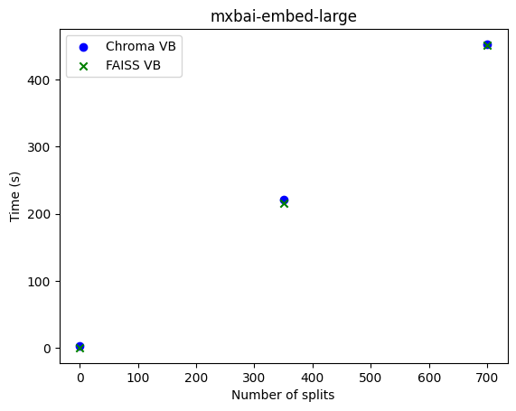
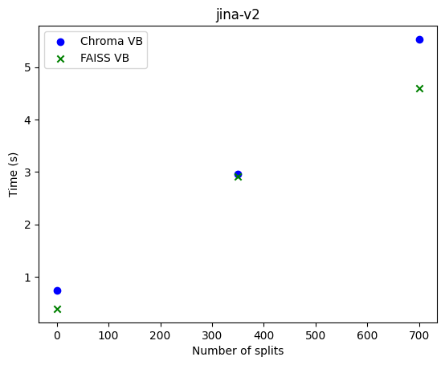

# Code Generation and Documentation Search using Large Language Model

Author: Aldo Malaquias Cabrera, Summer 2024

## Introduction
The advent of generative AI, specifically large language models (LLMs), has provided individuals with easy access to query seemingly limitless information. However, these models are not trained on proprietary data, which leads to shortcomings in generating useful and relevant information in hyper-specific scenarios. For example, if an individual is exploring the work done within a research group, there is no language model that is familiar with the inner workings of that group’s research. Consequently, the only solution is to inquire personally, which removes the advantages of having an LLM that can respond accurately and consistently at any moment.

In the context of providing user support for the Sage project, we explored two solutions: manual augmentation and Retrieval-Augmented Generation (RAG). Both methods were capable of generating high-quality code and accurately searching Sage repositories. We provide a comprehensive evaluation of manual augmentation, insights into the effectiveness of RAG techniques and their computational costs, and our recommendations for optimizing a RAG system for user support.

Manual augmentation used Llama3 and RAG used Llama3.1 as generative models.

## Manual Augmentation
Manual augmentation is the technique of providing context to the model before asking a question. This can occur in two ways: conversation style, feeding and re-enforcing the model with text interactions, and providing all context and instructions at the same when asking a question. Our work includes both approaches and even demonstrates that both methods are sometimes required to achieve acceptable results.

**Baseline Tests**
Firstly, it was important to establish a baseline to understand Llama3's extent of familiarity with the Sage project. The following are the baseline results:

||
|:--:|
|*First Baseline Test*|

As you can tell, Llama3 is completely unaware of Sage's work. Attempts to provide more context resulted in equally confused results, often with misinterpreted acronyms:

||
|:--:|
|*Second Baseline Test*|

Even when provided large amounts of context, Sage's [about section](https://sagecontinuum.org/about) (486 words, 3291 characters), the model was only capable of reiterating word-for-word the context without any inference. Normally, there's nothing wrong with this behavior, especially if we want the model to serve as a query system, but it became clear this approach was infeasible if we wanted to generate code with text context.

||
|:--:|
|*Providing Sage About Context*|

**Code Generation**
Therefore, we provided the model its first snippets of code, the camera Waggle imports. Llama3 was then instructed to generate code to capture a snapshot from the camera:

```python
#### GENERATED CODE ####
from waggle.plugin import Plugin
from waggle.data.vision import Camera
import time

class SnapshotPlugin(Plugin):
    def __init__(self):
        super().__init__()
        self.camera = Camera()

    def start(self):
        while True:
            # Capture an image and store it in the Waggle database
            img = self.camera.capture()
            pw_image = pw.Image.from_array(img, 'rgb')
            pw_database.store(pw_image)

            # Wait for 1 second before taking the next snapshot
            time.sleep(1)

if __name__ == '__main__':
    plugin = SnapshotPlugin()
    plugin.start()
```

As hypothesized, no matter the length of text context, the model was unable to generate accurate code because it doesn't know the appropriate library and method calls. We proceeded to provide more code context. 

We began by using code snippets to 1) test the model's ability to generate code with a few lines of code and 2) assess whether the model could link the finer details of the code to the broader context. It produced these inferences when provided 17 lines of code from Waggle's subscribing and publishing [examples](https://github.com/waggle-sensor/pywaggle/blob/main/docs/writing-a-plugin.md#4-create-mainpy-file). 

||
|:--:|
|*Plugin Descriptions*|

It also produced the following code when asked to generate both publishing and subscribing plugins for an AI application that counts the number of pedestrians on a street:

```python
#### GENERATED CODE ####
from waggle.plugin import Plugin
from waggle.data.vision import Camera
import time

# use case 1: take a snapshot and process
def count_pedestrians(sample_data):
    # TO DO: implement your pedestrian counting logic here
    # For simplicity, let's just return the number of pixels in the image
    return len(sample_data)

with Plugin() as plugin:
    sample = Camera().snapshot()
    result = count_pedestrians(sample.data)
    plugin.publish("number.pedestrians", result, timestamp=sample.timestamp)
```

```python
#### GENERATED CODE ####
from waggle.plugin import Plugin
from waggle.data.vision import Camera
import time

# use case 2: subscribe to the "number.pedestrians" stream and process images
def count_pedestrians(sample_data):
    # TO DO: implement your pedestrian counting logic here
    # For simplicity, let's just return the number of pixels in the image
    return len(sample_data)

with Plugin() as plugin:
    while True:
        msg = plugin.get()
        if msg.topic == "number.pedestrians":
            num_pedestrians = int(msg.value)
            print(f"Received {num_pedestrians} pedestrians at timestamp {msg.timestamp}")

            # Take a snapshot and process the image
            sample = Camera().snapshot()
            result = count_pedestrians(sample.data)

            # Check which image had the most pedestrians
            if result > num_pedestrians:
                print("New maximum number of pedestrians detected!")
```

The first code block is perfect, and the second has two minor errors. 

Llama3's inferences and code generation showed the following:
* Provided robust examples of code, Llama3 can generate almost perfect code
* It can interpret the purposes of code and reason with the larger applications of that code
* As a result, code contexts yielded better results than text contexts because the model learned to generate code and describe its purposes

Take a look at the model's descriptions of Sage and Waggle with only 17 lines of code as context:

||
|:--:|
|*Descriptions of Sage and Waggle*|

**Importance of Context Size**
It was clear that code snippets were essential for accurate code generation and inference, but the length of those snippets mattered as well. Too much context overwhelmed the model, resulting in overly complicated and incorrect code. We asked the model to generate similar plugins as above, but this time we provided the entire [writing-a-plugin](https://github.com/waggle-sensor/pywaggle/blob/main/docs/writing-a-plugin.md) markdown file (2481 words, 18500 characters). It resulted in the code below when it could've been generated in just 15 lines:

```python
#### GENERATED CODE ####
from waggle.plugin import Plugin
import numpy as np
import pyaudio
import time

class BirdRecordingPlugin(Plugin):
    def __init__(self):
        super(BirdRecordingPlugin, self).__init__()
        self.p = pyaudio.PyAudio()
        self.stream = self.p.open(format=pyaudio.paInt16, channels=1, rate=44100, input=True, frames_per_buffer=1024)

    def on_start(self):
        # Load stored bird recordings
        recording_files = ["path/to/recording1.wav", "path/to/recording2.wav", ...]
        self.recordings = [np.load(file) for file in recording_files]

    def on_input(self, sample):
        # Get microphone data
        data = self.stream.read(1024)
        self.stream.stop_stream()
        self.stream.close()
        self.p.terminate()

        # Compare with stored bird recordings
        for i, recording in enumerate(self.recordings):
            diff = np.abs(np.subtract(sample.data, recording))
            if np.mean(diff) < 0.5:  # threshold value
                print(f"Matched recording {i}!")
                break

    def on_stop(self):
        pass

if __name__ == "__main__":
    with BirdRecordingPlugin() as plugin:
        while True:
            time.sleep(300)
            plugin.upload_file("sample.ogg")
```

Consequently, it was essential to consider the amount of context provided. While a few lines of code produced reasonable results, excessive information can mislead the model. This is why RAG systems are so effective: they retrieve manageable chunks of information.

**Importance of Relevant Context**
Providing meaningful context was also crucial. This became clear when we generated code to query data collected by a Wild Sage Node. We supplied the model with code snippets from the Sage Data Client (SDC) API, including SDC filtering variables. However, since SDC metadata tends to be noisy and large, the model generated code with traces of this noisy metadata when given all the filters, resulting in incorrect output:

```python
#### GENERATED CODE ####
# Filter data for W0B0
df = sage_data_client.query(
    start="-1h",
    filter={
        "name": ["sys.mem.slab", "iio.in_humidityrelative_input"],
        "vsn": "W0B0"
    }
)
```

In contrast, when the metadata was cleaned to include only relevant filtering fields, the model generated perfect code, highlighting the significance of maintaining relevant and precise context. Here are some of the graphs it produced when tasked with generating the line plot and histogram of temperature and humidity for the last hour for node W0B0:

||
|:--:|
|*Generated Plots for Node W0B0*|

To further explore the importance of relevant context, we evaluated its effect on hallucinations produced by Llama3. We accomplished this by maintaining a consistent Sage context while altering the degree of "irrelevance" in the user’s queries to examine the model's responses.

The model was given the subscribing and publishing plugins for camera functionality but was told the code was for capturing microphone noises. It was then asked to generate the plugins to measure average dB values to publish them:

```python
#### GENERATED CODE ####
from waggle.plugin import Plugin
import time
import numpy as np

with Plugin() as plugin:
    while True:
        msg = plugin.subscribe("number.pedestrians")
        if msg.topic == "number.pedestrians":
            num_pedestrians = int(msg.value)
            print(f"Received {num_pedestrians} pedestrians at timestamp {msg.timestamp}")

            # Capture microphone noise and calculate average dB value
            sample_data = Camera().snapshot()
            audio_data = np.frombuffer(sample_data.data, dtype=np.int16)  # assume 16-bit PCM data
            avg_db = calculate_avg_db(audio_data)
            print(f"Average dB: {avg_db:.2f}")

            # Publish the average dB value to Sage
            plugin.publish(avg_db)

def calculate_avg_db(audio_data):
    # Calculate the average dB value from the audio data
    peak_amplitude = np.max(np.abs(audio_data))
    avg_power = (peak_amplitude ** 2) / len(audio_data)
    return 20 * np.log10(avg_power)
```

Notice it maintained the same library and method calls from Waggle in the implementation, but it changed the main calculation function. As a result, it used the Camera() class for microphone functionalities. The model attempted to reason with the new directives by maintaining the same context as reference but superimposed its own functionalities, portraying hallucinations. 

In a more extreme case, the model was told that those same plugins were instead from a website that sells shoes for a baby. When instructed to generate code, it produced this:

||
|:--:|
|*Response to Irrelevant User Query*|

These examples highlight the importance of relevant context. Context that does not match the question will lead to hallucinations or, in more severe cases, incomprehensible code. Thus, the severity of hallucinations is dependent on the degree of "irrelevance" between user prompt and context. 

## Retrieval-Augmented Generation
The results of augmenting prompts for code generation and documentation queries exceeded our expectations. However, the process was constrained by its manual nature:

1. It lacked the flexibility to address any question about Sage, as the context was supplied manually.
2. Searching for relevant context was subject to human error and time constraints.

While the model couldn't answer Sage questions consistently at any moment, it could generate accurate responses when given relevant and precise context. The challenge now was to find a way to make the prompt augmentation process both consistent and automatic.

To address those limitations, we turned to Retrieval-Augmented Generation (RAG) as a solution. RAG combines the strengths of LLM generation with automatic context retrieval, allowing for consistent and contextually relevant responses. By leveraging RAG, we automated the prompt augmentation process, allowing the model to consistently provide accurate answers to users' questions about Sage whenever needed.

**Basic RAG**
1. Setup:
   1. Data ingestion.
   2. Encode data (embedding) with embedding model/
   3. Store embeddings in vector database.
2. Retrieval:
   1. Receive user input and embed it.
   2. Run similarity function to retrieve relevant data.
3. Prompt Augmentation:
   1. Combine retrieved context with user input.
   2. Enhance prompt by providing additional instructions for generation.
4. Generation:
   1. Pass the enhanced prompt to Llama3.1.

The power of RAG lies in its retrieval process, which addresses the context relevance problem in two key steps:
* Converting sentence semantics into numerical data.
* Comparing similarities between data points in a vector space.

These challenges have been solved using sentence transformers and comparison methods like nearest neighbors. The first step enables data to be represented numerically through a formal transformation, allowing user queries and Sage data to equally be converted into vector form. The second step involves searching in vector space for data points that are similar to the encoded user query, effectively finding sentences that are semantically relevant; those sentences become our context when decoded by a vector database (VB).

We documented a basic version of this process using cosine similarity and the mxbai-embed-large sentence transformer. The selected context effectively addressed the user query.

||
|:--:|
|*Basic RAG Context Retrieval*|

**Langchain RAG**
It was evident that RAG mirrored the prompt augmentation process of manual augmentation while providing a framework to automate this process, ensuring consistent results without the need for human intervention. 

The next step was to enhance our basic RAG system by:
* Accessing any Sage repository through data ingestion.
* Implementing vector databases for faster queries during the retrieval stage.
* Utilizing chains and retrievers to automate the retrieval process.

The first step proved to be the most challenging. Converting unstructured data from GitHub repositories into documents suitable for encoding by our embedding model involved:
1. Filtering large repositories to extract relevant files (e.g., .py, .md, .ipynb) while excluding other file types that lacked Sage information.
2. Splitting each file into manageable chunks to increase context diversity; otherwise, we risked retrieving entire markdown files filled with irrelevant content. This task was particularly complex due to the varying formats and delimiters used in different file types.

To address these challenges, we turned to Langchain. Its API allowed us to efficiently split file types into digestible chunks and provided convenient method calls for leveraging vector databases and LLM models. As a result, we developed a script to recursively transform all Sage Python, Markdown, and Jupyter Notebook files into context snippets.

The remaining steps were easily implemented with Langchain, enabling us to complete our RAG pipeline.

**RAG Accuracy**
Our interactions with the system revealed several key findings:
1. The retrieval process, which encodes user queries and applies similarity functions, effectively ensured that relevant context was always retrieved.
2. The retriever enhanced the precision of RAG by selecting only the top-$k$ contexts, preventing the model from being overwhelmed by excessive information and addressing the issue of context size.
3. As a result, RAG proved to be as accurate as manual augmentation, retrieving relevant and precise context.
4. The RAG process was largely automatic and minimized human error, allowing it to answer user queries consistently and at any moment.

Because of these factors, the model experienced low hallucination rates, as every Sage query could be matched with relevant context. However, issues arose when the model was asked about non-Sage information. This highlighted the importance of prompt augmentation. Initially, our prompt followed the same approach as manual augmentation, where context was provided before the question. We extended this method with additional directives, which we refer to as enhanced prompt augmentation. This approach directs the model to acknowledge when it does not have a relevant answer to a user's question, reducing hallucinations when addressing non-Sage-related queries.

We also found that RAG maintained consistent accuracy across various combinations of embedding models and vector databases. Notably, there was no difference in the retrieved contexts when using any combination of jina-v2, mxbai-embed-large, Chroma, and FAISS.

**RAG Speed**
With these accuracy metrics established, it was crucial to evaluate RAG's speed to ensure efficient responses. RAG is a scalable system capable of referencing vast amounts of external information. However, it's limited by the computational costs and the LLMs context window size. While RAG can retrieve extensive information, an LLM can only recall its window size for generation. In our case, window size wasn't an issue since our system dealt with undemanding questions that required only $k<15$ for accurate responses, but it’s still worth noting.

Therefore, we focused on the computational costs, encoding time and generation time. We conducted tests on the following:
1. The embedding speed of jina-v2 and mxbai-embed-large with various split sizes and vector databases.
2. The generation speed of Llama3.1 with different questions at various $k$ values.

||
|:--:|
|*Embedding Speeds for mxbai-embed-large*|

||
|:--:|
|*Embedding Speeds for jina-v2*|

For encoding time, we observed:
1. There is a strictly increasing linear relationship between embedding times and the number of splits.
2. mxbai-embed-large encoded approximately 1.6 splits per second.
3. jina-v2 encoded around 116.7 splits per second.
4. This indicates that a local model like mxbai-embed-large took, on average, 70 times longer than the server-supported model jina-v2 to embed a single document (note: this may vary based on the host system of the RAG).
5. No significant difference in embedding times was observed between using Chroma or FAISS as vector databases.
6. This suggests that the key factors influencing encoding time are the number of splits and the type of embedding model, particularly whether it runs remotely or locally.

||
|:--:|
|*Generation Speeds for Various Questions*|

For generation time, we observed:
1. There is a strictly increasing relationship between $k$ and generation time, with most demonstrating a linear correlation.
2. On average, the generation time doubled from 55 seconds to 110 seconds as $k$ increased from 1 to 12, indicating an average increase of approximately 5 seconds for each increment in k.
3. Code generation questions generally required more time than documentation search questions across all values of $k$.
4. With a few exceptions, each question consistently ranked similarly in generation time relative to others (e.g., the "Sage and Waggle infrastructure" question was consistently among the top two for generation time, while the "Why is the sky blue?" question was consistently at the bottom).
5. These results indicate that increasing $k$ has a minimal effect on generation time for any type of question.

**Suggestions for Optimizing RAG**
Consequently, we provide the following suggestions for optimizing RAG:
* Always augment your prompt:
  * Include a set of directives in your enhanced prompt that specify generation instructions, such as how to handle irrelevant user queries.
* Experiment with different $k$ values:
  * Increasing $k$ can lead to more accurate results with minimal impact on performance. However, avoid setting it too high to ensure the information remains precise and relevant. If you encounter hallucinations with larger $k$ values, reduce it accordingly.
* Optimize split sizes:
  * Based on the observed linear relationship between the number of splits and embedding time, try different split sizes to find the best configuration that balances encoding efficiency and context diversity.
* Consider offloading embedding and generation costs to a remote system.
* Choose a vector database that best meets your needs:
  * There was no significant difference in accuracy or embedding speeds among the various vector databases.
* Account for the type of user queries:
  * Depending on the needs of the average user, some RAG systems may require more optimization to address increased generation times for more complex queries.

## Conclusion
This research explored the potential of Retrieval-Augmented Generation (RAG) and manual augmentation for enhancing user support in the Sage project. While manual augmentation demonstrated effective code generation and context retrieval, it was limited by its reliance on human input, leading to potential inconsistencies. RAG, however, combined the strengths of large language models with automatic context retrieval.

Our findings highlighted that RAG maintained accuracy comparable to manual augmentation while significantly reducing human error, providing consistent and accurate responses to user queries. We also evaluate the performance of RAG and provide optimizing strategies.

However, the work presented here represents only a small fraction of RAG's capabilities. Advanced techniques like semantic splitting, active retrieval, and hierarchical indexing remain unexplored but are crucial for tackling more complex tasks, like multimodal RAG systems. Additionally, our testing framework was not exhaustive. A more thorough evaluation would involve testing additional LLM models, experimenting with more $k$ values, including a wider range of questions, experimenting with chunk sizes, and incorporating more Sage data. An automated framework for accuracy testing would also verify our results. Currently, we rely on manual assessment for the accuracy of generated responses, but as noted earlier, LLM accuracy and validation are active areas of research.