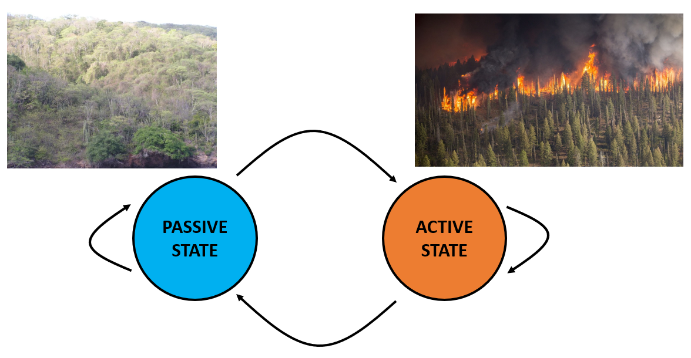
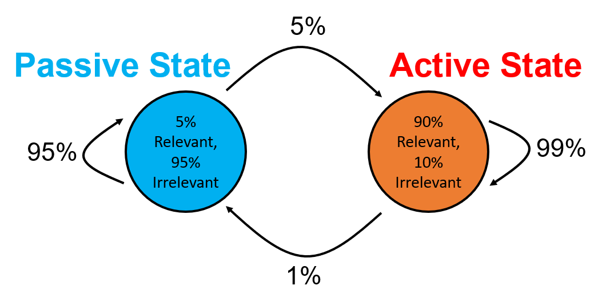
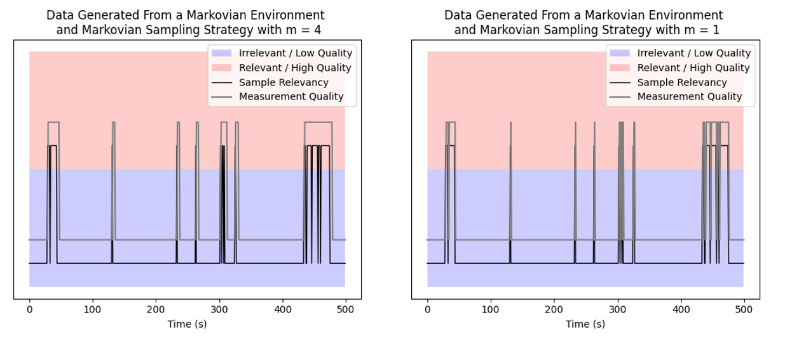
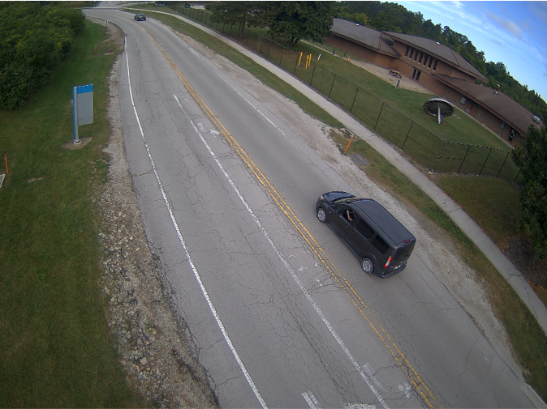
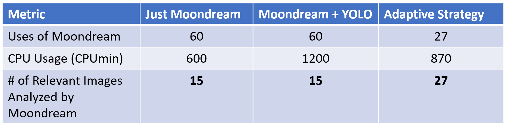

# Application-Agnostic Dynamic Data Collection for AI on the Edge
Henry Abrahamson
*Northwestern Unversity, Department of Electrical and Computer Engineering*

email: henryabrahamson2022@u.northwestern.edu

## Introduction

### Motivation

  
  <small className="flex align-center justify-end mt-[-25px] text-slate-500">
    ([Image Source](https://heritageconservancy.org/wp-content/uploads/2023/11/deer-8175966_1280.jpg))
  </small>

Consider a scientific application that uses a SAGE node to capture video in the wild in the hopes of using an AI model to identify the deer and describe what it is doing. In this application, there are large periods of inactivity when the camera captures no deer or other animals, punctuated by short periods of interest when a deer is on camera. In this way, the environment is *dynamic*. However, if SAGE naively runs this job *statically*, without any changes in response to the environment, multiple potential problems arise:
* Because the job relies on video or other high-memory data, the data collected at the edge could exceed the SAGE node's ability to transmit it back.
* Despite generating so much data, most of it is irrelevant or has few features of interest.
* If this job is being run sparsely in time, it may miss a deer sighting entirely, or to only run the job once during a sighting when it may be possible to run it multiple times.
* On the other hand, the job cannot be run at all times, either because other scientific applications have reserved time on the SAGE node, or because resources like power are scarce and have to be appropriately rationed.

### Our Work
All of these problems are not unique to our hypothetical deer-related application, but apply to a wide variety of tasks submitted to SAGE. Hence, we devise a **framework for dynamic data-collection strategies for AI applications on the edge**. Our framework must have the following two properties:
* **Generality:** There should be no application-specific dependencies in our framework, so that it has broad applicability for future jobs.
* **Edge-Implementability:** The strategies that our framework covers should only have to rely on local decision-making, to ensure prompt reactions to the dynamic environment.

In order to explore our framework, we also create a **simulation**. This simulation is written so that SAGE users interested in a dynamic data collection strategy for their job can freely explore how different strategies might affect their output data, using parameters and features motivated by their specific application. You can find the simulator here:

- [Dynamic Data Collection Simulator](https://github.com/waggle-sensor/summer2025/blob/main/henry/CollectionStrategySimulation.ipynb) 

## Modelling
Our framework consists of two components: the **environment**, and the **strategy**.
### Environment Model

Image Source [1](https://www.needpix.com/photo/download/1741227/forest-fire-wildfire-blaze-firefighters-smoke-trees-heat-burning-hot), [2](https://i0.wp.com/upload.wikimedia.org/wikipedia/commons/7/78/Chacachacare_dry_forest_3.JPG)

The environment controls what type of data the strategy can get when it tries to collect a sample. It is modelled using **two states**: an _active_ state in which is it tends to produce more _relevant_ than _irrelevant_ data (in orange above), and a _passive_ state, which produces the opposite (in blue). Essentially, the _active_ state corresponds to an environment in which an event of interest is occurring, while the _passive_ state corresponds to an environment where nothing of note is occurring.

Both the proportions of _relevant_ vs. _irrelevant_ data generated by an _active_ vs. _passive_ environment, as well as the transitions between the _active_ and _passive_ states are changeable based on the specific application we are interested in investigating. We implemented the following environmental models:

* **One-State:** A static, one-state environment, used mainly for comparison.

* **Markovian:** A simple 2-state Markov chain. Transition probabilities are tunable parameters.

* **Time Correlations:** A preset version of the Markovian environment. It still has the same two states and generates data stochastically, but instead of having transition probabilities, it instead is given a set of time-ranges during which the environment is _active_, and outside of which it is _passive_.

* **Preset:** A fully deterministic environment that will always produce *relevant* data in the *active* state, and *irrelevant* data in the *passive* state. The environment's states are determined by a user inputted array of labels. Particularly useful if the user already has access to a sample run of their job or a similar job run on SAGE.

### Strategy

The strategy controls how samples are generated. As with the environment, the strategy also has two states, *active* and *passive*. In each state, the strategy can control two parameters:
* **Sample Rate**: How frequently samples are generated, or how often a job is run.
* **Quality Level**: Whether a sample is considered to be high quality or not. This attribute is a little more abstract, but it could represent a variety of changes that make the resulting data more desirable, such as using a higher-end, more expensive AI model instead of a cheaper one, or using a camera's zoom so the video frame has less dead space and is focused on the object of interest.

Hence, a common strategy would be to take low-quality but frequent samples in the passive state, and then take high-quality samples while in the active state.

Also as before, the transitions between states are mutable. We explored two strategies:
* **Responsive:** This strategy transitions to *active* once it senses a piece of *relevant* data. It then transitions down to *passive* after it detects a number of consecutive *irrelevant* data points. The number needed is tunable. Applies neatly to a variety of applications.
* **Waiting Time:** This strategy transitions to *active* once it senses a piece of *relevant* data. It then remains in the *active* state for a number of samples (tunable), at which point it transitions back to the *passive* state if its most recent data point was *irrelevant*, otherwise, it stays *active* for that number of samples again. Useful if the application intends to run multiple AI models at different time scales at the same time.

## Simulation Results
As a proof of concept, we ran the simulation under two conditions.
### Responsive Strategy + Markovian Environment
Firstly, without any application in mind for motivation, we used the Responsive strategy that can switch between high and low quality measurements, with a static sample rate of 1 sample per second and a memory cap (*m*) of 1 vs. 4 for comparison, alongside a Markovian environment with parameters as in the figure below. We ran the simulation for 500  seconds in simulation time.

We see how our strategy responds to the environment over time in the figure below. The gray line indicates the measurement quality produced by the strategy, while the black line indicates the relevancy of the sample produced by the environment. Ideally, the gray line should follow the black line closely. We see that both the *m* = 1 and 4 strategies track the environment reasonably well, with the *m* = 1 measurement quality being generally more volatile since it tries to track the sample relevancy exactly. On the other hand, the *m* = 4 strategy is smoother, since it waits for 4 time steps before switching from active to passive sensing. As such, the *m* = 1 strategy has fewer high quality measurements wasted on irrelevant data points, but the *m* = 4 strategy has more high quality measurements of relevant data, since it has fewer misses from switching to passive sensing too early.

Assigning a cost of 1 Joule to passive sensing and 3 Joules to active sensing, we see that the *m* = 1 strategy costs 620J and the *m* = 4 strategy costs 678J, compared to a baseline of 500J for an all-low-quality strategy and 1500J for an all-high-quality strategy. Thus for *m* = 4, we incur a penalty of 35% extra energy to capture most of the relevant data with high quality measurements, compared to the 200% penalty from the all-high-quality strategy.

### Waiting Time Strategy + Preset Environment with More Realistic Numbers

Next, we devise a simple but real application to have the simulation generate realistic numbers, and to see if we still have tangible gains. In this case, we assume that a SAGE node is posted by a road, and is taking a picture once per minute and analyzing is using [YOLO](https://docs.ultralytics.com/tasks/detect/) to detect cars as they drive by. Once YOLO detects a car, the next picture taken is analyzed using the more computationally expensive [Moondream](https://moondream.ai/) for a more detailed description of the scene. Based on previous SAGE usage of Moondream, we assume that it takes 10 minutes for it to run to completion (counting initialization time). While Moondream is running, YOLO still runs once per minute in the background. We also assume based on past runs of these jobs that both jobs take up 1 CPU and GPU per minute.

Using our framework, we use the Waiting Time strategy, assuming that the strategy can only transition once per minute. The passive state is the state in which only YOLO is running, with an associated cost of 1 CPU minute per minute, while the active state has both YOLO and Moondream running with an associated cost off 2 CPU minutes per minute. The Waiting Time strategy's waiting parameter is 10 minutes, since that's how long it takes for Moondream, the longer of the two jobs, to run.

In this scenario, YOLO can be thought of as a tripwire: most of the time, the SAGE node runs the relatively quick YOLO job. Once YOLO detects something of interest though, the node then invokes the more expensive Moondream job. By using this dynamic strategy the node saves power in comparison to running YOLO and Moondream all the time.

For the environment, we collected video from one of the SAGE nodes near argonne campus, manually labelled the frames as relevant / irrelevant if there was a car in focus on the road, and loaded that data in as a Preset environment.

The results are shown in the table below. Using our dynamic strategy, we were able to get 27 runs of Moondream on relevant data, compared to 15 runs by naively running Moondream once every 10 minutes. This jump occurs because many of the events of interest lasted fewer than 10 minutes -- as such, using YOLO as a trigger allows the SAGE node to notice these short events and respond appropriately.

## Future Directions
Potential directions for future work include the implementation of these strategies on a SAGE node directly, developing new environment and strategy models (of particular interest would be a trinary state strategy with states representing *passive*, *ready*, and *active*). These two thrusts would both move towards making these dynamic data collection closer to being applied in reality and hopefully more easily accessible to SAGE users. Also of interest would be obtaining theoretical guarantees of performance given a Markovian environment with bounded parameters, providing a mathematical justification for these strategies, and allowing for the development of a tool that might be able to calculate worst-case performances.
