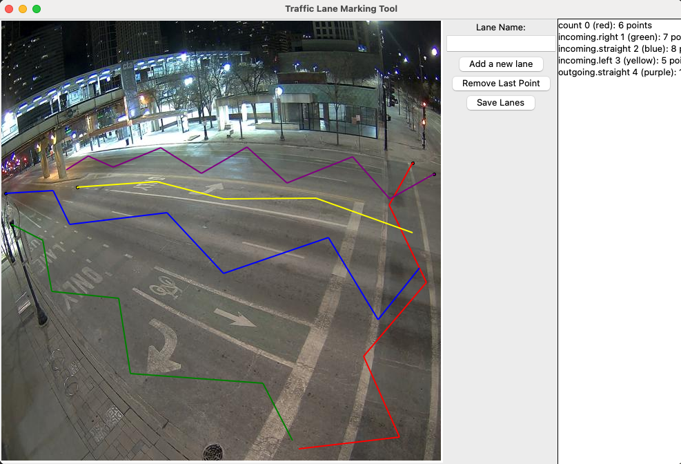
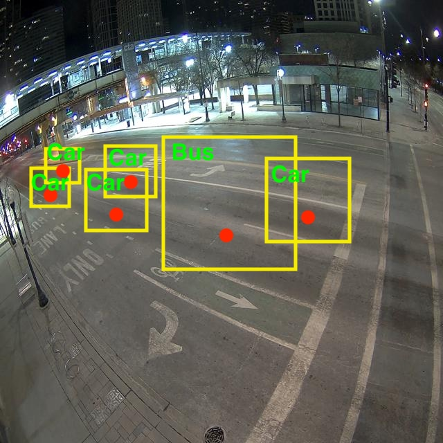

# Traffic Counting

> NOTE: This document is based on [the version 1.0.3 of the traffic counter application](https://portal.sagecontinuum.org/apps/app/yonghokim/traffic-counter?tab=tags).

Understanding traffic volume is essential to estimate the flow of city traffic. We utilize deep neural networks and tracking algorithms to count the number of vehicles passing the street. YOLO v7 is a well-known object detection model based on deep neural networks. SORT is an object tracking method utilizing Kalman filter to calculate possible location of the target between two continuous frames. This application introduces a method that can count traffic volume using a video source.

## Application Execution Flow

The application first records a video from a camera stream specified in the application argument. Then, it loads the video and runs the detection and tracking algorithms on the video to count vehicles in the traffic. Vehicle counts are published with the timestamp at which the video was recorded. Therefore, the measurements are interpreted in the way that they count vehicles in between the start and end time of the recording.

## Drawing Lanes

To estimate the traffic per lane, it is required to draw imaginary lines capturing target lanes from the perspective of camera. Below is the GUI program that takes a camera image and draw lines with their label.

First, the line "count", drawn in red in the image, represents the imaginary line used to determine whether vehicles that pass the line are counted. This line is required to count vehicles and its name must be "count".

Second, users can draw multiple lines for any recognized lane of interest. Because the algorithm computes the closest line from the vehicle's center of point, it is recommended to have those lines well capturing the region of the lane (see the zig-zag lines that capture different points of the lane).

After drawing, we save the line information into a file and transfer the file to the Waggle node where the camera belongs to. The line information will be later used by the AI application for counting.

See [the document](https://github.com/waggle-sensor/plugin-trafficcounter/blob/main/docs/preparation.md#preparing-for-target-scene) for technical details.

## Lane Matching for Counting

The above image shows the detection and lane matching. The red dots represent vehicle's weighted centroid and are matched to the nearest lane for counting. Their counts are added up throughout the video and reported using the naming from the lane drawing. For example,

- "env.traffic.count.incoming.left": The total count for vehicle that approach to the intersection and make a left turn.
- "env.traffic.count.outgoing.straight": The total count for vehicles that leave the intersection.

Additionally, we report the grand total count for all lanes in "env.traffic.count.total". This total count always matches with summation of all individual lane count reported from the same video source.

## Data Querying
When qurying this data, users can query individual count per lane or query all counts for a particular interest. Example includes, 

- "env.traffic.count.incoming.*": All vehicle counts for incoming traffic.
- "env.traffic.count.outgoing.*": All vehicle counts for outgoing traffic.