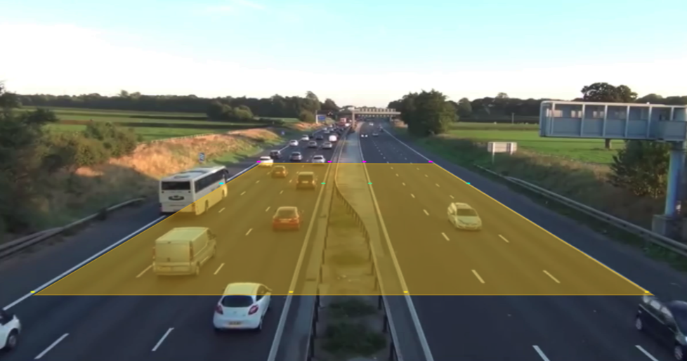

# Traffic State Estimation

A real-time vehicle tracking application based on deep neural networks was utilized to calculate traffic state. The deep neural networks that were utilized for the estimation were introduced in the ‘Vehicle Tracking’ post. The traffic state has been calculated by ‘traffic flow = traffic speed x traffic density’ (traffic_char1996, edie1963). With the equation, we need to measure two of the parameters using instruments for each parameters to estimate the third state. However, on the other hand, the application introduced in this study based on deep neural networks can calculate traffic state independently using a video source.

We tried to estimate traffic states directly from the information that can be extracted from videos. The traffic state, that are traffic volume, space occupancy, travel speed, travel time and travel delays can be categorized into three types of information: traffic speed, flow and density (traffic_char1996). We calculated the three traffic state, flow, speed and density, which can be represented as traffic volume, travel speed or time and space occupancy respectively. The image processing algorithm required videos that were recorded with frame rate higher than 12 fps. The calculation result reporting frequency can be determined based on the demand of user. The default reporting frequency is every 30 second.

## Traffic Flow
Traffic flow was defined as the number of vehicles that passed a certain line on a road per unit time. Traffic flow was estimated by counting how many vehicles passes the bottom line or top line of the orange box in the figure above for outgoing and incoming traffic respectively for the total length of the videos.  The number of vehicles that passed through the lines of the orange box were counted for the total length of the video, and that was averaged into the number of passed vehicles per second. The raw counting number also can be reported along with the averaged traffic flow. Because the vehicle tracking algorithm was able to identify each vehicles with identification number, we only counted each vehicle once while we processing the videos.

## Traffic Speed
Traffic speed was defined as averaged travel distance per unit time. Traffic speed was estimated by calculating how long each vehicle took time to travel from bottom to top line or top to bottom line of the region of interest, the orange box in the figure above, for outgoing and incoming traffic respectively. In the vehicle tracking algorithm, we calculated travel time of each vehicle from the one end to the other end of the box by counting the number of frames each vehicle took to travel. We calculated average speed of vehicles using the traffic speeds for each vehicle. The calculated value was $m/s$ because the maximum road length that can be recognized in the video did not long enough to a km. The m/s value can be converted into averaged speed in km/h.

## Traffic Density
Traffic density was defined as the number of vehicles in the unit area with the above equation. With the vehicle tracking algorithm, we can count the number of vehicles in the region of interest, and we can calculate occupied region additionally. The traffic density was estimated by counting the number of vehicles that were in the region of interest in each frame. In addition to the traffic density, road occupancy was calculated using the number of vehicles in the region of interest and vehicle identification that was identifying what type the vehicles they were in the region of interest. We assumed that there will be three types of vehicles in this research, those were car, truck and bus. Based on the vehicle type, we assume that car, truck and bus occupies road area of 4.5 x 1.7 m², 5.5 x 2 m² and 12 x 2.55 m² respectively. The calculated value was converted into a value of road occupancy in 1 km.