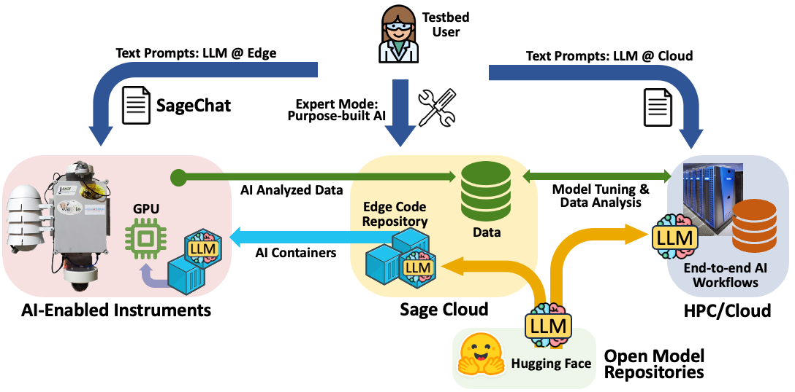
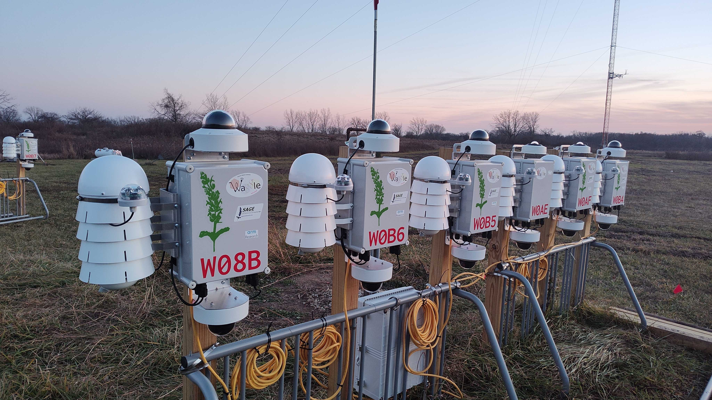

import Timeline from './AboutTimeline'
import PhotoGallery from './PhotoGallery'

## About the Sage Grande Testbed
#### Artificial Intelligence for Real-Time Edge Computing and Sensing

The Sage Grande Testbed (SGT) is building a cutting-edge artificial intelligence (AI) cyberinfrastructure to support advanced AI research.

SGT, funded by the NSF Office of Advanced Cyberinfrastructure, provides access to AI-enabled edge computing resources and software tools integrated with sensors—including infrared and RGB cameras, microphones, and a variety of atmospheric and air quality instruments—deployed across natural, urban, and wildfire-prone environments, with networking capabilities that support real-time hazard reporting.

By bringing advanced AI to the edge, where data is collected, full-resolution analysis, dynamic automation, and immediate actionable responses can be computed. Each Sage node includes a GPU and AI-optimized software stack connected to instruments such as infrared cameras, RGB cameras, LiDAR, and traditional sensors for air quality and wind, as well as LoRaWAN connected sensors for low-bandwidth measurements such as soil moisture. With over 100 Sage nodes deployed across 17 states, SGT provides a national-scale testbed for AI-enabled, autonomous, and rapid-response science and sustained observation of ecological systems, agriculture, urban environments, and weather-related hazards.

<!-- Sage has been around since 2019\. As an NSF MSRI-1 project ([\#1935984](https://www.nsf.gov/awardsearch/showAward?AWD_ID=1935984)), it built the nation’s first distributed, edge computing resource for AI and intelligent sensing. In 2023, Sage began exploring how a national-scale testbed could provide AI as an open research resource ([\#2331263](https://www.nsf.gov/awardsearch/showAward?AWD_ID=2331263)) and became a [NAIRR Pilot Demonstration](https://nairrpilot.org/projects/demo/sage). In early 2025, NSF funded the Sage Grande Testbed (SGT) as a five-year project ([\#2436842](https://www.nsf.gov/awardsearch/showAward?AWD_ID=2436842&HistoricalAwards=false)) to build out the Sage cyberinfrastructure with 300 next-generation nodes, the integration of advanced large language models (LLMs) for the edge, and new end-to-end workflows. -->

<Timeline />

Existing Sage nodes have been integrated into major scientific infrastructure networks such as [NEON](https://www.neonscience.org/), [OHAZ](https://ohaz.uoregon.edu/), [Hawai](https://nationalmesonet.us/hawai%CA%BBi-mesonet/)ʻ[i Mesonet](https://nationalmesonet.us/hawai%CA%BBi-mesonet/), and [HPWREN](https://www.hpwren.ucsd.edu/), enabling researchers to conduct convergent research across disciplines. The Sage ecosystem includes a flexible software stack for edge computing, a [Sage Portal](https://portal.sagecontinuum.org/nodes) for real-time data monitoring and edge AI job management and the [Edge Code Repository](https://portal.sagecontinuum.org/apps/explore) for deploying reusable AI workflows. Sage nodes already support multimodal sensor integration, data streaming, AI inferencing, and cloud-archiving of results for scientific reuse.

  
  

    <small>High-level overview of software infrastructure</small>
  

Sage Grande will extend this infrastructure with more powerful hardware (NVIDIA Orin NX and AGX modules), additional high-bandwidth and high-resolution sensors, expanded software tools, including SageChat, which provides interfaces to LLMs running at the edge, and advanced edge-to-cloud orchestration, data commons integration, and support for AI model evaluation and privacy-enhancing technologies.

SGT integrates advanced edge computing, multi-modal sensing, and LLMs into an accessible, user-friendly research testbed. The platform allows scientists and students to deploy AI applications directly in the field, conduct high-resolution measurements of environmental conditions, and interact with complex datasets using natural language prompts. Sage Grande bridges the gap between laboratory-scale AI development and real-world, mission-critical deployment scenarios across fields such as urban science, agriculture, ecology, fire science, and disaster response.

## AI for Science

Sage Grande is designed for broad impact across scientific disciplines and communities. Key use cases include:

* **LLMs at the Edge:**  Computer scientists are exploring LLMs in resource-constrained environments, enabling research into model compression, prompt optimization, and adaptive deployment strategies. With tools like **SageChat** and real-time multimodal data streams, researchers will explore LLMs for sensor analysis and actuation.  Scientists will also be able to explore LLM-based code generation to autonomously control instruments and configure AI jobs.  Natural language AI-enabled APIs will also allow students and scientists to explore new ways to interact with data.

  
  <small className="flex align-center mt-[-25px] text-slate-500">
    [Sage Testbed Nodes](/news/2024/01/10/sage-testbed), used for Development and Testing
  </small>

* **AI Evaluation, Safety, and Privacy:** With SGT’s real-world deployments, scientists can explore and test trustworthy AI concepts in situ, including explainable AI methods (what triggered detection?), benchmarking correctness, measuring noise, and building privacy-aware pipelines (e.g. redacting at the edge).

* **Novel AI Algorithms for the Edge:** SGT’s architecture—distributed across 300 nodes with cloud integration—supports foundational research in AI systems and novel algorithm design. Researchers can Implement federated learning for sensor-rich applications, enabling decentralized model training with local data; design distributed and asynchronous training protocols that adapt to real-world network constraints; and build retrieval-augmented generation (RAG) systems that combine live sensor feeds with LLM-based reasoning.

* **Precision Agriculture and Drought Monitoring**: At Colorado State University, researchers will use SGT nodes in experimental agricultural plots to detect signs of drought stress, soil conditions, and invasive species. Combined with LLMs, these platforms help optimize irrigation and support resilience in Western U.S. farming.

  
  <small className="flex align-center mt-[-25px] text-slate-500">
    View of the site after a [Konza Prairie Burn Experiment](https://wifire-data.sdsc.edu/en_AU/dataset/neon-mdp-sage-wifire-bp3d-konza-prairie-burn-experiment)
  </small>

* **Wildfire and Hazard Detection**: Working with the University of Oregon (OHAZ Lab), WIFIRE (UC San Diego), and Hawaii's Mesonet team, SGT provides a testbed for creating real-time wildfire smoke detection and hazard alert systems using AI at the edge. Nodes installed in Hawai‘i Volcanoes National Park and Lahaina monitor volcanic eruptions and air quality using live data.

* **Ecosystem Science**: Working closely with the National Ecological Observation Network (NEON), Sage supports AI-enabled ecosystem monitoring, flood detection, atmospheric and weather analysis in remote, natural ecosystems.

## Educational and Community Impact

SGT is not only building cutting-edge AI infrastructure—it’s also cultivating the next generation of researchers, technologists, and community leaders through a hands-on education program. Central to this mission is the process of preparing students to understand and use AI with the testbed.  Activities include:

  
  <small className="flex justify-center mt-[-25px] text-slate-500">
    Students learning about the Waikalua Loko Fishpond with Derek Esibill of Windward Community College
  </small>

* **Data Science Camps**: Programs developed in partnership with Northwestern University, University of Illinois Chicago, and Argonne National Laboratory for middle school, high school, and college students.
* AI Curriculum development.
* Hackathons to help further AI skills and build applications for SGT.
* Help students get access to [NAIRR Pilot](https://nairrpilot.org) resources.
* Multi-day workshops and hands-on AI coding challenges.

A structured training path that includes an introductory workshop, an AI hackathon, and a hands-on AI coding challenge will help students develop practical applications for using Sage nodes and deploying AI-enabled applications to the edge.

Through these efforts, SGT empowers students, educators, and early-career scientists to explore real-time AI, sensor networks, and data interpretation—transforming learners into active contributors to the future of AI-enabled intelligent infrastructure.

## Getting Involved

Sage Grande is an **open testbed**, meaning researchers, educators, and community partners can:

* Design, build, and deploy new AI or LLM applications to existing nodes.
* Apply to host Sage nodes (70 nodes are reserved for new deployments.)
* Use Sage data to build new AI models and better understand agriculture, wildfire, and natural ecosystems.

The Sage team looks forward to helping you use the Sage Grande Testbed for AI-enabled scientific discovery.

## Learn More

* **Project Website**: [sagecontinuum.org](https://sagecontinuum.org/)
* **[Live Data and Apps (Sage Portal)](https://portal.sagecontinuum.org/)**
* **[Sage GitHub](https://github.com/waggle-sensor)**
* **[Contact us](/docs/contact-us)**

Explore the wild edge of AI with Sage Grande – where AI and intelligent instruments meet.

## Photo Gallery

<PhotoGallery viewMore="/photos" limit={9} />
