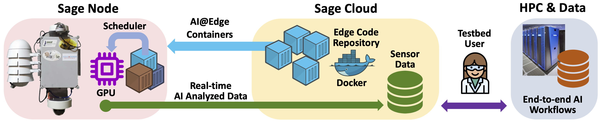

# About Sage

## A new kind of NSF Mid-scale Research Infrastructure (MSRI) that supports AI at the Edge

In September of 2019, the National Science Foundation awarded a multi-institutional team led by Northwestern University a $9 million grant to launch the Sage project, a novel cyberinfrastructure created to exploit dramatic improvements in artificial intelligence technology. The goal: to build a continent-spanning network of smart sensors.

With Sage, advanced machine learning algorithms will be moved to “the edge.” Edge computing is a way to streamline data flowing from Internet of Things (IoT) devices by providing data analysis very near the site where the data is gathered. By linking small, powerful, computers directly to high-resolution cameras, air quality and weather sensors, and experimental Light Detection and Ranging (LIDAR) systems, this new distributed infrastructure will enable researchers to analyze and respond to data almost instantly. From early detection of wildfire smoke plumes in California to identifying ultrasonic calls of bats or the patterns of pedestrians in a busy crosswalk, Sage’s artificial intelligence-enabled sensors will give scientists a new tool to understand our planet.

These distributed, intelligent sensor networks will prove essential for understanding the impacts of global urbanization, natural disasters, such as flooding and wildfires, and climate change on natural ecosystems and city infrastructure. However, many of today’s distributed systems struggle with the immense volume of streaming data that high-fidelity sensors can provide. Some systems resort to saving the data on hard drives that a technician traveling to the instrument might retrieve just a few times a year. Other systems manage the data deluge by only collecting a small portion of the valuable input and uploading it to a cloud server for analysis via a slow wireless link. To address this challenge, Sage will embed computers directly into the sensor network and rely on advancements in edge computing to analyze the torrent of sensor data as it streams past.

Sage’s name is inspired by nature: the perennial flowering plant. But it also conveys other connotations associated with the word, such as wisdom and good judgement. The new cyberinfrastructure project will be enhanced by a set of partnerships with existing scientific instruments that span contexts from urban (NSF-funded Array of Things) to continental-scale (NSF’s National Ecological Observatory Network, or NEON), and with regional instruments focused on understanding and responding to emergencies, such as severe storms (Atmospheric Radiation Measurement, or ARM) and wildfires (High-Performance Wireless Research and Education Network and WIFIRE). Sage will be able to integrate measurements from these multiple modalities. With the development of this new intelligent, or “software-defined” sensor network, researchers will be able to better collect and analyze data that is essential for understanding the impacts of wildfires, global urbanization, and climate change.

Sage test nodes will be deployed in environmental locations in California, Colorado, and Kansas and in urban settings in Illinois and Texas. The project will build on the open source technology platform used in the Array of Things project, which has deployed more than 100 sensors with edge computing capabilities within Chicago.

## Reusable Cyberinfrastructure
The research team that includes the University of Chicago, George Mason University, the University of California San Diego, Northern Illinois University, the University of Utah, the Lincoln Park Zoo, and collaborators at Argonne National Laboratory will design and build reusable software components and cyberinfrastructure services to support the new scientific measurement functions. These measures will range from in-situ analysis of high-bandwidth sensor data streams to adaptive system behaviors, such as adjusting the sampling rates and directional settings of LIDAR instruments or high-resolution cameras to capture events in more detail.  While the traditional method of reducing data volume on remote NEON towers works well for steady state conditions, Sage will provide the ability to detect ecosystem changes of interest at continental scale, allowing scientists to apply more sophisticated analytics in the field, capturing much greater detail on these changes.

Sage will be programmable cyberinfrastructure — allowing edge software that can monitor everything from wildfires to wolf calls, and from urban traffic flows to rural lightning strikes.  With Sage, mountaintop networking towers in Southern California, and part of the HPWREN and WIFIRE project will be able to analyze camera data for natural hazards and even autonomously redirect cameras to zoom in on regions of interest.

The reusable cyberinfrastructure running on these Sage testbeds will give climate, traffic, and ecosystem scientists new data for building models to study coupled systems. The software and hardware components developed in Sage will be open-source and provide an open architecture to enable scientists from a range of fields to build their own intelligent sensor networks. The Waggle edge computing platform, developed at Argonne National Laboratory, will be the starting point for the intelligent nodes deployed across the country.  Waggle was launched in 2013 to permit a new breed of sensor-driven environmental science and smart city research.

The Sage team will also extend the current educational curriculum used in Chicago and will inspire young people — with an emphasis on women and underrepresented populations — to pursue science, technology, and mathematics careers by providing a platform for students to explore measurement-based science questions related to the natural and built environments.

The capabilities of machine learning and artificial intelligence didn’t exist a decade ago.  Sage opens the door to scientists who will be able to write code that can measure a near limitless number of urban and environmental elements.
