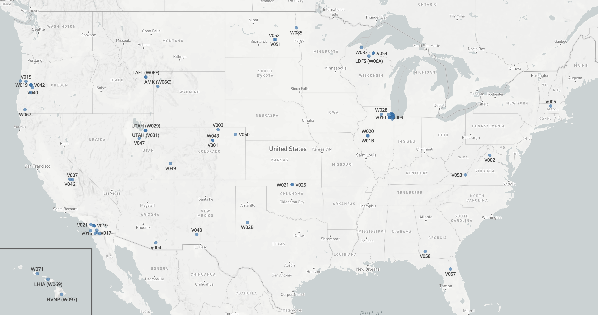

import Neon from './images/fire/during_burn.png'
import Wifire from './images/fire/wifire.png'
import OhazLeft from './images/fire/ohaz-left.jpg'
import OhazRight from './images/fire/ohaz-right.jpg'
import Lava from './images/fire/lava.png'

# Sage Cyberinfrastructure in Support of AI for Fire Science

Sage is a cutting-edge cyberinfrastructure testbed funded by the NSF Office of Advanced Cyberinfrastructure to support AI research.  Sage provides real-time environmental monitoring and AI-enabled edge computing at a national scale. By bringing advanced AI to the edge, where data is collected, full-resolution analysis, dynamic automation, and immediate actionable responses can be computed. Each Sage node includes a GPU and AI-optimized software stack connected to instruments such as infrared cameras, RGB cameras, LIDAR, and traditional sensors for air quality and wind, as well as LoRaWAN connected sensors for low-bandwidth measurements such as soil moisture.  With over **100 Sage nodes deployed across 17 states**, including fire-prone regions in the Western U.S., the platform supports rapid-response science and sustained observation of ecological systems, agriculture, urban environments, and weather-related hazards.

Sage nodes have been integrated into existing major scientific infrastructure networks such as [**NEON**](https://www.neonscience.org), [**OHAZ**](https://ohaz.uoregon.edu), [**Hawai**](https://nationalmesonet.us/hawaiʻi-mesonet/)ʻ[**i Mesonet**](https://nationalmesonet.us/hawaiʻi-mesonet/), and [**HPWREN**](https://www.hpwren.ucsd.edu), enabling researchers to conduct convergent research across disciplines. The Sage ecosystem includes a flexible software stack for edge computing, a [*Sage Portal*](https://portal.sagecontinuum.org/nodes) for real-time monitoring and job management and the [*Edge Code Repository*](https://portal.sagecontinuum.org/apps/explore) for deploying reusable AI workflows. Sage nodes already support multimodal sensor integration, data streaming, AI inferencing, and cloud-archiving of results for scientific reuse.

## Enabling Fire Science and Hazard Monitoring

Since 2021, Sage has been included in a wide range of advanced wildfire research through collaborations with NSF-funded projects and regional partners:

  
  <!-- style attribute overrides docsuaurus styling; todo: fix -->

  ### NSF RAPID
  #### Critical Wildfire Monitoring Utilizing the NEON Mobile Deployment Platform (MDP) with SAGE Cyberinfrastructure
  

    Led by Colorado State University, a rapid deployment during the 2022 burn season combined NEON’s Mobile Deployment Platform with Sage nodes and real-time modeling tools from WIFIRE. This experiment is documented and the data available in a [data commons](https://wifire-data.sdsc.edu/fi/dataset/neon-mdp-sage-wifire-bp3d-konza-prairie-burn-experiment).  It demonstrated multimodal data capture—including video, weather, and smoke detection—across a prescribed burn landscape of the Konza prairie.
    ([See video](https://www.youtube.com/watch?v=GF0jbkMPlTc))
  

  

  

  ### AI for Wildfire Smoke Detection
  

    The Sage cyberinfrastructure has hosted several groups building novel wildfire detection algorithms.  One of the first was developed by UCSD staff, [and is documented](https://portal.sagecontinuum.org/apps/app/iperezx/wildfire-smoke-detection) in the Edge Code Repository.  By deploying the AI model into the Sage cyberinfrastructure, Sage nodes across the West can identify smoke in real time camera data.  Since then, students have built on the work and several new approaches have been developed, including using LLMs, deployed at the edge, to identify fire, smoke, and volcanic eruptions in Hawaiʻi.  They are also available from the Sage Portal.
  

  

  
  

  ### OHAZ
  

    At the University of Oregon, the Oregon Hazards Lab is [deploying Sage nodes](https://ohaz.uoregon.edu/sage/) at sites that complement statewide monitoring and alerting for earthquakes and wildfires.  These nodes provide additional sensing capabilities that can be used in combination with other data to detect multi-hazards and/or study ecosystem response to extreme events.
  

  

  

  ### Hawai‘i Mesonet and LAVA Lab Collaboration
  

    In collaboration with the University of Hawaii (UH), Sage nodes were deployed in Lahaina to explore an AI-enabled multi-hazard monitoring and detection system.  Sage nodes and education programs are advancing wildfire risk prediction, community engagement, and AI-supported environmental sensing. See: [https://www.fema.gov/case-study/wildfire-aftermath-prompts-mitigation-project-aid-recovery](https://www.fema.gov/case-study/wildfire-aftermath-prompts-mitigation-project-aid-recovery)
  

  

    Leveraging the Sage node deployed in Hawaiʻi Volcanoes National Park, the UH team has also spearheaded the use of LLMs within the Sage cyberinfrastructure, exploring how real-time analysis of data can be used to identify fires and volcanic eruptions.
  

  

 

## The Sage Grande Testbed has just Launched!

Sage has been around since 2019\. As an NSF MSRI-1 project (\#1935984), it built the nation’s first distributed, edge computing resource for AI and intelligent sensing.  In 2023, Sage began exploring how a national-scale testbed could provide AI as an open research resource (\# 2331263\) and became a [NAIRR Pilot Demonstration](https://nairrpilot.org/projects/demo/sage). In early 2025, NSF funded the Sage Grande Testbed (SGT) as a five-year project (\# 2436842\) to build out the Sage cyberinfrastructure with 300 next-generation nodes, the integration of advanced LLMs for the edge, and new end-to-end workflows.

### Using Sage Grande Testbed for Wildfire Science

There are several ways to use Sage:

#### 1. Use Sage Nodes in the Western U.S.

Sage nodes are already deployed in key fire-prone regions, including California, Oregon, and Colorado.

> See the [Sage Portal](https://portal.sagecontinuum.org/nodes) for a full map.

Sage is NSF cyberinfrastructure. Students and scientists can apply for user accounts, and begin developing AI-enabled applications that can run at the edge, within the Sage cyberinfrastructure.

Sage is a novel cyberinfrastructure, and deploying AI models and tuning GPU codes for edge environments takes time and training.  Please contact us to help you get started and help explore what is feasible with today’s Sage nodes, and what might be possible as next-gen Sage Grande nodes come online.

#### 2. Explore new AI models and edge-HPC workflows

Sage supports containerized, AI workloads that can be deployed to remote nodes. In some cases, users develop new AI models.  For other applications, they use existing models such as YOLO, YAMNet, Cornell BirdNet, or LLMs tuned for the edge, such as Moondream or Florence.  Using the Sage data already collected, and the Sage AI cyberinfrastructure, research teams can explore training new models, fine tuning models, self-supervised learning, and LLM workflows.

New areas for AI models might include lightning and ignition detection using software defined radios available in some Sage nodes (for RF processing) and infrared cameras for hot spot detection; real-time weather and soil moisture detection with Sage nodes to inform models; acoustic events including thunder, aircraft, and fire; real-time air quality and wind data for AI model tuning.  Sage is an open platform for novel AI computation at the edge.

#### 3. Customizing and Deploying Sage Grande Nodes

As part of SGT, the Sage team is preparing future deployments of next-generation GPUs to support larger and faster AI models.  Teams can work with SGT to explore new locations, new instruments, and sensors that advance fire science.

Please contact the Sage team to discuss how your project might deploy Sage nodes and how new instruments or HPC models might be linked to real-time Sage data.

