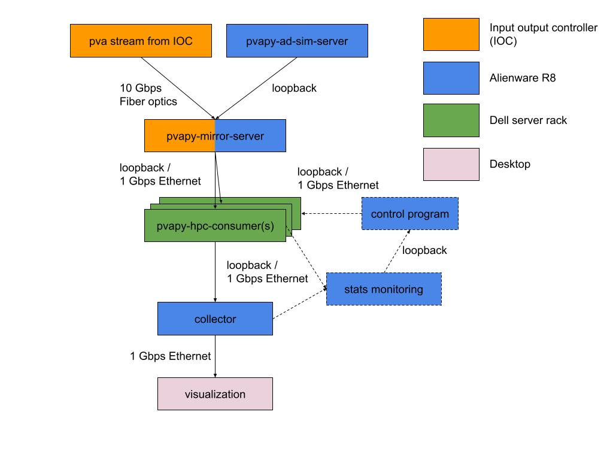

# Scalable AI@Edge computing in X-ray beamline experiments

Can Edge Computing Be Used in X-Ray Beamline Experiments to Process a High-Volume and Fast Data Stream and Help Scientists Make Real-Time Decisions for Experiments?

Edge computing offers computation close to sensors for real-time data processing. Various X-ray sensor beamlines at Argonne's Advanced Photon Source (APS) stream enormous data at a fast frame rate to the cloud for data analysis, and science discovery happens in a high performance computing (HPC) facility. The scientists and engineers in the beamlines have recently added the data streaming and processing feature to their PvaPy[[1]](#references) software package. This feature enables users to process data in real-time, allowing them to see experiment results immediately, as data is streamed to HPC, and make decisions as experiments take place. Edge computing can provide the same real-time data processing capability by deploying computation next to the sensors and can host AI@Edge applications that process data directly from the sensor. The Sage team questioned whether edge computing could scale its AI computation and match the requirement to provide the same real-time data processing capability while reducing the latency by not moving data to the cloud.

## Configuring Edge Computing in The Beamline

Figure 1- Dataflow of the pipeline: from X-ray detector to a visualization computer. Note that the control program in the diagram was designed for automatic scaling, but not implemented in this work.

To understand how edge computing plays in this domain, the Sage team established a workflow pipeline connecting an X-ray detector with a visualization computer placed at the end of the pipeline. We used multiple of a 1U server rack, equipped with a Nvidia T4 GPU accelerator, as an edge computing node and configured them in the middle of the pipeline to offer AI computation. The edge nodes were connected to the detector via a high-speed 10 Gbps network, however each node’s network supported up to 1 Gbps network. The nodes hosted computing resources for running the scientist-developed machine learning (ML) model[[2]](#references) after we quantized it to make the inference faster, though the process  sacrifices up to ~10% of accuracy. This allowed the nodes to run more instances of the model using the same computing resource. The X-ray detector was configured to stream 0.5 Mega-pixel frames at the frame rate of 1 - 2 kHz. To understand computation and network loads required in the workflow pipeline, we varied the number of edge nodes and instances of the AI@Edge application.

## Performance of The Pipeline

Interestingly, yet expectedly, we have found throughout the experiments that putting more edge computing nodes and model instances at the edge can satisfy the required frame rate by processing the streaming data (See Figure 2 and 3). We needed the number of edge nodes to be high enough to accommodate the network bandwidth required by the desired frame rate. Having more instances of the ML model enabled faster frame rate processing. What’s more, adding more edge nodes and model instances at the edge can visualize the processed frames to the scientist. However, we also found that using an excessive number of instances does not - significantly improve the ability to process the frames, but the edge nodes’ resources were underutilized as  more network burden was created. Controlling of such resource allocation will be the key to optimizing both computing and network resources per experiment and satisfying requirements unique per experiment, towards the scientific goal, i.e. rate and resolution of frames. This pipeline with the power of edge computing can help use the beamtime more efficiently, thus reducing the time and resources used in the beamline. This pipeline can also reduce radiological exposure to the sample, minimizing damage.

Figure 2- Performance of the pipeline at receiving 1 kHz data streaming. Among the cases, 5 edge nodes - each running 2 instances of the ML model, 10 instances in total - performed mostly efficiently to keep up with the frame rate.

Figure 3- Performance of the pipeline at receiving 2 kHz data streaming. Among the 3 cases, the total of 27 instances distributed in 9 edge nodes handled the data without losing any frame.

## Discussion
We believe that the capabilities of edge computing demonstrated in this experiment will be the key driving force to make successful beamline experiments. Advanced X-ray sensors with higher resolution and faster frame rate will demand faster edge computation and better control algorithms to distribute and manage the computation loads. As we demonstrated, the workflow can scale horizontally by allocating more edge nodes to an experiment, as computation and realtimeness of data processing needs increase. This workflow will also need to use given computing resources efficiently to run ML models with different resource allocation, driven by a control algorithm, and to host multiple experiments on the same edge computing node, when it cannot scale horizontally.

## Acknowledgement

We thank the Argonne's Advanced Photon Source for the opportunity to use the beamtime to perform the experiment. We also thank [Dr. Cherukara](https://www.anl.gov/profile/mathew-joseph-cherukara), his group members, and [Dr. Zhou](https://www.anl.gov/profile/tao-zhou) for the help and support on the beamline configuration, as well as the machine learning model. We also thank Siniša Veseli for all the immediate support in the Pvapy library,  fixes, and improvements.

## References
1. PvaPy: Python Binding for EPICS pvAccess, https://github.com/epics-base/pvaPy
2. Cherukara, M. J., Zhou, T., Nashed, Y., Enfedaque, P., Hexemer, A., Harder, R. J., & Holt, M. V. (2020). AI-enabled high-resolution scanning coherent diffraction imaging. Applied Physics Letters, 117(4), 044103.
