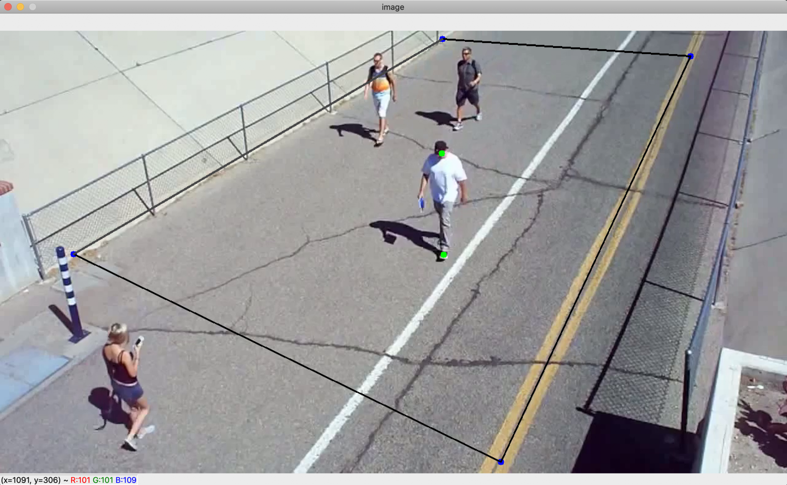
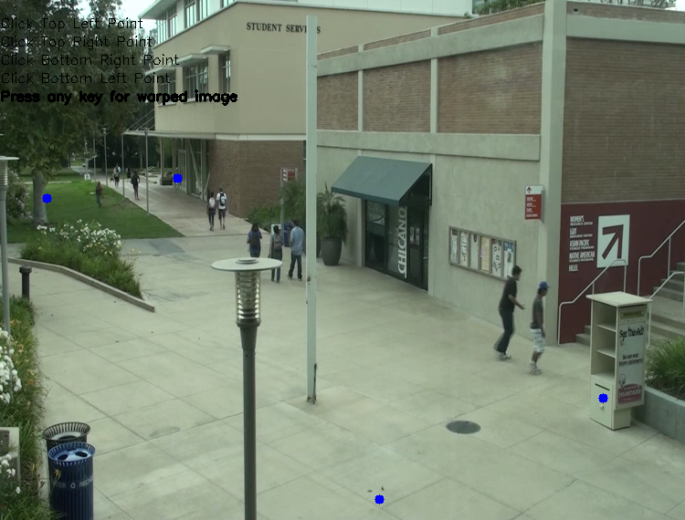

# Social Distancing

My name is Ori Zur and I am a rising junior at Northwestern University studying computer science and music composition. This summer at Argonne, I sought to answer the following question: how well are people following social distancing guidelines in outdoor urban environments?

For the past six months, the world has been enduring a historic pandemic due to the COVID-19 virus. As society attempts to adjust to the new lifestyle of mask wearing, virtual education, and working from home, one phrase that constantly gets brought up is “social distancing guidelines.” Social distancing is the action of keeping a distance of at least six feet from others in order to reduce the spread of the Coronavirus disease. For the past two months, I’ve been designing and coding a social distancing detector using Python and OpenCV as a means to answer the question of what percentage of people are properly following these social distancing guidelines.

The program takes a video of pedestrians, typically from surveillance camera footage, and analyzes each frame by detecting the people, calculating the distance between each pair of people, and indicating if any two people are standing less than six feet apart. OpenCV, a computer vision function library, was used because it greatly simplifies the process of loading in a video, separating it into individual frames for analysis and editing, and outputting the final results.

## How it works
There are two main components to the program: the setup, which only occurs once in the beginning, and the operation, which is a loop that occurs once for each frame of the input video.

## The setup
When the program begins running, the first frame of the input video is shown to the user. The user then inputs six points with their mouse. The first four points make up a rectangle on the ground plane, which will be referred to as the “region of interest” or ROI. The last two points are an approximation of a six-foot distance on the ground.

Six mouse points inputed by the user on the first frame of the input video. The four blue points make up the region of interest and the two green points are the six-foot approximation. Here, the height of the person was used to approximate six feet, but ideally there would be markers on the ground to help guide the user in plotting these points.
The purpose of creating a region of interest with the first four mouse points is to solve the issue of camera distortion. Because the camera is filming from an angle, the conversion rate between physical distance on the ground and pixel distance in the image is not constant. In order to solve this problem, the four mouse points are used to warp the region of interest to create a bird’s-eye-view image. This new image, shown below, looks distorted and unclear, but its appearance is irrelevant as it won’t be shown to the user. What’s important is that in the warped image, the conversion rate between physical distance and pixel distance is now constant.

> Original Image

> Warped Bird’s Eye View Image

In order to prove that this works, I created a small-scale experiment using LEGOs and ran the image through the same warping function. On the left, the tick marks on the sides of the paper are not evenly spaced in terms of pixel distance due to the camera angle. On the right image, however, the tick marks on the side of the paper are evenly spaced, indicating that the physical distance to pixel distance conversion rate is now constant.

> Left: original image, four blue points are inputed by the user via mouse clicks. Right: result of image transformation.

The last part of setup is to use the last two inputted mouse points to calculate the number of pixels that make up six feet. The coordinates of these two points are warped using the same function used to warp the image, and the distance formula is used to calculate the number of pixels between them. This distance is the number of pixels that make up six feet, which I call the minimum safe distance, and since the points and image were warped using the same function, this pixel distance is the same throughout the entire bird’s-eye-view image.

## The operation
The first step of the operation loop is person detection, which is accomplished using a real-time object detection program called You Only Look Once, or YOLO. This program recognizes a wide variety of objects, but my program includes a filter that only keeps the person recognitions. Once detection occurs, each person is represented by what’s called a “bounding box,” which is a rectangle whose coordinates surround the person.

The next step is to take a single point from each bounding box, warp it using the same function used in the setup, and map the coordinates of the warped box points onto the bird’s-eye-view image. Because everything is now mapped onto the bird’s-eye-view image, the distance formula can be used to calculate the distances between each pair of points. These distances are then compared to the minimum safe distance which was also calculated in the setup.

The final step is to create and display the outputs for the current frame. The first output is the street view, where red and green rectangles are drawn on the bounding boxes of the detected people. The second output is a representation of the bird’s-eye-view image using a white window and green and red circles to represent the warped box coordinates that were mapped in the previous step. Once the outputs are displayed, the loop moves onto the next frame of the input video.

> Screenshot of the program in action.  Left: bird’s-eye-view output.  Right: street view output

Here is a flowchart that summarizes the steps of the setup and operation components of the program.

> Setup steps are in orange and operation steps are in green.

## Next steps
One feature that I plan to add to the program in my remaining time at Argonne is the ability to detect groups of people walking together. For example, a couple or family walking together may be less than six feet apart, but that should not be considered a violation of social distancing guidelines. This will be done by adding in an algorithm that can associate objects across multiple frames and assign unique IDs to each person detected. Using this algorithm, my program will be able to recognize groups of people walking together by tracking their specific object IDs, and disregard them as violators even if they are standing too close together.

## References
1. https://github.com/deepak112/Social-Distancing-AI
2. https://github.com/aqeelanwar/SocialDistancingAI
3. https://www.pyimagesearch.com/2020/06/01/opencv-social-distancing-detector/
4. https://www.pyimagesearch.com/2014/08/25/4-point-opencv-getperspective-transform-example/
5. https://www.pyimagesearch.com/2018/11/12/yolo-object-detection-with-opencv/