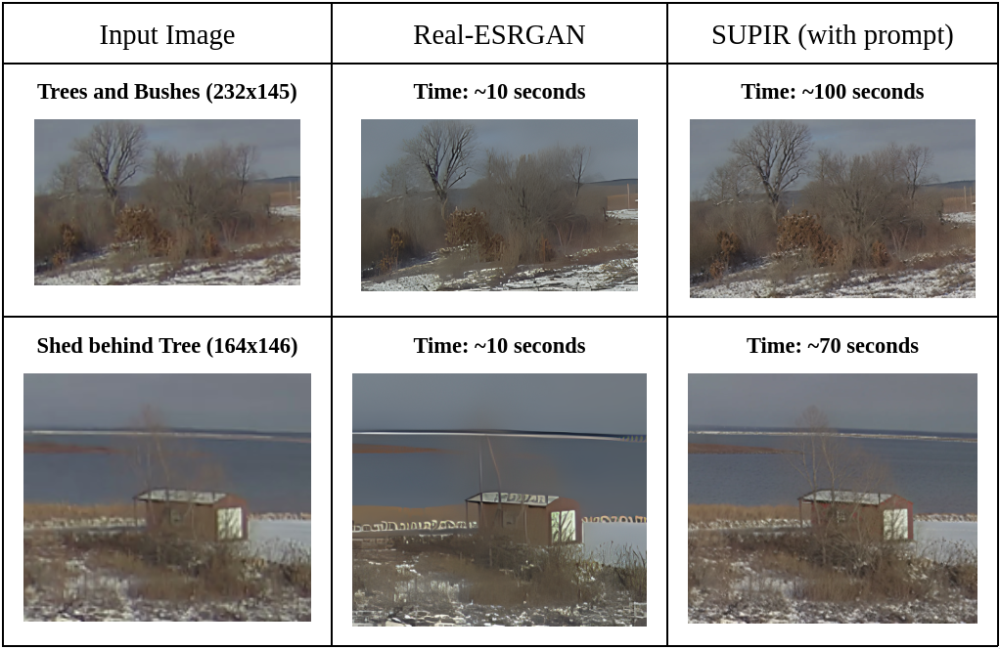

# Exploration of Super Resolution Image Enhancement

## Introduction
Super Resolution is an Image Enhancement Technique, where the goal is to take a low-resolution image and increase its resolution to improve its quality. In contrast with the reverse operation called the downscaling task, where a large area of pixels is converted into a small area of pixels, Super Resolution is a difficult task to execute. There are limited pixels on the original image to work with and the model must then predict and generate artificial data to create an improved image. 

**This project serves to explore different types of super-resolution models and understand the feasibility of deploying such models into laboratory systems.**

## Motivation
Super Resolution plays a critical role in various fields restoring old images to learn more about the history of our world, analyzing satellite images to create improved maps, and analyzing microscopic organisms in medical diagnoses. As technological and scientific advancements continue to improve, there is an increase in demand for image enhancement tools: the aid of AI in enhancing images helps play a pivotal role in decreasing the costs of developing advanced microscopes, telescopes, and cameras.

## Methods
For this project, I explored two different types of models that have played a revolutionary role in the Super Resolution field: GAN (Generative Advertisal Network) models and Diffusion models. I specifically chose the Real-ESRGAN model and Diffusion model because they were the best models for their respective models from my research. Here is a brief list of facts about each model.

**GAN Model**
- A Generator and a Discriminator compete against each other to mutually boost performance
- The Generator creates a fake image using noise (all at once) to fool the Discriminator
- The Discriminator tries to guess the real image between the generated image and the actual image
- May not produce the best results if the Discriminator or the Generator is not effective enough 
- **Real-ESRGAN:** has a powerful Discriminator contrary to other GAN models

**Diffusion Model**
- A method that outperforms GAN models in rendering quality
- A type of Generator
- Adds and removes noise from the original image at a slower rate
  - Better method than the GAN Model generator since it gives the model additional time to learn complex patterns
  - Main drawback is the time complexity will be longer
  - Process is similar to a thermodynamics problem
    - Analogy for adding noise:
      - Adding a drop of food coloring into a large bowl of water has a very high probability of the food coloring affecting the other water droplets
      - Results in all the water droplets being affected by food coloring
    - Analogy for removing noise:
      - Slowly rewinding time and pinpointing the exact location of where the initial drop of food coloring came from starting from when the bowl is filled with food coloring water droplets 
- Adjusts loss to make sure the image is as high quality as possible

- **SUPIR:**
  - There is an attached text prompt option to help guide the model to the correct output
    - Can plug in a Multi-Modal Large Language Model
  - Extremely computationally expensive, and the model is very large

  - *Encoder Decoder: Input and Output Source*
  - *SDXL: StableDiffusion Model*
  - *ControlNet: Controls Diffusion Models*
  - *Multi-Modal Model: Outputs text describing a given image*

## Results

Below are tables highlighting the results when using each of the models. The Numbers in the Input Image column highlight the dimensions of each image. The input images are less than 250x250 pixels in dimension and the output images are upscaled at least 4x in size to highlight the differences in generation.

For the SUPIR model, a prompt was inserted into the Multi-Modal Large Language Model to guide the model to the correct output as mentioned before. Below were the prompts for each of the tables:
- Trees and Bushes: A snowy landscape with bushes and trees nearby
- Shed behind Tree: Red shed with tree in front on a snowy island and ocean scenery in back
- Bus Stop: A road surrounded by grass leading to a bus stop.

From the results below, it is very apparent that SUPIR produces much clearer results than Real-ESRGAN. For both images in the chart below, the trees are rendered very clearly in the SUPIR model, whereas it is more blurry in the Real-ESRGAN model. These differences can also be viewed in the background, which is noticeable in the snow, the dirt, and the ocean that were generated by both the models.

The following chart provides the finishing blow for proving the effectiveness of the SUPIR model over the Real-ESRGAN model. Although the Real-ESRGAN model was unable to produce a realistic-looking image, the details that were provided in the SUPIR model are very apparent, as shown in the generated quality for the mountainous background, the grassy terrain, the bus stop, the rocky road, the street lights, and the bus sign. The two generated images are as clear as light and day in terms of quality.

It is however important to note the drawbacks of the SUPIR model. The same quality image is unable to be generated if a prompt is not used for the SUPIR model: a false prediction was made where the model created a hallucination and generated a plane instead of a bus stop roof. Additionally, the model is poor at generating text: there is incomprehensible text written on the plane. It is also important to highlight the amount of time it took for each model to generate each image. Because SUPIR's model is very large, it takes at least 70 seconds to generate an image compared to Real-ESRGAN's 10 seconds, which is a substantial difference in time.

## Summary

Here is a brief list of facts summarizing the advantages and disadvantages of the two models.

**Advantages of Real-ESRGAN:**
- Small model (<1 GB)
  - Requires <1 GB of VRAM
- Runs on CPU as well
- Fast compute time
- Deployable on Edge

**Disadvantages of Real-ESRGAN**
- Poor results if the image quality is too small
- Image enhancement is not very apparent

**Advantages of SUPIR:**
- Image enhancement is much more powerful compared to Real-ESRGAN

**Disadvantages of SUPIR:**
- Extremely large model (30-40 GB)
  - Requires 4~10 GB of VRAM
- Requires GPU
- Inefficient for large batch sizes
- Poor results if no text is provided
- Poor at rendering text

## Conclusion

This project explored the advantages and disadvantages of Real-ESRGAN and SUPIR and determined that it is difficult to deploy super-resolution models into the laboratory systems since current technology does not provide a proper balance between the number of computational resources, time, and quality generated. More research into the field would need to be performed for Super Resolution to serve as a viable solution to deploy on the edge.

It is however important to acknowledge that the SUPIR model displays excellent insight into the potential viability of Super-Resolution, and is very feasible for deployment when a method for decreasing computational power is discovered.
