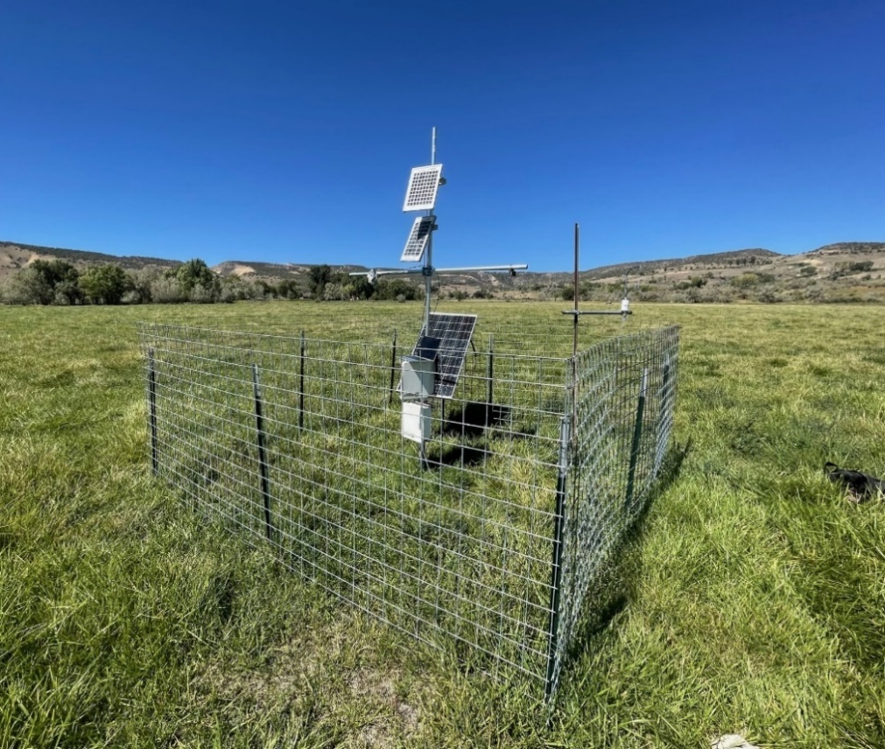
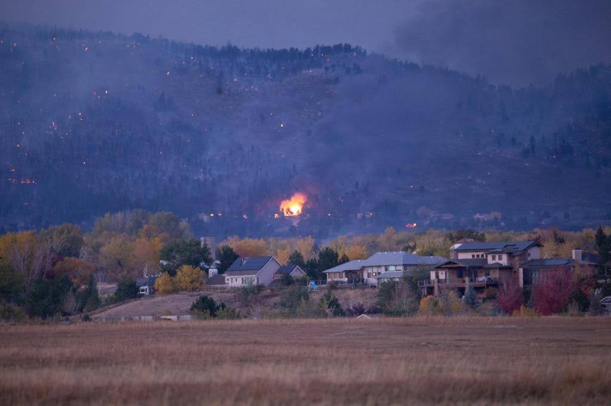

# AI-Driven Drought Mitigation and Prediction Testbed

## Drought Mitigation and Prediction

The Drought Monitoring Testbed is a cutting-edge platform designed to enhance drought forecasting and mitigation capabilities across diverse land uses and systems. It integrates AI-enabled edge computing resources with specialized sensors, including soil moisture sensors, rainfall sensors, vegetation health sensors, and atmospheric and hydrological instruments. These sensors provide critical data on soil moisture levels, precipitation patterns, vegetation stress, and atmospheric conditions, all of which are essential for predicting drought onset and severity. The testbed's networking capabilities will support real-time data transmission and analysis, enabling immediate drought reporting and predictive analytics. This allows for rapid detection of drought conditions and optimized resource allocation, ensuring efficient use of water and other critical resources during droughts. By leveraging these technologies, the testbed significantly enhances drought management and agricultural planning, supporting more effective water resource management.

### Sensors

  

* Soil Moisture Sensors: To measure the moisture levels in the soil, which are crucial for predicting drought conditions and optimizing irrigation strategies[7](https://blog.flux.id/en/iot-sensors-drought-monitoring/).
* Rainfall Sensors: To monitor precipitation patterns and provide real-time data on rainfall deficits, helping to predict drought onset.
* Vegetation Health Sensors: Utilizing multispectral or hyperspectral imaging to assess vegetation stress and health, which can indicate early signs of drought.
* Atmospheric and Hydrological Instruments: To monitor temperature, humidity, and other atmospheric conditions that contribute to drought development.

### Networking Capabilities
The testbed would include networking capabilities that support real-time data transmission and analysis, enabling:

* Real-time Drought Reporting: Immediate alerts and updates on drought conditions to support timely decision-making by farmers, policymakers, and emergency managers.
* Predictive Analytics: Integration of machine learning models to analyze sensor data and predict drought severity and duration, facilitating proactive mitigation strategies.

### AI-Enabled Edge Computing
The AI-enabled edge computing resources process data locally, reducing latency and enhancing real-time analysis. This allows for:

* Rapid Detection of Drought Onset: Early identification of drought conditions through real-time data analysis, enabling swift responses to mitigate impacts.
* Optimized Resource Allocation: Dynamic allocation of resources based on real-time data, ensuring efficient use of water and other critical resources during droughts.

By leveraging these technologies, the Drought Monitoring Testbed would significantly enhance drought forecasting and mitigation capabilities, supporting more effective management of water resources and agricultural planning.

## Enhancing Fire Forecasting with Soil Moisture Measurement

  

The integration of soil moisture measurements into fire forecasting is a crucial step in improving wildfire risk assessments. By incorporating soil moisture data into existing infrastructure, such as the U.S. Forest Service's  RAWS (Remote Automated Weather Stations) program, and the Colorado Agricultural Meteorological Network CoAgMET  (Hosted at Colorado State University), fire managers can enhance the accuracy of fire danger ratings. Soil moisture is a key indicator of fuel moisture levels, which directly influence wildfire ignition and spread. Its integration into forecasting models can improve the accuracy of fire danger assessments across diverse ecosystems, from grasslands to forests. Advanced modeling techniques and real-time monitoring capabilities allow for more sophisticated forecasting tools and timely adjustments in fire management strategies. However, challenges remain in integrating soil moisture data into existing systems, but the opportunities for further research and improved management strategies are substantial. By enhancing fire forecasting with soil moisture measurements, researchers and fire managers can develop more accurate and responsive strategies for mitigating wildfires. This approach is supported by USDA initiatives which use soil moisture data to predict wildfire probability, and emerging technologies such as drone-based radiometry for high-resolution soil moisture mapping

* **Purpose**: RAWS stations are designed to provide accurate and timely weather data for wildland fire management. They measure basic weather parameters such as temperature, relative humidity, wind speed, wind direction, precipitation, and fuel moisture.
* **Locations**: RAWS stations are placed in remote locations, often in national forests, and are not connected to the electrical grid. They are typically powered by solar panels or generators
* **Data Transmission**: The data collected by RAWS is transmitted via satellite to the National Interagency Fire Center (NIFC) and other systems like the Weather Information Management System (WIMS) and the Western Regional Climate Center (WRCC).
* **Integration with Other Systems**: The Forest Service's Weather Program coordinates with the National Weather Service (NWS) to ensure data quality standards for RAWS stations and to provide satellite support for data transmission.

In summary, the RAWS program is a critical component of the Forest Service's efforts to manage wildfires effectively by providing essential weather data for fire danger assessment and management decisions.

### The Open Soil Water Architecture

Recognizing the importance of soil moisture monitoring, several leading institutions are collaborating with us to develop an Open Soil Water Network, which will reflect the seamless integration of physical and cyber infrastructure represented in an Open Knowledge Platform. These institutions include Yampa Valley Sustainability Council, Aspen Global Change Institute, Colorado River District, US Forest Service (USFS), the Colorado Water Conservation Board (CWCB), and the Colorado Department of Agriculture (CDA). We will expand Colorado’s soil moisture sensor (SMS) infrastructure to at least 85 sites across the following networks: Colorado Agriculture Experiment Station (CAES), NEON (National Ecological Observatory Network), CoAgMET, and United States Forest Service Remote Automated Weather Stations (USFS RAWS). Many of these will be deployed with packages with edge AI capabilities.

### CoAgMET
CoAgMET, or the Colorado Agricultural Meteorological Network, is a network of over 90 research-grade weather stations located across the state of Colorado. It is managed by the Colorado Climate Center at Colorado State University. The primary purpose of CoAgMET is to collect detailed agricultural weather data, particularly for calculating evapotranspiration (ET), which is essential for irrigation scheduling and crop water use management.

### CoCoRaHS
CoCoRaHS The Community Collaborative Rain, Hail, and Snow Network, is a non-profit, community-based network of volunteers who work together to measure and map precipitation (rain, hail, and snow) across the United States, Canada, and other regions. Founded in 1998 at Colorado State University, CoCoRaHS aims to provide high-quality precipitation data for natural resource management, education, and research applications. Community Collaborative Rain, Hail, and Snow Network, Observations of precipitation and local conditions provided by these observers are widely used by researchers and the National Weather Service to better characterize wet and dry extremes. In NOAA’s precipitation dataset, two-thirds of observations in 2022 came from CoCoRaHS observers. A particular focus of this project will be expanding condition monitoring, which will complement the new soil moisture observations by providing information on the impacts of drought and other phenomena.

