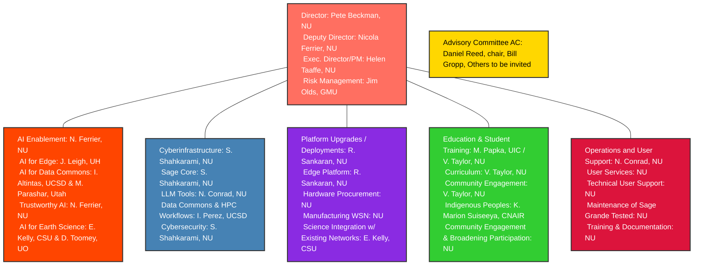

import OrgChart from './OrgChart.tsx'

# Staff Overview

Sage brings together experts from institutions across the country.

- **[Leadership](/team/leadership)**
- **[Teams](/team/team-members) | [Cyberinfrastructure](/team/team-members#cyberinfrastructure), [Research](/team/team-members#research--ai-enablement), and [Platform](/team/team-members#platform)**
- **[Collaborators](/team/collaborators)**

