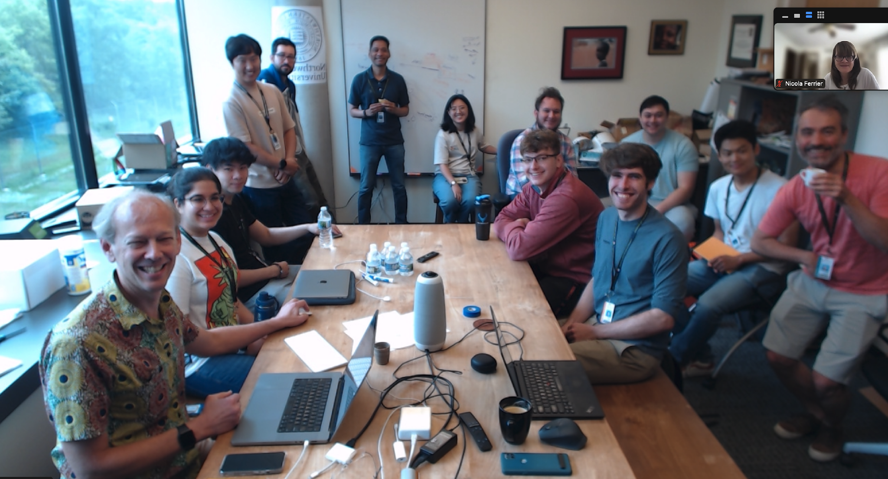
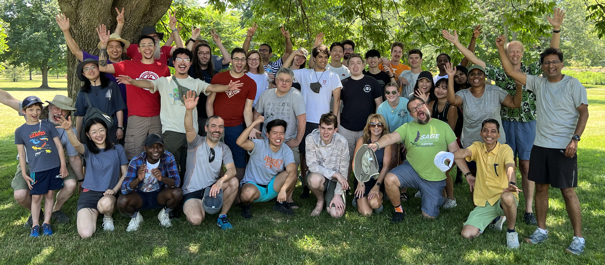

# Students

### 2025

- Henry Abrahamson (Northwestern University)
- Saleem Alharir (University of Utah)
- Mahsa Alishiri (University of Illinois Chicago)
- John Blackwell (Colorado State University)
- Elizabeth Cardoso (University of Illinois Chicago)
- Siddharth Chalasani (Northwestern University)
- Shivani Chiranjeevi (Iowa State University)
- Avasyu Chukkapalli (Purdue University)
- Michael Cortez (University of Illinois Chicago)
- Param Gandhi (University of Utah)
- Fatima Mora Garcia (University of Illinois Chicago)
- Hairik Honarchian (Colorado State University)
- Christopher Lee (University of Hawaiʻi at Māno)
- Vinayak Kapoor (Northwestern University)
- Om Patel (University of Illinois Chicago)
- Saumya Pailwan (Northwestern University)
- Sangshin Park (University of Utah)
- JD Pirtle (University of Illinois Chicago)
- Alejandra Rios (University of Illinois Chicago)
- Mark Schittenhelm (University of Hawaiʻi at Māno)

### 2024

- Ruben Abraham (University of Illinois Urbana-Champaign)
- Aldo Malaquias Cabrera (University of Chicago)
- Yufeng Luo (University of Wyoming)
- Chris Marshall (University of Chicago)
- Alex Nishio (Purdue University)
- Ryan Rearden (University of Dallas)
- Michael Szostak (Lewis University)

### 2023

- Alex Arnold (Northwestern University)
- Joseph Cannon (North Central College)
- Yufeng Luo (University of Wyoming)
- Chase Pelletier (Michigan Technology University)
- Alex Shen (Northwestern University)
- Jakub Szumny (University of Illinois Urbana-Champaign)
- Anagha Tiwari (University of Illinois Urbana-Champaign)

### 2022

